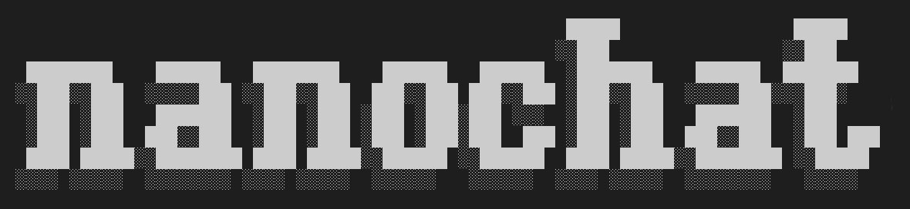
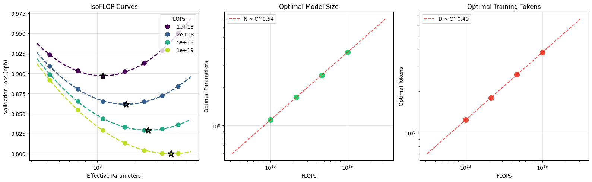

# nanochat




nanochat 是最简单的 LLM 训练实验框架。它设计为在单 GPU 节点上运行，代码极简且易于修改，涵盖 LLM 所有主要阶段：分词、预训练、微调、评估、推理和聊天 UI。例如，你可以训练自己的 GPT-2 级别 LLM（2019 年训练成本约 $43,000），现在仅需 $48（约 2 小时的 8XH100 GPU 节点），然后在类似 ChatGPT 的 Web UI 中与它对话。使用竞价实例，总成本可低至约 $15。更一般地说，nanochat 通过设置一个单一的复杂度旋钮来开箱即用地训练一系列计算最优模型：`--depth`，即 GPT Transformer 模型的层数（GPT-2 级别能力大约对应 depth 26）。所有其他超参数（Transformer 宽度、注意力头数、学习率调整、训练时长、权重衰减等）都会自动以最优方式计算。

关于本仓库的问题，推荐使用 [DeepWiki](https://deepwiki.com/karpathy/nanochat) 提问，或使用 [Discussions 页面](https://github.com/karpathy/nanochat/discussions)，或加入 Discord 上的 [#nanochat](https://discord.com/channels/1020383067459821711/1427295580895314031) 频道。

## GPT-2 速通排行榜

目前开发的主要重点是调优预训练阶段，它消耗最多的计算资源。受 modded-nanogpt 仓库启发，为激励进步和社区协作，nanochat 维护了一个"GPT-2 速通"排行榜，记录将 nanochat 模型训练到 GPT-2 级别能力（以 DCLM CORE 分数衡量）所需的墙上时间。[runs/speedrun.sh](runs/speedrun.sh) 脚本始终反映训练 GPT-2 级别模型并与其对话的参考方法。当前排行榜如下：

| # | 时间 | val_bpb | CORE | 描述 | 日期 | 提交 | 贡献者 |
|---|------|---------|------|------|------|------|--------|
| 0 | 168 小时 | - | 0.2565 | 原始 OpenAI GPT-2 checkpoint | 2019 | - | OpenAI |
| 1 | 3.04 | 0.74833 | 0.2585 | d24 基线，略微过训练 | 2026年1月29日 | 348fbb3 | @karpathy |
| 2 | 2.91 | 0.74504 | 0.2578 | d26 略微欠训练 **+fp8** | 2026年2月2日 | a67eba3 | @karpathy |
| 3 | 2.76 | 0.74645 | 0.2602 | 总 batch size 提升至 1M tokens | 2026年2月5日 | 2c062aa | @karpathy |
| 4 | 2.02 | 0.71854 | 0.2571 | 数据集更换为 NVIDIA ClimbMix | 2026年3月4日 | 324e69c | @ddudek @karpathy |
| 5 | 1.80 | 0.71808 | 0.2690 | 自动研究 [第1轮](https://x.com/karpathy/status/2031135152349524125) | 2026年3月9日 | 6ed7d1d | @karpathy |
| 6 | 1.65 | 0.71800 | 0.2626 | 自动研究 第2轮 | 2026年3月14日 | a825e63 | @karpathy |

我们最关心的指标是"到达 GPT-2 的时间"——在 8XH100 GPU 节点上超越 GPT-2（1.6B）CORE 指标所需的墙上时间。GPT-2 的 CORE 分数为 0.256525。2019 年，GPT-2 的训练成本约为 $43,000，令人难以置信的是，经过 7 年全栈技术的进步，我们现在可以在远低于 $100 的成本内完成（例如，按当前约 $3/GPU/小时计算，8XH100 节点约 $24/小时，2 小时约 $48）。

更多关于排行榜的解读和贡献方式请参见 [dev/LEADERBOARD.md](dev/LEADERBOARD.md)。

## 快速开始

### 环境配置

nanochat 使用 [uv](https://docs.astral.sh/uv/) 进行依赖管理。安装方法：

```bash
uv sync --extra gpu    # 用于 CUDA（A100/H100 等）
uv sync --extra cpu    # （或）仅 CPU / MPS
source .venv/bin/activate
```

开发模式（添加 pytest、matplotlib、ipykernel、transformers 等）：

```bash
uv sync --extra gpu --group dev
```

### 复现并与 GPT-2 对话

最有趣的事情是训练你自己的 GPT-2 并与它对话。整个流程包含在单个文件 [runs/speedrun.sh](runs/speedrun.sh) 中，设计为在 8XH100 GPU 节点上运行。从你喜欢的云服务商（推荐 [Lambda](https://lambda.ai/service/gpu-cloud)）启动一台新的 8XH100 GPU 机器，然后启动训练脚本：

```bash
bash runs/speedrun.sh
```

建议在 screen 会话中运行，因为大约需要 3 小时。完成后，可以通过类似 ChatGPT 的 Web UI 与它对话。确保本地 uv 虚拟环境已激活（运行 `source .venv/bin/activate`），然后启动服务：

```bash
python -m scripts.chat_web
```

然后访问显示的 URL。确保正确访问，例如在 Lambda 上使用节点的公网 IP 加端口，如 [http://209.20.xxx.xxx:8000/](http://209.20.xxx.xxx:8000/)。然后像使用 ChatGPT 一样与你的 LLM 对话！让它写故事或诗歌，问它是谁来看看幻觉，问它天空为什么是蓝色的，或者为什么是绿色的。速通模型是 4e19 FLOPs 能力的模型，所以有点像和幼儿园小朋友聊天 :)

---


---

一些补充说明：

- 代码在 Ampere 8XA100 GPU 节点上也能正常运行，只是稍慢一些。
- 即使在单 GPU 上，省略 `torchrun` 也能正常运行，结果基本一致（代码会自动切换到梯度累积），但需要等 8 倍时间。
- 如果 GPU 显存不足 80GB，需要调整一些超参数，否则会 OOM。在脚本中查找 `--device-batch-size` 并减小它，例如从 32（默认）降到 16、8、4、2 甚至 1。再小的话需要更多经验。
- 大部分代码是标准 PyTorch，应该能在任何支持 PyTorch 的设备上运行（xpu、mps 等），但这些路径未全部经过测试。

## 研究

如果你是研究人员并希望帮助改进 nanochat，两个值得关注的脚本是 [runs/scaling_laws.sh](runs/scaling_laws.sh) 和 [runs/miniseries.sh](runs/miniseries.sh)。相关文档请参见 [1月7日 miniseries v1](https://github.com/karpathy/nanochat/discussions/420)。快速实验（约 5 分钟预训练）推荐使用 12 层模型（GPT-1 大小），例如：

```
OMP_NUM_THREADS=1 torchrun --standalone --nproc_per_node=8 -m scripts.base_train -- \
    --depth=12 \
    --run="d12" \
    --model-tag="d12" \
    --core-metric-every=999999 \
    --sample-every=-1 \
    --save-every=-1 \
```

这会使用 wandb（运行名 "d12"），仅在最后一步运行 CORE 指标，不采样和保存中间 checkpoint。我喜欢修改代码后重新运行 d12（或 d16 等）来观察是否有改进。判断是否有帮助，我喜欢监控 wandb 的以下图表：

1. `val_bpb`（以 bits per byte 为单位的验证损失，与词表大小无关）随 `step`、`total_training_time` 和 `total_training_flops` 的变化
2. `core_metric`（DCLM CORE 分数）
3. 显存使用率、`train/mfu`（模型 FLOPS 利用率）、`train/tok_per_sec`（训练吞吐量）

示例请参见[这里](https://github.com/karpathy/nanochat/pull/498#issuecomment-3850720044)。

需要注意的是，nanochat 围绕一个单一的复杂度旋钮——Transformer 的深度——来编写和配置。这个单一整数自动决定所有其他超参数（Transformer 宽度、注意力头数、学习率调整、训练时长、权重衰减等），使训练出的模型达到计算最优。用户无需思考或设置这些参数，只需通过 `--depth` 请求更小或更大的模型，一切"就能工作"。通过扫描 depth，你可以获得 nanochat 在不同规模下的计算最优模型系列。目前最关注的 GPT-2 级别模型大约在 d24-d26 范围。但任何对仓库的候选修改都必须足够通用，能在所有 depth 设置下工作。

## 在 CPU / MPS 上运行

[runs/runcpu.sh](runs/runcpu.sh) 展示了在 CPU 或 Apple Silicon 上运行的简单示例。它大幅缩小了训练的 LLM 以适应合理的训练时间（几十分钟）。这种方式不会得到很强的结果。

## 精度 / dtype

nanochat 不使用 `torch.amp.autocast`。相反，精度通过单一全局变量 `COMPUTE_DTYPE`（定义在 `nanochat/common.py` 中）显式管理。默认根据硬件自动检测：

| 硬件 | 默认 dtype | 原因 |
|------|-----------|------|
| CUDA SM 80+（A100、H100 等） | `bfloat16` | 原生 bf16 张量核心 |
| CUDA SM < 80（V100、T4 等） | `float32` | 无 bf16；可通过 `NANOCHAT_DTYPE=float16` 使用 fp16（使用 GradScaler） |
| CPU / MPS | `float32` | 无低精度张量核心 |

可通过 `NANOCHAT_DTYPE` 环境变量覆盖默认值：

```bash
NANOCHAT_DTYPE=float32 python -m scripts.chat_cli -p "hello"   # 强制 fp32
NANOCHAT_DTYPE=bfloat16 torchrun --nproc_per_node=8 -m scripts.base_train  # 强制 bf16
```

工作原理：模型权重以 fp32 存储（为了优化器精度），但自定义的 `Linear` 层在前向传播时将其转换为 `COMPUTE_DTYPE`。Embedding 直接以 `COMPUTE_DTYPE` 存储以节省内存。这提供了与 autocast 相同的混合精度优势，但对精度有完全的显式控制。

注意：`float16` 训练会在 `base_train.py` 中自动启用 `GradScaler` 以防止梯度下溢。SFT 也支持，但 RL 目前不支持。fp16 推理在所有地方都能正常工作。

## 指南

我发布了一些可能有用的指南，从新到旧：

- [2026年2月1日：以远低于$100击败GPT-2：nanochat之旅](https://github.com/karpathy/nanochat/discussions/481)
- [1月7日 miniseries v1](https://github.com/karpathy/nanochat/discussions/420) 记录了第一批 nanochat 模型系列
- 要为 nanochat 添加新能力，请参见[指南：数 strawberry 中的 r（以及如何添加能力）](https://github.com/karpathy/nanochat/discussions/164)
- 要自定义你的 nanochat，请参见[指南：为你的 nanochat 注入身份](https://github.com/karpathy/nanochat/discussions/139)，描述了如何通过合成数据生成并将其混入 SFT 阶段来调优 nanochat 的个性
- [2025年10月13日：nanochat 原始发布帖](https://github.com/karpathy/nanochat/discussions/1) 介绍 nanochat，但包含一些已过时的信息，模型比当前 master 分支旧很多（结果更差）

## 文件结构

```
.
├── LICENSE
├── README.md
├── dev
│   ├── gen_synthetic_data.py       # 身份合成数据示例
│   ├── generate_logo.html
│   ├── nanochat.png
│   └── repackage_data_reference.py # 预训练数据分片生成
├── nanochat
│   ├── __init__.py                 # 空
│   ├── checkpoint_manager.py       # 保存/加载模型 checkpoint
│   ├── common.py                   # 各种小工具函数
│   ├── core_eval.py                # 评估 base 模型 CORE 分数（DCLM 论文）
│   ├── dataloader.py               # 分词分布式数据加载器
│   ├── dataset.py                  # 预训练数据下载/读取工具
│   ├── engine.py                   # 带 KV Cache 的高效模型推理
│   ├── execution.py                # 允许 LLM 执行 Python 代码作为工具
│   ├── gpt.py                      # GPT nn.Module Transformer
│   ├── logo.svg
│   ├── loss_eval.py                # 评估 bits per byte（而非 loss）
│   ├── optim.py                    # AdamW + Muon 优化器，单 GPU 和分布式
│   ├── report.py                   # nanochat 报告生成工具
│   ├── tokenizer.py                # BPE 分词器，GPT-4 风格
│   └── ui.html                     # nanochat 前端 HTML/CSS/JS
├── pyproject.toml
├── runs
│   ├── miniseries.sh               # 模型系列训练脚本
│   ├── runcpu.sh                   # CPU/MPS 运行示例
│   ├── scaling_laws.sh             # 缩放定律实验
│   └── speedrun.sh                 # 训练约$100的 nanochat d20
├── scripts
│   ├── base_eval.py                # Base 模型：CORE 分数、bits per byte、采样
│   ├── base_train.py               # Base 模型：训练
│   ├── chat_cli.py                 # Chat 模型：CLI 对话
│   ├── chat_eval.py                # Chat 模型：评估任务
│   ├── chat_rl.py                  # Chat 模型：强化学习
│   ├── chat_sft.py                 # Chat 模型：SFT 训练
│   ├── chat_web.py                 # Chat 模型：WebUI 对话
│   ├── tok_eval.py                 # 分词器：评估压缩率
│   └── tok_train.py                # 分词器：训练
├── tasks
│   ├── arc.py                      # 多选科学问题
│   ├── common.py                   # TaskMixture | TaskSequence
│   ├── customjson.py               # 从任意 jsonl 对话创建 Task
│   ├── gsm8k.py                    # 8K 小学数学题
│   ├── humaneval.py                # 简单 Python 编程任务
│   ├── mmlu.py                     # 广泛主题多选题
│   ├── smoltalk.py                 # HuggingFace SmolTalk 混合数据集
│   └── spellingbee.py              # 教模型拼写/数字母的任务
├── tests
│   └── test_engine.py
└── uv.lock
```

## 贡献

nanochat 的目标是提升微型模型的前沿水平，使其可在 < $1000 预算内端到端地工作。可及性不仅关乎总成本，也关乎认知复杂度——nanochat 不是一个可穷尽配置的 LLM"框架"；代码库中没有巨大的配置对象、模型工厂或 if-else 怪物。它是一个单一、连贯、极简、可读、可修改、最大化可 fork 的"强基线"代码库，设计为从头到尾运行并产生一个你可以对话的 ChatGPT 模型。目前最有趣的部分是加速到达 GPT-2 的延迟（即获得高于 0.256525 的 CORE 分数）。目前需要约 3 小时，通过改进预训练阶段可以进一步缩短。

当前 AI 政策：披露。提交 PR 时，请声明任何由 LLM 实质贡献且你未编写或不完全理解的部分。

## 致谢

- 名称（nanochat）来源于我之前的项目 [nanoGPT](https://github.com/karpathy/nanoGPT)，后者仅涵盖预训练。
- nanochat 也受 [modded-nanoGPT](https://github.com/KellerJordan/modded-nanogpt) 启发，后者通过明确的指标和排行榜使 nanoGPT 仓库游戏化，并借鉴了其很多想法和部分预训练实现。
- 感谢 [HuggingFace](https://huggingface.co/) 提供 fineweb 和 smoltalk。
- 感谢 [Lambda](https://lambda.ai/service/gpu-cloud) 提供本项目开发所用的计算资源。
- 感谢首席 LLM 召唤师 🧙‍♂️ Alec Radford 的建议和指导。
- 感谢仓库管家 Sofie [@svlandeg](https://github.com/svlandeg) 帮助管理 nanochat 的 issues、pull requests 和 discussions。

## 引用

如果你觉得 nanochat 对你的研究有帮助，请按如下方式引用：

```bibtex
@misc{nanochat,
  author = {Andrej Karpathy},
  title = {nanochat: The best ChatGPT that \$100 can buy},
  year = {2025},
  publisher = {GitHub},
  url = {https://github.com/karpathy/nanochat}
}
```

## 许可证

MIT
