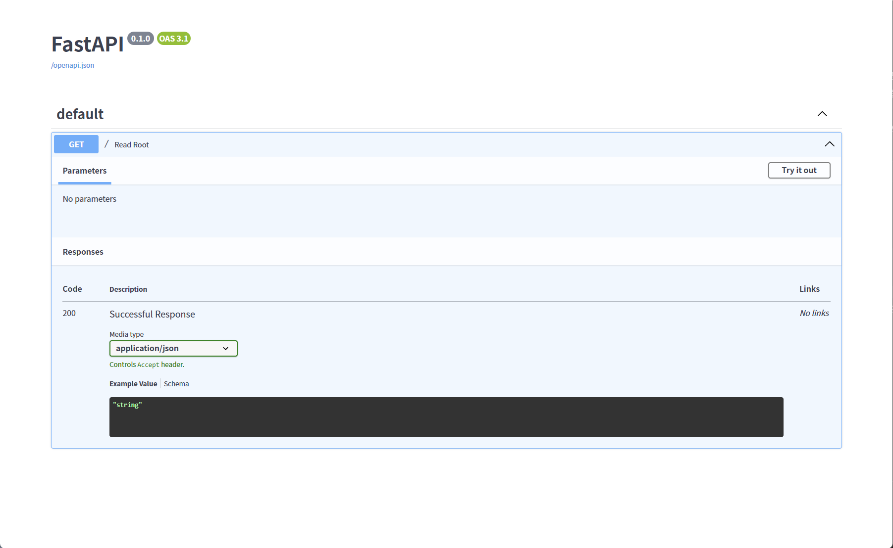
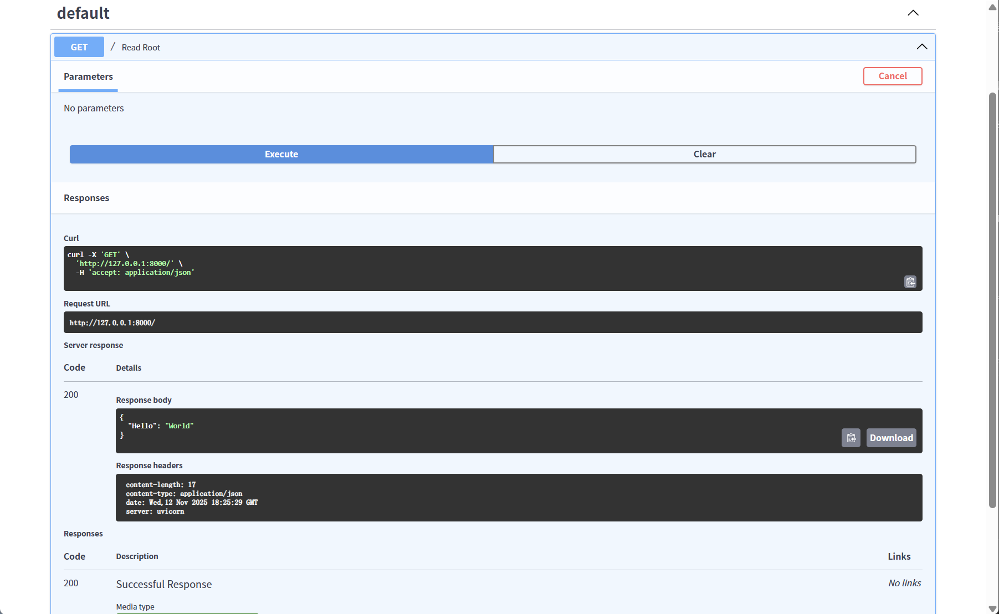
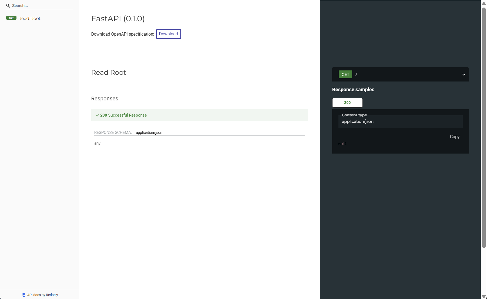

# 第一节 FastAPI 模型部署实战

在部署机器学习模型时，常见的做法是将其封装成一个可以通过 HTTP 访问的 API 服务。在 Python 社区中有许多优秀的 Web 框架，都能帮助我们构建 API。本节我们以 **[FastAPI](https://fastapi.tiangolo.com/zh/)** 为例，来对此前训练好的命名实体识别模型进行部署。

FastAPI 是基于 Starlette 和 Pydantic 构建的。Starlette 赋予了它极高的性能，足以与 NodeJS 和 Go 等语言的框架相媲美；而 Pydantic 则使其能够利用 Python 的类型提示（Type Hints）实现自动的数据校验和转换，极大地减少了烦琐的参数验证代码。除此之外，FastAPI 还有一个“杀手级”特性。它能够根据代码自动生成交互式的 API 文档（基于 OpenAPI 和 Swagger UI），方便开发者直接在页面上进行调试。同时，它还充分利用了 `async/await` 等现代 Python 特性，为开发者带来了既健壮又高效的现代化开发体验。

## 一、环境准备

安装 FastAPI 非常简单。推荐直接安装它的“全家桶”，其中包含了 FastAPI 本身以及运行它所需要的 ASGI 服务器 `uvicorn`。

```bash
pip install "fastapi[all]"
```
> `uvicorn` 是一个高性能的 ASGI (Asynchronous Server Gateway Interface) 服务器，用于在生产环境中运行 FastAPI 应用。ASGI 是现代 Python Web 框架用于与 Web 服务器通信的标准接口。

## 二、FastAPI 主要用法

### 2.1 第一个 FastAPI 应用

让我们创建一个名为 `01_test.py` 的 python 文件，从经典的 "Hello World" 开始，感受一下 FastAPI 的简洁。

```python
from fastapi import FastAPI

app = FastAPI()

@app.get("/")
async def read_root():
    return {"Hello": "World"}
```

来看看上面的代码做了哪些工作。首先，`app = FastAPI()` 创建了一个 `FastAPI` 类的实例，这个 `app` 实例将是后续构建所有 API 功能的主要入口。`@app.get("/")` 是一个路径操作装饰器，它将下面的 `async def read_root()` 函数与根路径 `/` 的 `GET` 请求绑定起来。当用户访问这个路径时，FastAPI 就会执行此函数，并将其返回的字典 `{"Hello": "World"}` 自动转换为 JSON 格式的响应。

可以在终端中运行以下命令来启动服务：

```bash
uvicorn 01_test:app --reload
```

- `01_test`: 指的是 `01_test.py` 文件。
- `app`: 就是在 `01_test.py` 文件中，由 `app = FastAPI()` 创建的那个 FastAPI 实例。`uvicorn` 需要通过这个名字找到并运行我们的应用。
- `--reload`: 这个参数会让服务器在代码发生变化后自动重启，适合在开发阶段使用。

终端会显示类似下面这样的信息，说明服务已经成功运行在 `127.0.0.1:8000`：

```bash
INFO:     Uvicorn running on http://127.0.0.1:8000 (Press CTRL+C to quit)
INFO:     Started reloader process [95664] using WatchFiles
INFO:     Started server process [84940]
INFO:     Waiting for application startup.
INFO:     Application startup complete.
```

现在，打开浏览器访问 `http://127.0.0.1:8000`，将看到返回的 JSON 结果： `{"Hello":"World"}`。

### 2.2 自动交互式 API 文档

接下来，在服务仍在运行的情况下，打开浏览器访问 `http://127.0.0.1:8000/docs`。

我们会看到一个由 Swagger UI 生成的、功能齐全的交互式 API 文档页面。如图 14-1，在这个页面中，可以查看所有的 API 端点（Endpoints）、参数和返回结构，并直接进行调用和测试。点击右上角的 “Try it out” 按钮，然后再点击蓝色的 “Execute” 按钮，页面下方会立即显示出 API 的执行结果。

<p align="center">
  
  <br />
  <em>图 14-1 FastAPI 自动生成的交互式 API 文档</em>
</p>

如图 14-2，返回的结果中甚至包含了可以直接使用的 `curl` 命令、请求 URL、服务器响应内容和响应头。这种所见即所得的调试方式能够大大提高开发效率。

<p align="center">
  
  <br />
  <em>图 14-2 在 FastAPI 文档中执行 API</em>
</p>

除此之外，FastAPI 还有另一个由 ReDoc 生成的文档地址 `http://127.0.0.1:8000/redoc`，提供了另一种风格的文档。如图 14-3 所示，ReDoc 提供了更加紧凑和文档化的视图，适合阅读和理解 API 的整体结构。

<p align="center">
  
  <br />
  <em>图 14-3 由 ReDoc 生成的 API 文档</em>
</p>

在界面顶部可以看到有个 “Download” 按钮，能够直接下载 `openapi.json` 文件。这份文件非常有用，因为它可以被许多第三方工具使用，例如：

- **客户端代码生成器**：自动生成用于调用 API 的多种语言（如 TypeScript、Java）的客户端代码。
- **API 测试工具**：如 Postman，可以直接导入规范文件，一键创建所有 API 的测试集合。

这两套文档之所以能够自动生成，是因为 FastAPI 严格遵循了 **OpenAPI 规范**（前身为 Swagger 规范），并根据代码自动生成了一份描述 API 信息的 `openapi.json` 文件。Swagger UI 和 ReDoc 都是读取这份文件并将其可视化地呈现出来的工具。

### 2.3 路由与参数处理

Web API 的本质是为特定的 URL 端点定义响应逻辑。这引出了两个基本概念：**路由**负责将请求导向正确的处理函数，而**参数**则是从请求中提取数据的方式。FastAPI 在这两个方面都提供了优雅且强大的实现。

#### 2.3.1 请求体

对于模型推理，最常见的场景是通过 POST 请求将需要预测的数据发送到服务器。在 FastAPI 中，我们使用 **Pydantic** 模型来定义请求体的结构。

首先，我们从 `pydantic` 导入 `BaseModel`，并创建一个继承自它的类 `PredictRequest` 来定义数据结构。这实际上是利用 Pydantic，通过 Python 的类型提示来定义数据规则：`text` 字段是必需的，且其值必须是字符串。FastAPI 会自动使用这个模型来校验请求数据。我们也可以用同样的方式定义更多不同类型的字段，甚至可以提供默认值使其成为可选字段。

```python
from fastapi import FastAPI
from pydantic import BaseModel

class PredictRequest(BaseModel):
    text: str
    # a: int
    # b: float
    # c: bool | None = None # 可选字段

app = FastAPI()

@app.post("/predict/")
def predict(request: PredictRequest):
    # 直接通过 request.text 访问经过校验和转换的数据
    text_to_predict = request.text
    
    # (此处调用模型)
    # result = model.predict(text_to_predict)

    return {"input_text": text_to_predict, "prediction": "some_result"}
```

在路径操作函数中，将参数 `request` 的类型声明为创建的 `PredictRequest` 模型。这样一来，FastAPI 就会自动完成一系列工作：

（1）读取请求体中的 JSON 数据。

（2）校验数据是否符合 `PredictRequest` 模型的定义（例如，`text` 字段是否存在且为字符串）。

（3）如果校验通过，将数据转换为 `PredictRequest` 对象，赋值给 `request` 参数。

（4）如果校验失败，FastAPI 会自动返回一个 HTTP 422 错误，并附带详细的错误信息。

**代码即文档且自带校验**是这种方式的核心优势。我们不再需要编写 `if 'text' not in data:` 或 `isinstance(data['text'], str)` 这样的防御性代码，因为 FastAPI 和 Pydantic 已经自动处理了上述所有数据校验和转换工作。

#### 2.3.2 查询参数

如果我们的 API 需要通过 URL 查询字符串（如 `?key=value`）来接收参数，只需在路径操作函数中以普通函数参数的形式声明即可。

```python
# 示例: http://127.0.0.1:8000/search/?query=你好
@app.get("/search/")
async def search(query: str):
    return {"query": query}

# 也可以提供默认值，使其成为可选参数
# 示例: http://127.0.0.1:8000/users/ 或者 http://127.0.0.1:8000/users/?skip=10
@app.get("/users/")
async def read_users(skip: int = 0, limit: int = 10):
    return {"skip": skip, "limit": limit}
```

FastAPI 会自动识别出 `query`, `skip`, `limit` 是查询参数，并利用类型提示进行转换和校验。

#### 2.3.3 路径参数

有时，参数是 URL 路径的一部分（例如用户的 ID）。FastAPI 使用与 Python 格式化字符串相同的语法来声明路径参数。

```python
# 示例: http://127.0.0.1:8000/items/123
@app.get("/items/{item_id}")
async def read_item(item_id: int):
    # item_id 会被自动校验为整数
    return {"item_id": item_id}
```

可以同时使用路径参数、查询参数和请求体，FastAPI 会自动区分它们。

### 2.4 模型部署 API 模板

现在，我们来将所有知识点整合起来，创建一个完整的、可以用于模型部署的 API 代码模板。

```python
# 01_main.py

import logging
from fastapi import FastAPI, HTTPException
from pydantic import BaseModel
import json

# --- 1. 应用与日志配置 ---
logging.basicConfig(level=logging.INFO)
logger = logging.getLogger(__name__)

app = FastAPI(
    title="AI 模型API",
    description="一个用于演示如何使用FastAPI部署模型的简单API",
    version="1.0.0",
)

# --- 2. 请求体数据模型 ---
class PredictRequest(BaseModel):
    text: str
    model_name: str | None = None # 可选字段

# --- (模拟)模型加载 ---
# from your_model_module import Model
# model = Model()
# logger.info("模型加载成功")

# --- 3. 预测逻辑路由 ---
@app.post("/predict/")
async def predict(request: PredictRequest):
    """
    接收文本输入，并返回模型预测结果。
    """
    try:
        # 参数过滤与校验
        text = request.text.strip()
        if not text:
            raise HTTPException(status_code=400, detail="输入文本不能为空")

        logger.info(f"接收到请求: {text}")

        # 调用模型获取预测结果 (此处为模拟)
        # prediction = model.predict(text)
        prediction = f"模型对'{text}'的预测结果"
        logger.info(f"模型预测结果: {prediction}")
        
        # 结果转换与输出
        response_data = {
            "code": 0,
            "message": "成功",
            "data": {
                "input_text": text,
                "prediction": prediction
            }
        }
        return response_data

    except Exception as e:
        # 全局异常捕获
        logger.error(f"服务器内部错误: {e}", exc_info=True)
        raise HTTPException(status_code=500, detail=f"服务器内部错误: {e}")

# --- 4. 其他辅助路由 ---
@app.get("/")
async def root():
    return {"message": "欢迎使用 API"}

@app.get("/health")
async def health_check(verbose: bool = False):
    """
    健康检查，可附带详细信息。
    """
    if verbose:
        return {"status": "ok", "details": "All systems operational."}
    return {"status": "ok"}
```

这个模板包含了日志记录、参数校验、异常处理和结构化的 JSON 返回，是一个非常好的起点。我们来逐步解析一下：

（1）**应用与日志配置**：在创建 `FastAPI` 实例时，传入 `title`、`description` 和 `version` 等参数，这些信息将显示在自动生成的 API 文档中。同时，我们配置了基本的日志记录。

（2）**请求体数据模型**：与前面类似，使用 Pydantic 模型 `PredictRequest` 来定义输入数据的结构。

（3）**预测逻辑路由**：这是 API 的核心。

-   在函数内部，先对输入参数进行业务层面的校验，例如检查文本是否为空。对于不合法的请求，使用 `HTTPException` 来中断执行并向客户端返回一个标准的 HTTP 错误响应。这是一种比直接 `return` 错误信息更规范的做法。
-   使用 `try...except` 块捕获了所有预料之外的异常。可以防止服务器因内部代码错误而崩溃，并向客户端返回一个标准的 500 内部错误，同时在服务器日志中记录详细的错误信息以供排查。

（4）**其他辅助路由**：提供一个根路径用于返回信息，以及一个 `/health` 路径用于监控服务。`/health` 路由还包含了一个可选的布尔查询参数 `verbose`，演示了如何在模板中轻松集成查询参数。这是一个很好的工程实践。

## 三、部署命名实体识别模型

对 FastAPI 的使用有了一定了解后，来尝试使用 FastAPI 为之前训练的 **NER 模型**创建一个 API 服务。

[NER 模型推理部署完整代码](https://github.com/datawhalechina/base-nlp/tree/main/code/C14/ner_deployment)

### 3.1 项目结构准备

第一步是合理地组织项目文件。创建一个新的部署目录 `ner_deployment`，并从 `C8` 项目中复制必要的文件。

最终的目录结构如下：

```text
ner_deployment/
├── checkpoints/          # 存放训练好的模型文件和配置文件
│   ├── best_model.pth
│   └── config.json
├── data/                 # 存放词汇表和标签文件
│   ├── vocabulary.json
│   └── categories.json
├── src/                  # 模型预测所需的核心源代码
│   ├── __init__.py
│   ├── models/
│   │   ├── __init__.py
│   │   ├── base.py
│   │   └── ner_model.py
│   ├── tokenizer/
│   │   ├── __init__.py
│   │   ├── base.py
│   │   ├── char_tokenizer.py
│   │   └── vocabulary.py
│   └── utils/
│       ├── __init__.py
│       └── file_io.py
├── main.py               # FastAPI 应用代码
└── predict.py            # 模型预测器代码
```

各部分的作用分别是：

- **checkpoints/** 和 **data/**: 与原 `C8` 项目结构一致，分别存放模型权重、配置文件以及词汇表。
- **src/**: 从 `C8` 项目复制的核心源代码，但经过精简，只保留了预测所必需的模块（如模型定义、分词器等）。
- **predict.py**: 从 `code/C8/06_predict.py` 复制并重命名而来，封装了模型加载和预测的 `NerPredictor` 类。
- **main.py**: 我们为本次部署新创建的 FastAPI 服务入口文件。

### 3.2 编写 FastAPI 服务代码

`predict.py` 中的 `NerPredictor` 类已经封装好了加载和预测的逻辑，我们可以直接在 FastAPI 应用中使用它。

下面是 `main.py` 的完整代码：

```python
# code/C14/ner_deployment/main.py

import logging
from fastapi import FastAPI, HTTPException
from pydantic import BaseModel
from predict import NerPredictor

# --- 全局配置 ---
logging.basicConfig(level=logging.INFO)
logger = logging.getLogger(__name__)

MODEL_DIR = "./checkpoints"

# --- 数据模型定义 ---
class NerRequest(BaseModel):
    text: str

# --- FastAPI 应用初始化 ---
app = FastAPI(
    title="命名实体识别 API",
    description="部署 NER 模型",
    version="1.0.0"
)

# --- 模型加载 ---
@app.on_event("startup")
async def startup_event():
    logger.info(f"开始加载模型，来源: {MODEL_DIR}")
    app.state.predictor = NerPredictor(model_dir=MODEL_DIR)
    logger.info("模型加载成功！")


# --- API 路由定义 ---
@app.post("/predict/ner")
async def predict_ner(request: NerRequest):
    """
    接收文本，返回命名实体识别结果。
    """
    try:
        text = request.text.strip()
        if not text:
            raise HTTPException(status_code=400, detail="输入文本不能为空")

        logger.info(f"接收到NER请求: '{text}'")
        
        predictor = app.state.predictor
        entities = predictor.predict(text)

        logger.info(f"识别出实体: {entities}")

        return {
            "code": 0,
            "message": "成功",
            "data": {
                "text": text,
                "entities": entities
            }
        }
    except Exception as e:
        logger.error(f"NER预测时发生错误: {e}", exc_info=True)
        raise HTTPException(status_code=500, detail=f"服务器内部错误: {e}")

@app.get("/health")
async def health_check():
    return {"status": "ok"}

@app.get("/")
async def root():
    return {"message": "欢迎使用命名实体识别 (NER) API"}
```

在前面 API 模板的基础上，当前代码的主要改动在于**模型的加载与管理**。模板中我们只是用注释模拟模型加载的过程，而在这里则利用 FastAPI 的两个核心特性进行了真正的实现：

- **`@app.on_event("startup")`**：这是一个 FastAPI 的事件处理器。被它装饰的函数会在应用服务器启动时执行且仅执行一次。对于机器学习模型这类需要在启动时完成的耗时操作（如加载权重文件到内存），这里是最佳的执行位置，避免了在每次收到请求时都重复加载模型，从而提高后续请求的响应速度。

- **`app.state.predictor`**：在 `startup_event` 函数中，将初始化好的 `NerPredictor` 实例存储在了 `app.state` 对象里。`app.state` 是 FastAPI 提供的一个用于在应用各处共享状态的属性。通过这种方式，模型实例只在启动时创建一次，之后任何路径操作函数（如 `predict_ner`）都可以方便地从中获取到这个已经加载好的模型实例，实现高效复用。

### 3.3 启动与测试

（1）**启动服务**：

在 `ner_deployment` 目录下，运行命令：
```bash
uvicorn main:app --reload
```

（2）**使用 `curl` 测试**：

打开一个新的终端，发送一个 POST 请求：

```bash
curl -X POST "http://127.0.0.1:8000/predict/ner" -H "Content-Type: application/json" -d "{\"text\":\"患者自述发热、咳嗽，伴有轻微头痛。\"}"
```

> 在 Windows PowerShell 中，`curl` 是 `Invoke-WebRequest` 命令的别名，它的参数格式与标准 `curl` 不同，直接运行以上命令会报错。推荐在 `cmd` 中执行此命令。

应该会收到类似下面的 JSON 响应（格式化后）：

```json
{
    "code": 0,
    "message": "成功",
    "data": {
        "text": "患者自述发热、咳嗽，伴有轻微头痛。",
        "entities": [
            {
                "text": "发热",
                "type": "sym",
                "start": 4,
                "end": 6
            },
            {
                "text": "咳嗽",
                "type": "sym",
                "start": 7,
                "end": 9
            },
            {
                "text": "头",
                "type": "bod",
                "start": 14,
                "end": 15
            }
        ]
    }
}
```

通过这个实战案例，我们成功地将一个具体的 NLP 模型封装成了一个健壮、高效、且带有交互式文档的 API 服务。
