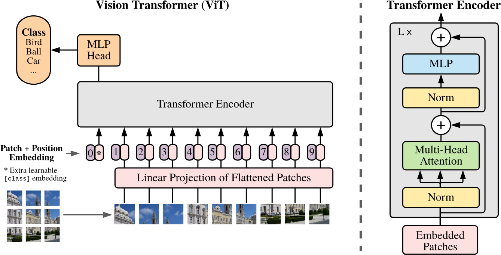
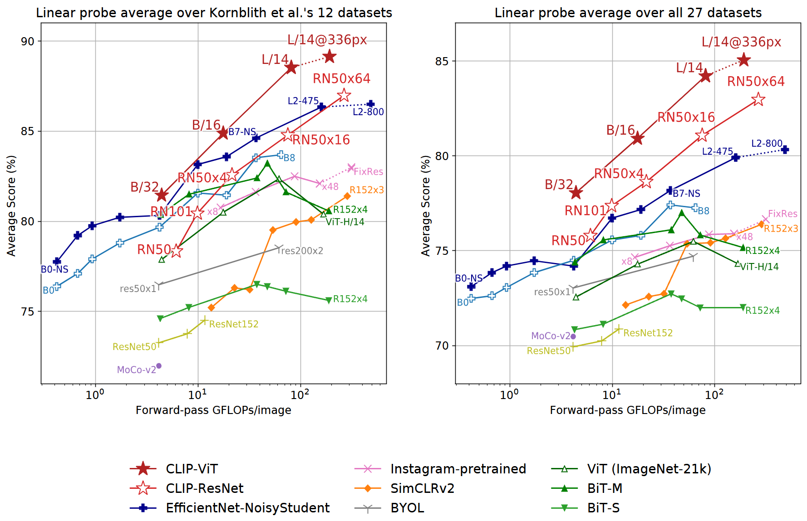
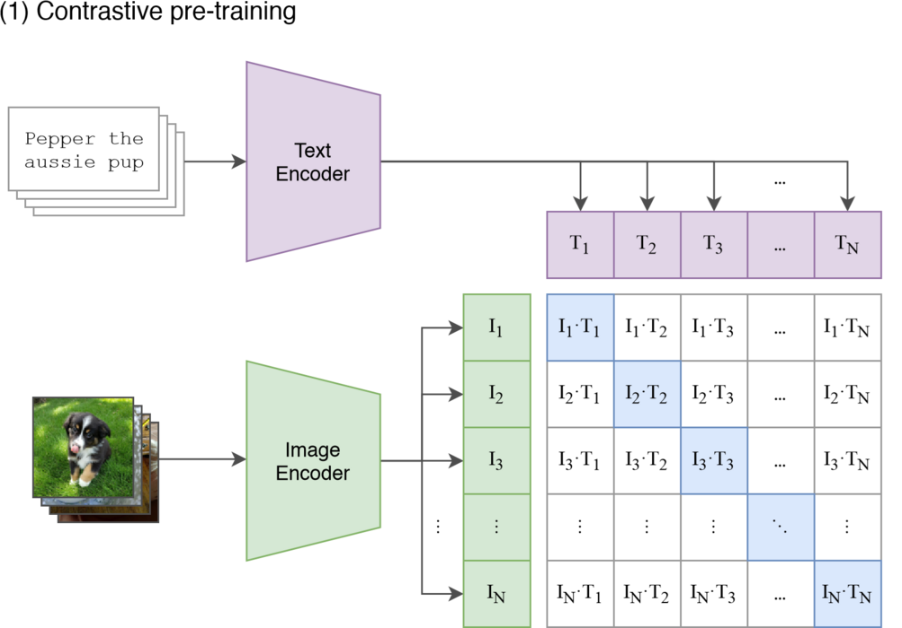
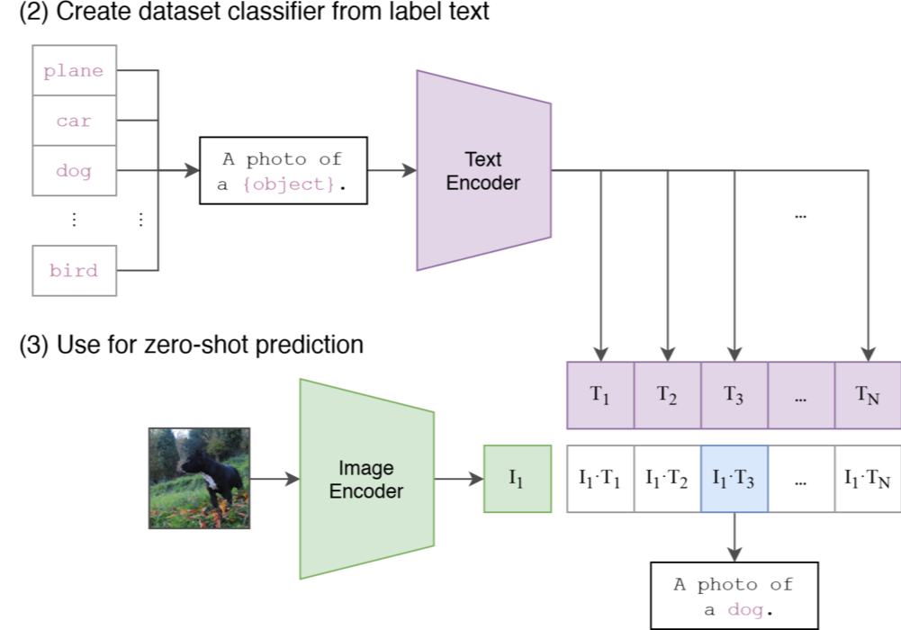

# 第二节 图文多模态

虽然多模态领域涵盖了音频、视频、3D 点云、热成像等多种数据形式，且“多模态”的边界正在不断拓展，但**图文（Image-Text）**始终是目前研究最深入、应用最广泛，也是最能体现跨模态交互逻辑的基础组合。本节我们将深入探讨两个具有代表性的模型架构，分别是将 Transformer 引入视觉领域的 **ViT**，以及连接文本与图像语义的 **CLIP**。

## 一、视觉的 Transformer 化

在过去十年里，计算机视觉领域长期以 CNN（卷积神经网络，如 ResNet）为主流，而 NLP 领域自 2017 年后则由 Transformer 主导。虽然两者都能通过网络设计获得全局信息，但在基础算子的特性上仍有明显区别。2020年，Google 提出了 **ViT (Vision Transformer)** [^1]，**既然 Transformer 擅长处理 Token 序列，能不能把图像切成 Patch（图像块），把每个 Patch 当作一个 Token，直接用 Transformer 来做图像识别？**

### 1.1 序列化图像

Transformer 的标准输入是 1D 向量序列，而图像是 2D 网格。ViT 的处理方式非常直接且“暴力”，具体步骤如下：

（1）**Patch Embedding（把图像变成 Token，见图 19-5 左下）**：将图像 $\mathbf{x}\in\mathbb{R}^{H\times W\times C}$ 切分为 $N$ 个固定大小的 Patch（如 $P\times P \times C$），展平后得到 $\mathbf{x}_p\in\mathbb{R}^{N\times(P^2\cdot C)}$，其中

$$
N=\frac{H\cdot W}{P^2} \tag{19.1}
$$

然后用一个**可学习的线性投影** $\mathbf{E}\in\mathbb{R}^{(P^2\cdot C)\times D}$ 把每个 Patch 映射为 $D$ 维向量（**图 19-5 中的粉色长条 "Linear Projection..."**）。这一步在实现上等价于一个 **kernel=$P$、stride=$P$** 的卷积（把每个 patch “一次性”投到 $D$ 维）。

（2）**特殊的 `[CLS]` Token（全局聚合器，见图 19-5 左下角标 * 的紫色胶囊）**：借鉴 BERT，在序列开头拼接一个可学习的分类令牌 $\mathbf{x}_{class}$。它更像一个“读写全局信息的槽位”，通过自注意力在层间不断从各个 patch 聚合信息。最终，我们只用该位置对应的输出向量（**图 19-5 左上角的 "Class" 黄色框**）来代表整张图像进行分类。

> 假设图像尺寸为 $224\times224$，Patch 大小 $P=16$，则会切分出 $14\times14=196$ 个 Patch。加上这个额外的 `[CLS]` Token 后，输入 Transformer 的**序列总长度**变为 $196+1=197$。

（3）**位置编码（保留空间信息，见图 19-5 紫色标号圆圈）**：给序列加上可学习的 1D 位置编码 $\mathbf{E}_{pos}\in\mathbb{R}^{(N+1)\times D}$。

<p align="center">
  
  <br />
  <em>图 19-5 ViT 架构概览（左侧为 Patch Embedding 流程，右侧为 Transformer Encoder 内部结构）</em>
</p>

最终，输入 Transformer 的**向量序列** $\mathbf{z}_0$ 如下：

$$
\mathbf{z}_0=[\mathbf{x}_{class};\mathbf{x}_p^1\mathbf{E};\mathbf{x}_p^2\mathbf{E};\dots;\mathbf{x}_p^N\mathbf{E}] + \mathbf{E}_{pos} \tag{19.2}
$$

其中：

- $\mathbf{x}_{class}$：特殊的分类 Token 向量。
- $\mathbf{x}_p^k\mathbf{E}$：第 $k$ 个图像 Patch 经过线性投影后的嵌入向量。
- $\mathbf{E}_{pos}$：与序列长度对应的位置编码，用于补充 Transformer 缺失的位置信息。


### 1.2 ViT 模型架构细节

ViT 尽可能保持了 Transformer 的原貌，这种“无修饰”的设计反而使其具有极强的扩展性。我们可以对照图 19-5 中右侧的 **Transformer Encoder** 部分。

（1）**Encoder-only + Pre-Norm**：ViT 沿用了标准的 Transformer Encoder 架构（即 MSA 和 MLP 的堆叠），不过它将 **Layer Norm 移到了每个子层的输入位置（Pre-Norm）**。这种设计与之前学习过的 GPT-2/3 一致。

（2）**分类读出**：用分类 token 的输出做表征：

$$
\mathbf{y}=\mathrm{LN}(\mathbf{z}_L^{0}) \tag{19.3}
$$

其中 $\mathbf{z}_L^{0}$ 表示 **Transformer Encoder 最后一层（第 $L$ 层）** 输出序列中的第 0 个 token（即 `[CLS]` 位置）的向量。实践中， $\mathbf{y}$ 会接一个 MLP 分类头来输出最终类别。论文指出，在预训练阶段这个 Head 是含有一个隐藏层的 MLP，而在微调阶段通常简化为单层线性映射。

（3）**位置编码与“高分辨率微调”的 2D 插值**：ViT 的位置编码本身是 1D 可学习向量，但当微调分辨率变化导致 $N$ 变化时，需要把预训练的 $\mathbf{E}_{pos}$ 视作 $h\times w$ 的 patch 网格再做 **2D 插值**，以适配新的 patch 网格尺寸。这也是 ViT 少数显式注入“2D 结构”的地方。也就是说假设 Patch 大小为 $16 \times 16$，预训练时图像为 $224\times224$，Patch 数量为 $14\times14=196$（即 $224/16=14$）。微调时若图像放大到 $384\times384$，Patch 数量变为 $24\times24=576$（即 $384/16=24$）。此时，我们不仅要处理序列变长的问题，还要保持空间位置的相对关系。所以，需要将原本 $14\times14$ 的位置编码矩阵“拉伸”（双线性插值）到 $24\times24$，以初始化新的位置编码。

> **为什么微调时要放大图像？**
>
> 这是一个在计算机视觉中常见的策略（效率 vs 精度权衡）。**预训练阶段**由于数据量巨大，为了节省计算成本，通常使用标准分辨率。而**微调阶段**面向下游特定任务，数据量相对较小，此时使用更高分辨率（如 $384 \times 384$）可以让模型“看清”更多细节，以追求更高的精度。

（4）**全局交互**：这其实就是 BERT 中“**深度双向注意力**”在图像领域的直接体现。在 BERT 中，每个 Token 在第一层就能“看见”句子中所有的其他 Token。同样地，在 ViT 中，**每个 Patch 就相当于一个 Token**。CNN 需要堆叠多层卷积才能扩大感受野看到全图，而 ViT 的自注意力机制在**第一层**就能让任意两个 Patch 进行交互。左上角的 Patch 可以直接“关注”到右下角的 Patch，无需经过层层传递，通过 Attention 矩阵实现了一步到位的**全局视角**。但这种能力的代价是计算量，标准 Self-Attention 的复杂度是序列长度 $N$ 的平方（$O(N^2)$）。Patch 越小（$P$ 越小），序列长度 $N$ 就越大（$N \propto 1/P^2$），计算量就会呈平方级爆炸（$O(1/P^4)$）。这也是为什么 ViT 通常不把 Patch 设置得太小的原因。

### 1.3 关键特性

ViT 的设计哲学与 CNN 截然不同，首先体现在**弱归纳偏置 (Inductive Bias)** 上。所谓归纳偏置，就是模型在处理数据时**预先带有的“偏见”或“假设”**。CNN 天然假设图像具有**局部性**（相邻像素有关联）和**平移等变性**（猫在左上角和右下角都是猫）等结构先验，就像是带着“有色眼镜”看图，所以 CNN 在小数据上也能快速抓住重点，更容易泛化。而 ViT 的自注意力是**全局**的，它把图像看作一串长长的序列，显式的 2D 结构只在**切 patch**与**位置编码插值**这两处出现。这就好比 ViT 是一张白纸，模型无法预先“知道”像素的空间规则，需要更多数据去“学会”稳定的空间与语义模式。

> **空间与语义模式**
>
> **空间模式**指像素点如何在空间上组成有意义的几何结构（如“圆形”通常由连续的弧线像素组成，“眼睛”通常位于“鼻子”上方），CNN 通过卷积核的局部连接天然假设了这种相邻关系，而 ViT 最初是一张白纸，必须靠大量数据自己发现“相邻的 Patch 往往属于同一个物体”这一规律。**语义模式**则指图像内容的高层含义及其组合规则，例如“蓝色的上方区域”通常是“天空”，“两个尖耳朵 + 胡须”通常代表“猫”。ViT 不仅要学会识别这些物体，还要学会跨越长距离关注它们的关联（如鸟的头和尾巴虽然相距很远，但共同定义了“鸟”这个概念）。

这种弱归纳偏置的设计虽然增加了学习难度，但也带来了**架构的统一性 (Unified Architecture)**。ViT 的最大贡献在于证明了 **Transformer 是一个通用的计算原语**。在 ViT 之前，CV 领域由 CNN 统治，NLP 领域由 Transformer 统治，两者的模型设计思路完全不同。ViT 出现后，CV 和 NLP 终于可以在**底层架构**上实现统一（都用 Transformer 处理 Token 序列）。这种统一性不仅简化了模型设计，更为后续的多模态大模型提供了实现路径。图像和文本都能被变成 Token 喂给 Transformer，那么在一个模型里同时处理它们**就有了可能性**。归纳偏置的减弱同时也导致了 ViT 的**数据饥渴 (Data Hungry)** 特性。在中小数据集（如 ImageNet-1k）从头训练时，ViT 往往不如同规模的 CNN。但当在超大规模数据（如 ImageNet-21k、JFT-300M）上预训练后，再迁移到下游任务，ViT 会呈现更强的**扩展性（scale 越大越吃香）**。总结起来就是因为 ViT 的归纳偏置更弱、需要从数据里学到“空间结构 + 语义组合”这套规则，所以更依赖大规模预训练数据来把泛化能力堆起来。

## 二、连接图文的 CLIP 架构

2021年，OpenAI 紧随其后发布了 **CLIP (Contrastive Language-Image Pre-training)** [^2]。如果说 ViT 统一了视觉的模型架构，那么 CLIP 就统一了图文的**语义空间**。

### 2.1 CLIP 的架构与原理

ViT 虽然实现了图像与文本在**底层架构**上的统一，但这仅仅是第一步。尽管模型能“吃”进去图像和文本，但它并不理解“一张猫图”和“单词 Cat”之间有什么联系。要打破这层隔阂，我们需要让这两个模态在**语义空间**上实现对话。而实现这一对话的关键就是 **Embedding**，它能够将高维、非结构化的数据（图片、文字）映射到一个低维的、稠密的数学空间中。在多模态任务中，仅仅分别得到图像向量和文本向量是不够的。我们还需要让这两个向量在**同一个空间**中具有几何意义上的关联，这就是**语义对齐（Alignment）**。多模态学习的理想状态下，一张“猫”的图片生成的向量 $V_{img}$ 应该与单词“Cat”生成的向量 $V_{text}$ 在空间中距离非常近，即夹角小且相似度高。面对图像和文本原本处于两个完全不同异构特征空间的挑战，CLIP 的目标就是解决如何让模型学会将它们对齐。

（1）双塔结构

为了实现上述目标，CLIP 采用了经典的**双塔结构**，但在具体设计上不仅追求特征的表达能力，更注重大规模训练的效率。对于负责将图像编码为特征向量的**图像编码器（Image Encoder）**，OpenAI 探索了经过改进的 ResNet 和 ViT 两种架构。ResNet 版本在 ResNet-50 的基础上引入了 **ResNet-D** 的改进，并采用**抗混叠下采样（anti-aliased downsampling）**来减少下采样带来的信息折叠；同时将末端的**全局平均池化**替换为**注意力池化**，以更好地聚合全局特征。ViT 版本则基本遵循原始 ViT 的实现，只做了很小的改动。仅在 **patch embedding 和 position embedding** 相加后、进入 Transformer 之前增加一个额外的 **LayerNorm**，并使用了稍微不同的初始化方案以提升训练稳定性。如图 19-6 所示，实验表明在同样的计算预算下，ViT 架构在相近计算预算下整体表现更优。论文也指出 **CLIP 的 ViT 系列在计算效率上大约比 CLIP ResNet 系列高 3 倍**。而对于负责将文本编码为特征向量的**文本编码器（Text Encoder）**，CLIP 选用了类似 GPT-2 的 **Decoder-only Transformer** 架构而非 BERT，通过**自注意力掩码**确保模型在编码当前词时仅能关注之前的词。文本序列以 `[SOS]` 标记开始，以 `[EOS]` 标记结束。经过 Transformer 编码后，每个词位置都会产生对应的特征向量，但 CLIP 只取最后一层 Transformer 在 `[EOS]` 标记位置的特征向量作为整句话的语义表示。这是因为 `[EOS]` 位置的特征通过自注意力机制已经聚合了整个句子的信息，能够代表整句话的语义。

<p align="center">
  
  <br />
  <em>图 19-6 CLIP 图像编码器计算效率对比：ViT vs ResNet</em>
</p>

这两个**模态塔**（图像模态塔和文本模态塔）在特征提取阶段互不干扰，分别输出图像和文本的特征向量。随后，两个向量会分别经过一个线性的投影层映射到**维度相同**的联合嵌入空间 (Joint Embedding Space) 中，并进行 L2 归一化。通过这一系列操作就可以直接计算两个向量的点积（即余弦相似度），来衡量"图"与"文"在语义上的匹配程度。

（2）对比学习

如图 19-7 所示，**对比学习（Contrastive Learning）**是 CLIP 的核心训练策略，它为双塔结构注入了“灵魂”，真正实现了**让图像和文本在同一个 Embedding 空间中实现语义对齐**。

<p align="center">
  
  <br />
  <em>图 19-7 CLIP 的对比预训练过程</em>
</p>

我们可以结合图 19-7 来完整梳理一下这个**跨模态对齐**的过程。第一步是输入一个包含 $N$ 个图文对的 Batch（图中通过叠放的输入和下标 $1 \dots N$ 来示意），图像和文本会分别通过各自的 Encoder 变成特征向量。接下来，这些原始特征会被投影到**同一个联合嵌入空间**，分别形成图像 Embedding ($I_1, I_2, \dots, I_N$) 和文本 Embedding ($T_1, T_2, \dots, T_N$)。此时，它们已经变成了“同一种语言”（都是 $D$ 维向量）。接下来进行**相似度矩阵**的构建，模型会计算这两个序列中所有向量的两两点积，生成一个 $N \times N$ 的相似度矩阵（图中右侧的网格）。其中，**对角线（蓝色块）**代表 $I_k$ 和 $T_k$ 的匹配程度，这是原始数据中真实的“图文对”，即**正样本**；而**非对角线（白色块）**代表 $I_k$ 和 $T_j (j \neq k)$ 的匹配程度（比如“猫的图”配了“描述狗的字”），这是错误的组合，即**负样本**。最后的训练目标是**最大化对角线上的数值，同时最小化非对角线上的数值**。也就是说，当模型努力让 $I_{dog} \cdot T_{dog}$ 变大时，它实际上是在高维空间中**推着**“狗的图片向量”和“Dog 单词向量”相互靠近；反之，当模型努力让 $I_{cat} \cdot T_{dog}$ 变小时，它是在让它们相互远离。通过在 4 亿对数据上重复这个过程，CLIP 最终“学会”了将视觉概念和语言概念紧密地绑定在一起。这就实现了我们最初的构想，**Embedding 不再是孤立的模态特征，而是成为了连接视觉与语言的通用货币。**

### 2.2 零样本推理与提示工程

虽然 CLIP 在预训练阶段仅仅是学习了图文对齐，但它最具革命性的特性其实是它的**零样本推理能力**。传统的计算机视觉模型通常只能识别训练时定义好的类别，一旦遇到新类别就必须重新收集数据微调模型。而 CLIP 将“分类任务”彻底重构为“**图文匹配任务**”，打破了固定类别的限制。

为了让模型更好地理解类别名称，CLIP 还引入了**提示工程**的概念。当我们需要识别一张图像是否属于某个类别（例如“狗”）时，不再是让模型输出一个类别 ID，而是让模型去判断这张图与句子“一张狗的照片”之间的相似度（如图 19-8 所示）。由于训练数据多为句子而非单词，直接输入单词往往会造成歧义（例如论文中提到的 “boxer”，既可能是“拳师犬”，也可能是“拳击手”），且与预训练数据的分布存在差异。所以，我们可以将类别标签填入一个模板句子，如 **"A photo of a {label}."**。在推理时，模型会将所有候选类别（如猫、狗、飞机）都填入模板，生成一组文本向量，然后找出与当前图像向量相似度最高的那句话，从而确定图像的类别。这种范式使得 CLIP 无需任何微调，就能直接迁移到任意的视觉分类任务中，成为一个真正的“开放词汇”分类器。

<p align="center">
  
  <br />
  <em>图 19-8 CLIP 的 Zero-Shot 推理过程</em>
</p>

### 2.3 CLIP 的局限

作为多模态领域的里程碑，CLIP 的出现打通了视觉与语言的壁垒。它生成的 Embedding 具有很强的语义线性与鲁棒性，例如在 **Stable Diffusion** 等扩散模型中，通常会使用 **CLIP/OpenCLIP 的文本编码器**将提示词变成条件向量，达到在生成过程中提供语义约束的目的。它也启发并影响了后续大量视觉语言模型，为“图文对齐 + 下游任务适配”提供了关键范式。除此之外，由于在海量且多样化的互联网数据上训练，CLIP 对图像风格、光照变化、草图甚至卡通画的鲁棒性往往强于传统仅在 ImageNet 上训练的模型。

然而，CLIP 并非完美无缺。由于它是基于“图像整体”与“文本整体”的统计相关性进行训练的，它在处理**细粒度分类**（如区分波音747与波音777，或不同品种的特定花卉）时往往表现不佳，因为这些细微差别在海量图文对中可能被淹没。同时，CLIP 在**逻辑计数**（如“数一数图中有几个红色的气球”）或**空间关系判断**（如“车在房子的左边还是右边”）方面也存在短板，这通常被归因于对比学习损失函数难以捕捉复杂的组合性语义。最后，在医学影像或遥感图像等与其预训练数据分布差异巨大的**专业领域**，CLIP 的 Zero-Shot 性能也会显著下降，通常需要进行针对性的微调。

## 三、CLIP 代码实现

> [本节完整代码](https://github.com/datawhalechina/base-nlp/blob/main/code/C19/02_clip.py)

（1）**图像与文本编码器**

理解了 CLIP 的原理后，我们尝试用 PyTorch 实现一个简化版的 CLIP 模型。**原始 CLIP 的两个编码器都是从零训练**，并且会进行 **L2 归一化 + 可学习温度（logit scale）缩放**，这里为了跑通流程与降低门槛，我们直接加载预训练的模型。第一步可以先构建**双塔结构**的两个编码器。首先是 **Image Encoder**，利用 `timm` 库可以非常方便地加载预训练的 ViT 模型。这里我们选择 `vit_small_patch16_224` 这个型号，其中 `patch16` 表示将图像切分为 $16 \times 16$ 的块，`224` 表示输入分辨率。同时开启 `pretrained=True` 让模型加载在 ImageNet 上预训练好的权重，让模型拥有基础的“看图”能力。由于 `timm` 的 ViT 默认带有用于分类的 head，为了得到我们需要的图像 embedding，会显式加一个投影层把视觉特征映射到目标 embedding 维度（这样不会误把随机初始化的分类 head 当作 embedding）。

```python
class ImageEncoder(nn.Module):
    """图像编码器"""
    def __init__(self, output_dim):
        super(ImageEncoder, self).__init__()
        # num_classes=0 会移除分类 head，输出 backbone 特征（维度为 vit.num_features）
        self.vit = timm.create_model('vit_small_patch16_224', pretrained=True, num_classes=0)
        self.proj = nn.Linear(self.vit.num_features, output_dim, bias=False)

    def forward(self, x):
        feat = self.vit(x)          # (Batch, vit.num_features)
        return self.proj(feat)      # (Batch, output_dim)
```

对于 **Text Encoder**，为了贴近原始 CLIP 使用 Decoder-only 架构的设计，我们选择 **GPT-2** 作为近似替代。不过，GPT-2 是为文本生成设计的，默认没有 Padding Token，而在处理 Batch 数据时我们要对齐长度，所以需要将它的 `pad_token` 临时设置为 `eos_token`。在获取特征时，我们取序列**最后一个非 padding token**的隐藏状态作为整句话表征。

```python
class TextEncoder(nn.Module):
    """文本编码器"""
    def __init__(self, output_dim):
        super(TextEncoder, self).__init__()
        self.tokenizer = GPT2Tokenizer.from_pretrained('gpt2')
        # 解决 GPT-2 无 pad_token 的问题，将其设为 eos_token
        self.tokenizer.pad_token = self.tokenizer.eos_token
        self.model = GPT2Model.from_pretrained('gpt2')
        self.proj = nn.Linear(self.model.config.hidden_size, output_dim, bias=False)

    def forward(self, texts):
        inputs = self.tokenizer(texts, return_tensors='pt', padding=True, truncation=True).to(self.model.device)
        output = self.model(**inputs)
        
        # 获取最后一个非 padding token 的输出作为句子表征
        # 利用 attention_mask 找到每个样本的真实长度
        last_hidden_state = output.last_hidden_state
        attention_mask = inputs.attention_mask
        last_token_idx = attention_mask.sum(dim=1) - 1 
        
        # 从 batch 中取出对应索引的向量
        batch_idx = torch.arange(last_hidden_state.size(0)).to(last_token_idx.device)
        sent = last_hidden_state[batch_idx, last_token_idx]      # (Batch, hidden)
        return self.proj(sent)                                   # (Batch, output_dim)
```

（2）**投影与双塔对齐**

接下来我们将刚才实现的两个编码器组合起来实现一个完整的 CLIP 模型。图像编码器和文本编码器输出的特征通常是不同维度的。为了计算相似度，我们需要通过**可学习的投影层** 将它们映射到**相同的维度**（联合嵌入空间），并计算点积。

```python
class CLIP(nn.Module):
    """CLIP：双塔 + 线性投影 + 归一化 + 温度缩放"""
    def __init__(self, embed_dim):
        super(CLIP, self).__init__()
        self.image_encoder = ImageEncoder(embed_dim)
        self.text_encoder = TextEncoder(embed_dim)
        # 可学习温度（论文中用 log 参数化的 logit_scale）
        self.logit_scale = nn.Parameter(torch.log(torch.tensor(1 / 0.07)))

    def forward(self, images, texts):
        # 1) 提取 embedding
        img = self.image_encoder(images)
        txt = self.text_encoder(texts)

        # 2) L2 归一化（点积 -> 余弦相似度）
        img = torch.nn.functional.normalize(img, dim=-1)
        txt = torch.nn.functional.normalize(txt, dim=-1)

        # 3) 温度缩放后的相似度矩阵 (Batch, Batch)
        scale = self.logit_scale.exp()
        logits = scale * (img @ txt.T)
        return logits
```

（3）**数据准备**

为了演示，我们使用 CIFAR-10 数据集。由于 ViT 模型默认的输入分辨率是 224x224，而 CIFAR-10 的图片大小是 32x32，所以我们需要在预处理阶段将图片 **Resize** 到 224。同时，为了匹配预训练模型的输入分布，我们还需要使用模型特定的均值和方差（通过 `vit.default_cfg` 获取）对图像进行归一化处理。

```python
def load_cifar10_dataset(batch_size, image_size=224, root='./cifar10', mean=None, std=None):
    """加载CIFAR10数据集"""
    transform = transforms.Compose([
        transforms.Resize((image_size, image_size)), 
        transforms.ToTensor(),
        transforms.Normalize(mean=mean, std=std),
    ])

    train_dataset = CIFAR10(root=root, train=True, download=True, transform=transform)
    loader = DataLoader(train_dataset, batch_size=batch_size, shuffle=True)
    classes = train_dataset.classes
    return loader, classes
```

（4）**对比训练过程**

最后的**训练循环**需要遍历数据集以构造 Batch 数据，获取一批图像及其对应的类别名称作为文本。随后将这些图像和文本同时输入模型，生成 $N \times N$ 的相似度矩阵 `logits`。由于第 $i$ 张图对应的正是第 $i$ 个文本，所以监督信号就是对角线的“匹配位置索引”，即 `targets=[0, 1, ..., N-1]`。接下来，我们分别计算“图像找文本”（行方向）和“文本找图像”（列方向）的损失，并将两者取平均值作为最终的优化目标。

```python
if __name__ == "__main__":
    device = torch.device("cuda" if torch.cuda.is_available() else "cpu")
    print(f"Using device: {device}")
    
    # 初始化模型
    clip_model = CLIP(embed_dim=512).to(device)
    clip_model.text_encoder.model.to(device)

    cfg = clip_model.image_encoder.vit.default_cfg
    mean = cfg['mean']
    std = cfg['std']
    data_root = os.path.join(os.path.dirname(__file__), "cifar10")
    dataset, classes = load_cifar10_dataset(batch_size=4, root=data_root, mean=mean, std=std)
    
    # 模拟训练循环
    for i, (images, labels) in enumerate(dataset):
        images = images.to(device)
        # 将标签转换为对应的文本描述 (例如 label 0 -> "airplane")
        texts = [classes[label.item()] for label in labels]

        # 前向计算得到相似度矩阵
        logits = clip_model(images, texts) 
        
        # 构造目标标签
        targets = torch.arange(logits.shape[0]).to(device)
        
        # 计算损失
        loss_i = nn.CrossEntropyLoss()(logits, targets)
        loss_t = nn.CrossEntropyLoss()(logits.T, targets)
        loss = (loss_i + loss_t) / 2

        print(f"Batch {i}: Loss = {loss.item():.4f}")

        # 仅演示前几个batch
        if i >= 2: break
```

输出如下：

```bash
Batch 0: Loss = ...
Batch 1: Loss = ...
Batch 2: Loss = ...
```

## 小结

回顾第一节提到的**多模态机器学习五大挑战**（表征、转换、对齐、融合、协同学习），本节介绍的 **ViT 解决了“表征”的统一性**，它打破了 CNN 对视觉的统治，证明 Transformer 能作为通用的计算原语，通过 Patch Embedding 将图像“序列化”为 Token，从而在底层架构上与语言达成一致。而 **CLIP 则解决了“对齐”的普适性**，利用对比学习将异构的图文映射到同一**联合嵌入空间**，让 Embedding 真正成为连接不同模态的“桥梁”，无需微调即可实现零样本迁移。通过本节的代码实践，我们也亲手实现了这种“双塔+对比损失”的简洁架构。尽管 CLIP 在细粒度理解和复杂逻辑上仍有短板，但它为后续的**多模态生成**与**复杂推理**提供了关键的语义地基。

## 参考文献

[^1]: [Dosovitskiy, A., Beyer, L., Kolesnikov, A., et al. (2020). *An image is worth 16x16 words: Transformers for image recognition at scale*. ICLR.](https://arxiv.org/abs/2010.11929)

[^2]: [Radford, A., Kim, J. W., Hallacy, C., et al. (2021). *Learning transferable visual models from natural language supervision (CLIP)*. ICML.](https://arxiv.org/abs/2103.00020)
