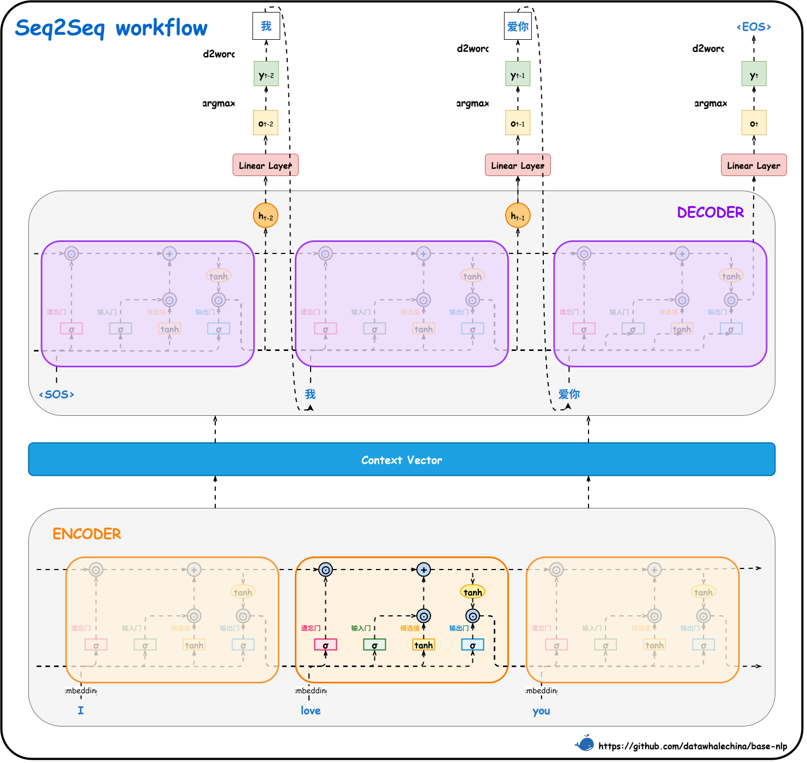

# 第一节 Seq2Seq 架构

前面我们已经学习了如何使用 RNN 和 LSTM 处理序列数据。这些模型在三类任务中表现出色：

- **多对一（Many-to-One）**：将整个序列信息压缩成一个特征向量，用于文本分类、情感分析等任务。
- **多对多（严格对齐，Many-to-Many, Aligned）**：要求**输入序列和输出序列的长度必须相等**，为每一个输入词元（Token）按顺序生成一个对应的输出标签，属于“字字对应”的标注任务，如词性标注、命名实体识别等。
- **一对多（One-to-Many）**：从一个固定的输入（如一张图片、一个类别标签）生成一个可变长度的序列，例如图像描述生成、音乐生成等。

但是，在自然语言处理中，还存在一类更复杂的、被称为**多对多（不对齐，Many-to-Many, Unaligned）** 的任务。不同于前者，这类任务的**输入序列和输出序列不仅长度通常不相等，且元素之间没有严格的一对一映射关系**。也就意味着模型不能“边读边写”，而是必须先完整接收整个输入序列并在内部形成全局理解后，再重新组织生成输出。最典型的例子就是**机器翻译**，比如将“我是中国人”（3个词）翻译成 "I am Chinese"（3个词），但 “我爱人工智能”（3个词）翻译成 "I love artificial intelligence"（4个词）。

> 此处将“人工智能”视为单个单元仅为方便举例，旨在说明输入与输出序列长度可能不等的概念，不代表严格的分词标准。

对于这类问题，简单的 RNN 或 LSTM 架构难以胜任。为了解决这一挑战，2014年，研究者们提出了**序列到序列（Sequence-to-Sequence, Seq2Seq）** 架构，它成功地将一种通用的**编码器-解码器（Encoder-Decoder）** 架构应用于序列转换任务 [^1][^2]。该架构一经提出，便在机器翻译、文本摘要、对话系统等领域取得了巨大成功。

## 一、Seq2Seq 详解

Seq2Seq 架构借鉴了自编码器的结构，但对其核心目标进行了关键的**泛化**：它不再要求解码器的输出与编码器的输入相同，而是要生成一个全新的、与输入语义相关的**目标序列**。

### 1.1 从自编码器到 Seq2Seq

要理解 Seq2Seq，可以先从一种更基础的、同样使用编码器-解码器思想的无监督神经网络**自编码器（Autoencoder）** 说起。自编码器主要由两个部分组成。其中**编码器**负责读取输入数据（如一张图片、一个向量），并将其压缩成一个低维度的、紧凑的**潜在表示 (Latent Representation)** ，这个过程可以看作是特征提取或数据压缩。**解码器**则接收这个潜在表示，并尝试将其**重构**回原始的输入数据。自编码器的训练目标是让**输出与输入尽可能地相同**。通过这个过程，模型被迫学习到数据中最具代表性的核心特征，并将这些特征编码在潜在表示中。它的目标是**数据重构**，常被用于降维、特征学习或数据去噪等任务。

### 1.2 整体架构

Seq2Seq 的核心思想借鉴了人类进行翻译的过程，即先完整地阅读并理解源语言的整个句子，形成一个综合的**语义表示**，然后基于这个语义表示开始用目标语言逐词生成译文。它的目标是从 `Input` 到 `Output` 的**转换**，而非重构。模型同样被拆分为两个组件，其中**编码器**扮演“阅读和理解”的角色，负责接收整个输入序列，并将其信息压缩成一个固定长度的**上下文向量（Context Vector）** $C$，这个向量即为输入序列的“语义概要”。**解码器**则扮演“组织语言并生成”的角色，它接收上下文向量 $C$ 作为初始信息，然后逐个生成输出序列中的词元。在最初基于 Seq2Seq 架构的模型中，编码器和解码器通常都由 RNN 或其变体（如 LSTM、GRU）构成。图 4-1 以“I love you” -> “我爱你”的翻译任务为例，展示了一个基于 LSTM 的 Seq2Seq 架构如何将编码、解码与自回归机制结合在一起的完整工作流程。

<div align="center">
  
  <p>图 4-1 Seq2Seq 详细工作流程</p>
</div>

（1）编码器 (Encoder)

编码器的任务是生成上下文向量 $C$。它可以是一个标准的 RNN（或 LSTM），逐个读取输入序列的词元 $x_1, x_2, \dots, x_T$。在每个时间步，它都会根据前一时刻的状态和当前输入来更新自身状态。对于标准 RNN，这个过程可以简化为 $h_t = f(h_{t-1}, x_t)$；而对于 LSTM，则同时更新隐藏状态和细胞状态，$(h_t, c_t) = \text{LSTM}((h_{t-1}, c_{t-1}), x_t)$。当处理完最后一个输入词元 $x_T$ 后，编码器最终的状态就被用作整个输入序列的上下文向量 $C$。对于 LSTM，上下文向量 $C$ 通常就是最后一个时间步的隐藏状态和细胞状态的元组，即 $C = (h_T, c_T)$。虽然这是最常见的做法，但上下文向量 $C$ 也可以由所有时间步的隐藏状态 $\{h_1, h_2, \dots, h_T\}$ 经过某种变换（如拼接后通过一个线性层、或取平均池化）得到，以期保留更全面的序列信息。在图中，编码器依次处理英文单词 “I”、“love”、“you” 的词嵌入向量，并将最终的状态打包成上下文向量（Context Vector）传递给解码器。由于编码器在处理时可以访问整个输入序列，所以它可以使用**双向 RNN**。通过同时从正向和反向两个方向读取序列，编码器可以为每个词元生成更全面的上下文表示，从而得到一个信息更丰富的上下文向量 $C$。

（2）解码器 (Decoder)

解码器的任务是根据上下文向量 $C$ 生成输出序列 $y_1, y_2, \dots, y_{T'}$。它同样可以使用一个标准的 RNN（或 LSTM）作为核心，但它扮演的角色是**生成器**，所以它的工作流程与编码器有显著差异。主要包括两个阶段，首先是**初始化**阶段，解码器的初始状态直接由编码器生成的上下文向量 $C$ 初始化。对于 LSTM，也就意味着初始的隐藏状态和细胞状态 $(h^{\prime}_0, c^{\prime}_0)$ 都被设置为编码器的最终状态 $C=(h_T, c_T)$，相当于将整个输入序列的“语义概要”交给了解码器。其次是**自回归生成 (Auto-regressive Generation)** 阶段，即解码器逐个生成词元，具体过程如下：
    
- 在第一个时间步，它以初始状态（对 LSTM 而言是 $(h^{\prime}_0, c^{\prime}_0)$ ）和一个特殊的起始符 `<SOS>` (Start of Sentence) 作为输入，生成第一个目标词元 $y_1$。

- 在第二个时间步，它将上一步的状态（ $(h^{\prime}_1, c^{\prime}_1)$ ）和 **上一步生成的词元 $y_1$** 作为输入，生成第二个目标词元 $y_2$。

- 这个过程不断重复，状态也随之更新。对于 LSTM，这个更新过程可以表示为 $(h^{\prime}_t, c^{\prime}_t) = \text{LSTM}((h^{\prime}_{t-1}, c^{\prime}_{t-1}), y_{t-1})$。这个过程将持续进行，直到生成一个特殊的终止符 `<EOS>` (End of Sentence) 或达到预设的最大长度。图中展示的正是这个过程，解码器首先接收 `<SOS>` 符和上下文向量，生成第一个汉字“我”；接着，它将“我”作为下一步的输入，生成“爱你”；这个过程将持续进行，直到生成句子结束符 `<EOS>` 为止。

> 解码器在生成序列时，是按照从左到右的顺序逐词生成的，它在预测当前词元时不能“看到”未来的词元。为满足因果性约束，解码器通常使用单向 RNN（或采用因果掩码的解码结构）。

在每个生成步骤中，解码器的隐藏状态 $h^{\prime}_t$ 会经过一个额外的全连接层（通常带有 Softmax 激活函数），以计算出词汇表中每个单词的概率分布，模型随即选择概率最高的单词作为当前时间步的输出。从更深层次看，解码器本身就是一个强大的**条件语言模型 (Conditional Language Model)** 。普通的**语言模型**任务是**预测下一个词元**，就像手机输入法根据输入预测后续词语一样，可以基于上文持续生成文本。**Seq2Seq 的解码器**执行的也是“预测下一个词元”的任务，但它不是凭空预测，而是**以编码器生成的上下文向量 $C$ 为初始条件**。一旦接收了 $C$，解码器就开启了它的生成过程，将这个语义概要“翻译”成目标序列。因此可以认为 **Seq2Seq 的本质就是编码器（用于理解和压缩信息）加上条件语言模型（用于在特定条件下生成信息）**。如果去掉编码器，只保留解码器部分，此时的模型不再接收外部的上下文向量 $C$ 作为条件，它可视为仅基于自身前缀（提示词）的 **decoder-only 语言模型**，即根据已有前缀预测下一个词元。例如，给定一个起始词元或提示前缀，它可以自回归地生成后续词元，写出完整的句子或段落。这与 **GPT (Generative Pre-trained Transformer)** 等现代大语言模型的训练范式一致，它们采用解码器（“Decoder-only”）架构，以“预测下一个词”为目标在海量文本上预训练，使用时通过提示词进行条件化生成，学习并利用语言规律、事实知识与一定的推理能力。

### 1.3 实现细节与考量

在构建 Seq2Seq 模型时，除了核心架构，还有几个关键的实现细节需要注意。在词嵌入层的处理方面，编码器和解码器都需要将输入的词元 ID 转换为向量，这通常由一个 `Embedding` 层完成。这里存在一个设计选择，若源语言和目标语言的词汇表彼此独立（如未采用联合子词/合并词表的英译中），通常选择**不共享**，也就是编码器和解码器各自拥有独立的 `Embedding` 层。反之，如果源语言和目标语言词汇表有大量重叠（如文本摘要任务），或者干脆将两种语言的词汇合并成一个大词汇表，那么**共享** `Embedding` 层是可行的。共享不仅可以减少模型参数，还可能帮助模型学到两种语言之间词元的潜在联系。理论上，编码器的最终状态 $C$ 会被传递给解码器。但在实践中，为了充分利用这个上下文向量 $C$，架构设计上主要衍生出了如下两种不同的策略。

（1）**作为解码器的初始状态**

这是最经典的做法。将编码器输出的上下文向量 $C$ 经过适配层（如全连接层、`reshape`、`permute`等操作）变换后，作为解码器RNN的初始隐藏状态 $h^{\prime}_0$（以及 $c^{\prime}_0$ for LSTM）。这种方法的优点是概念直观，符合“先理解全文（生成 $C$ ），再开始生成（初始化解码器）”的逻辑。但其缺点也很明显，解码器的所有生成步骤都源于这“唯一一次”的初始信息输入。对于长序列，RNN自身的长距离依赖问题可能会导致初始状态的信息在多步传递后逐渐“稀释”或“遗忘”。

（2）**作为解码器每个时间步的输入**

还有一种方式是不改变解码器默认的零向量初始状态，将上下文向量 $C$ 作为解码器**每一个时间步**的额外输入。具体实现上，可以在第 $t$ 个时间步，将常规的词元输入 $y_{t-1}$ 经过 `Embedding` 层后得到的向量与上下文向量 $C$ 进行合并。合并的方式通常有两种，一是直接将两个向量**拼接**在一起，但这会改变输入特征的维度，需要相应地调整后续RNN层的输入大小；二是**相加**，也就是将两个向量逐元素相加，这要求词嵌入向量与上下文向量 $C$ 的维度相同，且通常需要先将二维的 $C$ 扩展成匹配的三维形状以进行广播加法。这种方式的优势是在每个生成步骤都直接“提醒”解码器全局上下文信息是什么，理论上可以更好地对抗信息遗忘。它的缺点是虽然信息在每个时间步都存在，但输入的全局信息始终是**同一个**静态向量 $C$，它仍然无法解决更深层次的“对齐”问题（即在生成某个特定词时应该重点关注输入的哪个部分）。总的来说，这两种方式都无法从根本上解决信息瓶颈问题，但这也正是它们激发后续注意力机制（Attention Mechanism）诞生的重要原因。

确立了模型架构与前向传播流程后，我们还需要定义优化目标。在训练过程中，解码器的目标是让其在每个时间步 $t$ 的输出概率分布尽可能地接近真实的目标词元 $y_t$。解码器在时间步 $t$ 的隐藏状态 $h^{\prime}_t$ 会首先经过一个全连接层（分类器），并使用 Softmax 函数计算出词汇表中每个词的概率，得到概率分布向量 $p_t$（原始输出形状通常为 `(Batch Size, Sequence Length, Vocab Size)`）。随后的损失函数（通常是**交叉熵损失 Cross-Entropy Loss**）会计算这个预测概率分布 $p_t$ 与真实目标 $y_t$ 之间的差异，它的本质是取出 $p_t$ 中对应真实词元 $y_t$ 的概率值并取负对数，即 $Loss_t = -\log p_t(y_t)$。在实际计算中，以 PyTorch 为例，通常需要调整维度（如将 `(N, L, C)` 展平或 `permute` 至 `(N, C, L)`）以适配 `CrossEntropyLoss` 接口，并配合 `ignore_index` 忽略 `<PAD>` 位置的损失以避免填充针对梯度的干扰。最终，整个序列的总损失由所有时间步的损失累加或平均得到（$Loss_{total} = \sum_{t=1}^{T'} Loss_t$），并通过反向传播算法更新模型的所有参数。在实际处理过程中，一个批次（Batch）中的序列长度往往不同。为了能够进行高效的矩阵运算，需要将它们填充（Pad）到相同的长度。此外，还需要引入一些**特殊词元**来辅助模型处理：

- `<PAD>`：填充符，用于对齐长度，在计算损失时会被忽略。
- `<SOS>` 或 `<GO>`：句子起始符，作为解码器第一个时间步的输入，启动生成过程。
- `<EOS>`：句子终止符，是解码器生成的目标之一。当模型生成它时，表示句子已完整，可以停止生成。
- `<UNK>`：未知词元。用于替换在训练词汇表中未出现过的词，增强模型的鲁棒性。

具体应用到模型输入时，**编码器输入**通常会对源语言序列进行填充，在末尾添加 `<PAD>` 以对齐长度。而**解码器输入与目标**则需要精心构造以实现“错位”训练，利用上一个真实词元预测下一个词元。假设原始目标序列为 `W, X, Y, Z`，解码器的输入需要在序列开头添加起始符 `<SOS>`（变成 `<SOS>, W, X, Y`），而解码器的目标则是在序列末尾添加终止符 `<EOS>`（变成 `W, X, Y, Z, <EOS>`）。如果长度不足，同样在末尾添加 `<PAD>` 进行对齐，且计算损失时会自动**忽略**填充位置的损失。通过这种方式，模型能够确保在每个时间步都能学到从正确的历史信息到下一个正确词元的映射关系。

## 二、训练与推理模式

### 2.1 教师强制

基于 Seq2Seq 架构的模型在训练和推理时，解码器的工作模式有很大差异。如果在训练阶段采用推理时的自回归模式（将上一时刻的预测值作为下一时刻的输入），模型初期预测不准会导致错误的预测不断被累积到后续步骤，造成收敛缓慢，且每个时间步的计算都依赖于上一步结果使得训练过程难以并行化，效率低下。为解决这些问题，Seq2Seq 引入了一种名为**教师强制 (Teacher Forcing)** [^3] 的高效训练策略。在教师强制模式下，解码器在计算第 $t$ 步的输出时，它的输入不再是上一时刻的预测值 $y^{\prime}_{t-1}$，而是直接使用数据集中真实的标签值 $y_{t-1}$，构造方式就是我们前面描述的“解码器输入”序列。通过这种方式，解码器的每个时间步都能接收到正确的历史信息，避免了误差累积，能够显著提升收敛稳定性与速度。不过需要注意，虽然对于基于 RNN 的解码器而言时间维的计算仍是串行依赖的，但在 Transformer 等非递归结构中，教师强制使训练过程可在时间步上配合适当掩码实现并行计算。

### 2.2 自回归

在模型训练完毕，进行实际的翻译或生成任务时，我们并没有“正确答案”可以喂给解码器。此时，模型必须工作在**自回归模式**下，相当于“自己教自己”。在此过程中，编码器处理输入序列生成上下文向量 $C$ 后，解码器会以 $C$ 和 `<SOS>` 为初始输入生成第一个词元 $y_1$，随后将 $y_1$ 作为下一时间步的输入生成 $y_2$，不断将上一时刻的输出作为下一时刻的输入循环此过程，直到生成 `<EOS>` 标志或达到预设的最大输出长度时停止。

> **推理效率的优化**
>
> 在朴素的自回归实现中，存在大量的重复计算。例如：
> - **第1步**：输入 `<SOS>`，RNN 内部计算 $h^{\prime}_1 = f(h^{\prime}_0, y_0)$。
> - **第2步**：输入 `<SOS>`, $y^{\prime}_1$，RNN 会**重新**计算 $h^{\prime}_1 = f(h^{\prime}_0, y_0)$，然后再计算 $h^{\prime}_2 = f(h^{\prime}_1, y^{\prime}_1)$。
> - **第3步**：输入 `<SOS>`, $y^{\prime}_1$, $y^{\prime}_2$，RNN 会**再次重新**计算 $h^{\prime}_1$ 和 $h^{\prime}_2$，然后再计算 $h^{\prime}_3$。
>
> 显然，“从头算起”的方式效率极低，更高效的实现方式是**缓存并利用上一个时间步的输出状态**。在生成第 $t$ 个词元时，只将**第 $t-1$ 个词元** $y^{\prime}_{t-1}$ 和**上一步的隐藏状态** $h^{\prime}_{t-1}$ 作为 RNN 的输入，RNN 仅执行一步计算，得到新的隐藏状态 $h^{\prime}_{t}$ 和当前词元的预测 logits，这个新的状态 $h^{\prime}_t$ 会被缓存，用于下一步的计算。通过这种方式，每个时间步都只进行一次 RNN 单元的计算。

这种在每一步都选择当前概率最高的词元作为输出的策略，被称为**贪心搜索（Greedy Search）**。它简单高效，但在某些情况下可能会导致次优解。例如，如果在某一步选择了一个局部最优但在全局看来是错误的词，这个错误可能会影响后续所有词元的生成，导致整个输出序列的质量下降。这就好比下棋时只看眼前一步的最好走法，最终却导致满盘皆输。要缓解这个问题，通常有以下两种思路：

- **提升模型能力**：通过使用更深、更复杂的模型架构（例如，从3层网络变成30层网络）和更大规模的训练数据，让模型本身在每一步做出正确预测的概率大大提高。
- **改进解码策略**：使用更复杂的解码算法，如**束搜索（Beam Search）**。它在每一步都会保留多个（而不是一个）最可能的候选序列，并在最后选择整体概率最高的序列作为最终输出，从而在全局上找到更优的解，避免“一步错，步步错”的陷阱。

## 三、PyTorch 代码实现与分析

> [本节完整代码](https://github.com/FutureUnreal/base-nlp/blob/main/code/C4/01_Seq2Seq.py)

### 3.1 标准的 Encoder-Decoder

首先，我们来构建模型的基础骨架，编码器、解码器以及将它们组合在一起的 Seq2Seq 包装器。

#### 3.1.1 编码器 (Encoder)

编码器的职责是读取输入序列并生成上下文向量。在这个示例实现中，将单向 LSTM 的最终隐藏状态 `hidden` 和细胞状态 `cell` 直接作为上下文，传递给解码器。

```python
class Encoder(nn.Module):
    def __init__(self, vocab_size, hidden_size, num_layers):
        super(Encoder, self).__init__()
        self.embedding = nn.Embedding(
            num_embeddings=vocab_size,
            embedding_dim=hidden_size
        )
        self.rnn = nn.LSTM(
            input_size=hidden_size,
            hidden_size=hidden_size,
            num_layers=num_layers,
            batch_first=True,
            bidirectional=False
        )

    def forward(self, x):
        # x shape: (batch_size, seq_length)
        embedded = self.embedding(x)
        # 返回最终的隐藏状态和细胞状态作为上下文
        _, (hidden, cell) = self.rnn(embedded)
        return hidden, cell
```

下面我们详细分析一下编码器的代码实现逻辑：

（1）**`__init__`**：

-   `self.embedding`：定义词嵌入层，将输入的词元ID（整数）映射为稠密的 `hidden_size` 维度向量。
-   `self.rnn`：定义 LSTM 层。`input_size` 和 `hidden_size` 均为 `hidden_size`，因为词嵌入向量的维度与 LSTM 隐藏状态的维度在此设计中保持一致。此处为简化演示选择单向（`bidirectional=False`）；实际工程中编码器常使用双向 RNN 以获取更充分的上下文，需要将双向状态（如拼接/线性映射）转换为解码器的初始状态。

（2）**`forward(self, x)`**：

-   输入 `x` 是一个形状为 `(batch_size, seq_length)` 的张量，代表了一批句子的词元ID序列。
-   `embedded = self.embedding(x)`：输入经过词嵌入层，形状变为 `(batch_size, seq_length, hidden_size)`。
-   `_, (hidden, cell) = self.rnn(embedded)`：`self.rnn` 处理整个嵌入序列后，会返回两个内容，其中一个是 `outputs`，包含了序列中**每一个时间步**的隐藏状态，对于编码器而言，中间步骤的输出通常不被使用，所以用 `_` 接收。二是 `(hidden, cell)`，这是一个元组，包含了整个序列**最后一个时间步**的隐藏状态和细胞状态，这就是我们需要的、概括了整个输入序列信息的**上下文向量**。
-   `return hidden, cell`：函数最终返回这两个状态，作为上下文传递给解码器。这种实现方式对应了前面实现细节中描述的最经典的做法，也就是直接使用编码器最后一个时间步的状态作为上下文向量 $C$。

#### 3.1.2 解码器 (Decoder)

解码器在每一步接收一个词元和前一步的状态，然后输出预测和新的状态。这个实现体现了为**高效推理**而设计的**单步前向传播**逻辑，即 `forward` 函数一次只处理一个时间步。

```python
class Decoder(nn.Module):
    def __init__(self, vocab_size, hidden_size, num_layers):
        super(Decoder, self).__init__()
        self.embedding = nn.Embedding(
            num_embeddings=vocab_size,
            embedding_dim=hidden_size
        )
        self.rnn = nn.LSTM(
            input_size=hidden_size,
            hidden_size=hidden_size,
            num_layers=num_layers,
            batch_first=True
        )
        self.fc = nn.Linear(in_features=hidden_size, out_features=vocab_size)

    def forward(self, x, hidden, cell):
        # x shape: (batch_size)，只包含当前时间步的token
        x = x.unsqueeze(1) # -> (batch_size, 1)

        embedded = self.embedding(x)
        # 接收上一步的状态 (hidden, cell)，计算当前步
        outputs, (hidden, cell) = self.rnn(embedded, (hidden, cell))

        predictions = self.fc(outputs.squeeze(1)) # -> (batch_size, vocab_size)
        return predictions, hidden, cell
```

下面我们继续分析一下解码器的实现逻辑：

（1）**`__init__`**：

-   `self.embedding` 和 `self.rnn`: 与编码器中的定义类似。
-   `self.fc`: 增加了一个全连接层（`Linear`），它的作用是将 LSTM 输出的 `hidden_size` 维度的隐藏状态，映射到 `vocab_size` 维度的向量上。这个向量的每一个元素对应词汇表中一个词的得分（logit），后续可以通过 Softmax 函数转换为概率。

（2）**`forward(self, x, hidden, cell)`**：这是一个**单步**的前向传播函数，其输入 `x` 是一个形状为 `(batch_size,)` 的张量，仅包含当前时间步的词元ID。

-   `x = x.unsqueeze(1)`：为了适应 `nn.Embedding` 和 `nn.LSTM` 对输入形状（需要有序列长度维度）的要求，需要给 `x` 增加一个长度为1的“伪序列”维度，使其形状变为 `(batch_size, 1)`。
-   `embedded = self.embedding(x)`：词元经过嵌入，形状变为 `(batch_size, 1, hidden_size)`。
-   `outputs, (hidden, cell) = self.rnn(embedded, (hidden, cell))`：解码器的 RNN 接收两个输入：当前步的嵌入向量 `embedded`，以及**上一步**传递过来的隐藏状态 `(hidden, cell)`。它只进行一步计算，然后返回当前步的输出 `outputs` 和更新后的状态 `(hidden, cell)`。
-   `predictions = self.fc(outputs.squeeze(1))`：RNN 的输出 `outputs` 形状是 `(batch_size, 1, hidden_size)`，需要用 `squeeze(1)` 移除长度为1的序列维度，再送入全连接层，得到形状为 `(batch_size, vocab_size)` 的最终预测。
-   `return predictions, hidden, cell`：返回当前步的预测，以及更新后的状态，用于下一步的计算。

#### 3.1.3 Seq2Seq 包装模块

这个包装模块将编码器和解码器连接起来，并负责实现**训练**时的逻辑，特别是**教师强制**。

```python
class Seq2Seq(nn.Module):
    def __init__(self, encoder, decoder, device):
        super(Seq2Seq, self).__init__()
        self.encoder = encoder
        self.decoder = decoder
        self.device = device

    def forward(self, src, trg, teacher_forcing_ratio=0.5):
        batch_size = src.shape[0]
        trg_len = trg.shape[1]
        trg_vocab_size = self.decoder.fc.out_features

        outputs = torch.zeros(batch_size, trg_len, trg_vocab_size).to(self.device)
        hidden, cell = self.encoder(src)

        # 第一个输入是 <SOS>
        input = trg[:, 0]

        for t in range(1, trg_len):
            output, hidden, cell = self.decoder(input, hidden, cell)
            outputs[:, t, :] = output

            # 决定是否使用 Teacher Forcing
            teacher_force = random.random() < teacher_forcing_ratio
            top1 = output.argmax(1)
            # 如果 teacher_force，下一个输入是真实值；否则是模型的预测值
            input = trg[:, t] if teacher_force else top1

        return outputs
```

在这个 `forward` 函数中，我们正式将编码器和解码器串联起来。它接收源序列 `src` (形状 `(batch_size, src_len)`) 和目标序列 `trg` (形状 `(batch_size, trg_len)`)，并模拟了训练过程中的一个批次计算。具体的处理流程如下：

（1）**初始化**：

-   `outputs = torch.zeros(...)`：创建一个形状为 `(batch_size, trg_len, vocab_size)` 的全零张量，用于存储解码器在每一个时间步的输出 logits。
-   `hidden, cell = self.encoder(src)`：调用编码器处理源序列 `src`，得到初始的上下文向量。`hidden` 和 `cell` 的形状均为 `(num_layers, batch_size, hidden_size)`。

（2）**启动解码**：

-   `input = trg[:, 0]`：取出目标序列 `trg` 的第一个词元（通常是 `<SOS>` 标志），作为解码器循环的起始输入。

（3）**循环解码**：

-   `for t in range(1, trg_len)`：循环从第二个词元（索引为1）开始，直到目标序列结束。
-   `output, hidden, cell = self.decoder(input, hidden, cell)`：调用解码器执行单步计算。它接收形状为 `(batch_size)` 的 `input` 和上一时刻的状态，返回当前步的预测 `output` 和更新后的状态。
-   `outputs[:, t, :] = output`：将当前步的预测存入 `outputs` 张量中。

（4）**教师强制**：

-   `teacher_force = random.random() < teacher_forcing_ratio`：以一定的概率决定是否启用教师强制。
-   `top1 = output.argmax(1)`：找出当前步预测概率最高的词元ID，得到形状为 `(batch_size)` 的张量 `top1`。
-   `input = trg[:, t] if teacher_force else top1`：这是教师强制的关键。根据 `teacher_force` 的值，选择真实的下一个词元 `trg[:, t]` 或模型自己的预测 `top1` 作为下一步的输入。无论哪种情况，下一步的 `input` 形状都将是 `(batch_size)`。
    
（5）**返回**：最终返回 `outputs` 张量，它的形状为 `(batch_size, trg_len, vocab_size)`，用于后续与真实标签计算损失。

### 3.2 高效的推理实现

在推理时，模型必须以自回归模式运行。一个最直接的实现方式是在生成每个新词元时，都将**已生成的完整序列**重新喂给解码器。例如，生成第3个词时，将 `<SOS>, y'_1, y'_2` 作为解码器输入。这种方式虽然逻辑简单，但会导致严重的**重复计算**。RNN 在处理 `y'_2` 时，会**重新**计算 `<SOS>` 和 `y'_1` 对应的隐藏状态，而这些状态在上一步其实已经计算过了。随着序列变长，这种浪费会越来越严重，导致推理效率极低。正确的做法是利用 RNN 的“记忆”能力，**缓存并传递状态**，避免重复计算。我们设计的 `Decoder` 每次只处理一个时间步，正是为了支持这种高效模式。在推理时，只需将**上一步的输出词元**和**上一步的隐藏状态**传入解码器，进行单步计算，然后用返回的新状态覆盖旧状态即可。`Seq2Seq` 类中的 `greedy_decode` 方法展示了这一过程：

```python
# ... 在 Seq2Seq 类中 ...
    def greedy_decode(self, src, max_len=12, sos_idx=1, eos_idx=2):
        """推理模式下的高效贪心解码。"""
        self.eval()
        with torch.no_grad():
            hidden, cell = self.encoder(src)
            trg_indexes = [sos_idx]
            for _ in range(max_len):
                # 1. 输入只有上一个时刻的词元
                trg_tensor = torch.LongTensor([trg_indexes[-1]]).to(self.device)
                
                # 2. 解码一步，并传入上一步的状态
                output, hidden, cell = self.decoder(trg_tensor, hidden, cell)
                
                # 3. 获取当前步的预测，并更新状态用于下一步
                pred_token = output.argmax(1).item()
                trg_indexes.append(pred_token)
                if pred_token == eos_idx:
                    break
        return trg_indexes
```

在上述实现中，模型通过**状态的传递与更新**避免了重复计算。可以看到在循环开始前，我们只调用一次编码器 `hidden, cell = self.encoder(src)` 获取初始上下文。在循环内部，每次的输入 `trg_tensor` **仅仅是上一步生成的最后一个词元** `trg_indexes[-1]`，而非整个序列。接着将这个单词元输入和**上一步的 `hidden`, `cell` 状态**送入解码器，解码器仅执行一步计算，并返回**新的 `hidden`, `cell` 状态**。这两个新状态会**覆盖**旧的状态变量，并在下一次循环中被用作输入。通过这种方式，信息流和状态在时间步之间平稳地传递，每个时间步都只进行一次必要的计算。

### 3.3 上下文向量的另一种用法

除了将上下文向量用作解码器的初始状态外，还可以将其作为解码器**每个时间步的额外输入**。这种方式可以持续地为解码器提供全局信息。下面是这种变体解码器的实现。注意 `rnn` 层的输入维度和 `forward` 函数中的**拼接**操作。

```python
class DecoderAlt(nn.Module):
    def __init__(self, vocab_size, hidden_size, num_layers):
        super(DecoderAlt, self).__init__()
        self.embedding = nn.Embedding(
            num_embeddings=vocab_size,
            embedding_dim=hidden_size
        )
        # 主要改动 1: RNN的输入维度是 词嵌入+上下文向量
        self.rnn = nn.LSTM(
            input_size=hidden_size + hidden_size,
            hidden_size=hidden_size,
            num_layers=num_layers,
            batch_first=True
        )
        self.fc = nn.Linear(in_features=hidden_size, out_features=vocab_size)

    def forward(self, x, hidden_ctx, hidden, cell):
        x = x.unsqueeze(1)
        embedded = self.embedding(x)

        # 主要改动 2: 将上下文向量与当前输入拼接
        # 这里简单地取编码器最后一层的 hidden state 作为上下文代表
        context = hidden_ctx[-1].unsqueeze(1).repeat(1, embedded.shape[1], 1)
        rnn_input = torch.cat((embedded, context), dim=2)

        # 解码器的初始状态 hidden, cell 在第一步可设为零；之后需传递并更新上一步状态
        outputs, (hidden, cell) = self.rnn(rnn_input, (hidden, cell))
        predictions = self.fc(outputs.squeeze(1))
        return predictions, hidden, cell
```

（1）**`__init__`**：

- `self.rnn = nn.LSTM(...)`：这里的主要改动是 `input_size=hidden_size + hidden_size`。因为在每个时间步，输入给 LSTM 的不再仅仅是词嵌入向量（维度 `hidden_size`），而是**词嵌入向量**与**上下文向量**（维度也是 `hidden_size`）拼接后的新向量，因此输入维度加倍。

（2）**`forward(self, x, hidden_ctx, hidden, cell)`**：

- `context = hidden_ctx[-1].unsqueeze(1).repeat(1, embedded.shape[1], 1)`：这一步是为了准备用于拼接的上下文向量。
- `rnn_input = torch.cat((embedded, context), dim=2)`：核心操作，在最后一个维度（特征维度）上，将词嵌入向量和上下文向量拼接起来，形成 RNN 的最终输入。
- `outputs, (hidden, cell) = self.rnn(rnn_input, (hidden, cell))`：将拼接后的向量送入 RNN。注意，这里传入的 `(hidden, cell)` 是解码器自身的上一步状态（初始是零向量），而不是编码器传来的上下文 `hidden_ctx`。上下文信息已经通过输入端注入了。

## 四、应用与局限

### 4.1 广泛的应用空间

Seq2Seq 架构的成功也揭示了它背后 Encoder-Decoder 框架的强大通用性。这个框架本质上定义了一个“将一种数据形态转换为另一种数据形态”的通用范式，所以它的应用远不止于文本到文本的任务。例如，在**语音识别（Audio-to-Text）**中，编码器可以是一个处理音频信号的模型（如基于RNN或卷积的模型），提取语音特征并生成上下文向量，解码器可以基于此向量生成识别出的文本序列。在**图像描述生成（Image-to-Text）**中，编码器也可以是一个卷积神经网络，负责“阅读”整张图片并提取其视觉特征，生成一个概括图片内容的上下文向量，解码器则根据该向量生成一段描述性的文字，实现“看图说话”。而在**文本到语音（Text-to-Speech, TTS）**任务中，编码器处理输入文本，解码器则生成对应的音频波形数据。此外，在**问答系统（QA）**中，模型可以将一篇参考文章和用户提问一起编码，然后解码生成问题的答案。甚至传统的分类任务也可以被“生成化”，实现**任务范式统一**。例如，文本分类任务中，可以构造一个特殊的输入（即 Prompt），引导模型直接生成类别名称。这种方式极大地统一了不同 NLP 任务的处理范式，通过替换不同的编码器和解码器实现，Seq2Seq 架构可以灵活地应用于各种跨模态的转换任务中。

### 4.2 信息瓶颈

尽管基于 Seq2Seq 架构的模型取得了巨大成功，但它也存在一个明显的缺陷——**信息瓶颈（Information Bottleneck）**。这个问题在概念上与前一章讨论的**长距离依赖**非常相似，但发生在不同的层面。其中，**长距离依赖**是 RNN **内部**的问题，指信息在**单一序列处理过程**中因梯度累乘而难以从序列开端传递到末端，LSTM 通过门控机制和细胞状态缓解了这个问题。**信息瓶颈**则是 Encoder-Decoder **架构层面**的问题，它与 RNN 内部如何传递信息无关，而在于它规定了编码器和解码器之间唯一的沟通桥梁就是一个**固定长度**的上下文向量 $C$。编码器必须将输入序列的所有信息，无论其长短，都压缩到这个向量中。可以说，编码器自身的长距离依赖问题，进一步加剧了信息瓶颈的严重性。即便编码器使用了 LSTM，能更好地在内部传递信息，但当输入句子很长时，这个最终的上下文向量 $C$ 依然很难承载全部的语义细节，模型可能会“遗忘”掉句子开头的关键信息，导致生成质量下降。这就好比让一个人将一篇长文的所有细节都总结成**一句话**，然后仅凭这一句话去复述原文，必然会丢失大量信息。

我们可以用一个更具体的例子来理解这个问题。假设在做一个对联生成的任务，上联是“两个黄鹂鸣翠柳”。在生成下联时，期望第一个词（如“一行”）能够主要参考上联的第一个词“两个”，第二个词（如“白鹭”）主要参考“黄鹂”，以此类推，形成对仗。不过，在标准的 Seq2Seq 架构中，存在两个核心问题：

- **信息稀释**：编码器将“两个”这个词的信息经过多步 RNN 传递后，在最终的上下文向量 $C$ 中可能已经变得非常微弱。

- **信息无差别（缺乏倾向性）**：解码器在生成每一个词（“一行”、“白鹭”、“上青天”）时，所依赖的全局信息都是同一个、包含了整个上联概要的上下文向量 $C$。它没有一种机制去“特别关注”或“倾向于”当前生成位置所对应的输入部分。

即使采用我们前面探讨过的**将上下文向量作为解码器每个时间步额外输入**的策略，问题依然存在。因为每个时间步输入的都是**同一个** $C$，模型仍然无法学会有选择性地、有侧重地利用输入信息，缺乏这种动态的“倾向性”。为了解决这个信息瓶颈和对齐问题，后续研究者们引入了**注意力机制**。允许解码器在生成每个词元时，都能“回头看”并动态地计算一个权重分布，重点关注输入序列的不同部分，而不是仅仅依赖于单一的上下文向量。这极大地提升了长序列任务的性能，并直接催生了后来更强大的 Transformer 模型。

---

## 参考文献

[^1]: [Sutskever, I., Vinyals, O., & Le, Q. V. (2014). *Sequence to sequence learning with neural networks*. Advances in Neural Information Processing Systems, 27.](https://proceedings.neurips.cc/paper/2014/hash/a14ac55a4f27472c5d894ec1c3c743d2-Abstract.html)

[^2]: [Cho, K., Van Merriënboer, B., Gulcehre, C., Bahdanau,D., Bougares, F., Schwenk, H., & Bengio, Y. (2014). *Learning phrase representations using RNN encoder-decoder for statistical machine translation*. Proceedings of the 2014 Conference on Empirical Methods in Natural Language Processing (EMNLP).](https://aclanthology.org/D14-1179/)

[^3]: [Bengio, S., Vinyals, O., Jaitly, N., & Shazeer, N. (2015). *Scheduled Sampling for Sequence Prediction with Recurrent Neural Networks*. Advances in Neural Information Processing Systems (NeurIPS).](https://proceedings.neurips.cc/paper/2015/hash/e995f98d56967d946471af29d7bf9a1e-Abstract.html)
