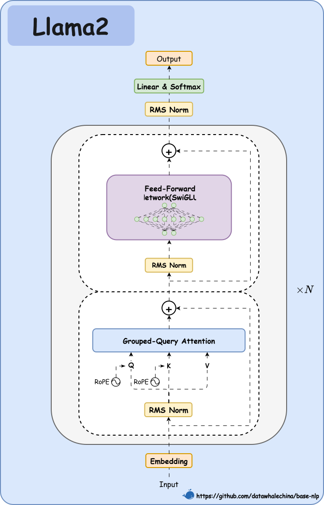
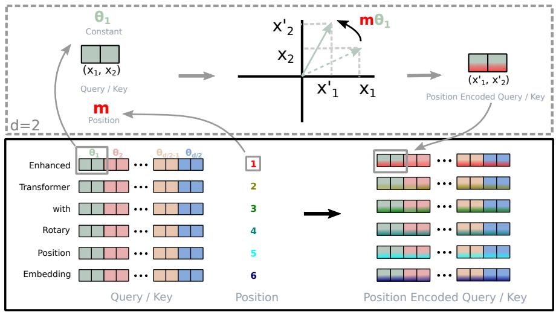

# 第一节 手搓一个大模型

前面我们已经深入学习了 **注意力机制**、**Transformer 架构**，以及基于其 Encoder 衍生的 **BERT** 和基于 Decoder 衍生的 **GPT**。接下来尝试亲手实现一个（曾经的）前沿大语言模型，看看它的模型结构究竟有什么不同。本节将聚焦于 Llama2，一个由 Meta AI 推出的开源大模型。我们不再依赖 `transformers` 库的高度封装，而是从零开始，先梳理关键思想与设计取舍，再逐步落地到代码实现。这一过程将有助于学习原理，深化对大模型内部工作的理解。

## 一、Llama2 架构总览

Llama2 遵循了 GPT 系列开创的 **Decoder-Only** 架构，也就意味着它完全由 **Transformer 解码器层**堆叠而成，天然适用于自回归的文本生成任务。如图 6-1 所示，Llama2 的核心是 N 个相同的 Transformer Block 堆叠，其内部数据流展示了多项关键设计。与经典 Transformer 的后归一化不同，输入在进入注意力层和前馈网络**之前**，都会先经过一次 `RMS Norm` 进行预归一化（Pre-Normalization），正如当初 GPT-2/3 转向 Pre-Norm 解决了深层网络的训练难题一样，这种预归一化被认为是提升大模型训练稳定性的关键。其次在组件升级上，模型支持了 `Grouped-Query Attention（GQA）`（如 Llama2-70B 采用 [^1]，小模型可视为 `n_kv_heads == n_heads` 的 MHA 特例），前馈网络采用了 `SwiGLU`，并且归一化统一使用 `RMSNorm`。除此之外，位置信息并不是在输入端与词嵌入相加，而是通过 `RoPE`（旋转位置编码）操作在注意力层内部动态地施加于查询（Q）和键（K）向量之上。最后，每个诸如注意力层和前馈网络等子层的输出都通过残差连接（`+`号）与子层的输入相加，从而完整且无损地保留了原始信息流。整个模型的数据流自下而上贯穿所有 Transformer Block，最后经过一次最终的 `RMS Norm` 和一个线性输出层，得到 Logits。

<p align="center">
  
  <br />
  <em>图 6-1：Llama2 架构示意图</em>
</p>

与原始 Transformer 解码器相比，Llama2 及其同类模型进行了一系列改进，以提升性能和训练稳定性。它的数据流可以概括为：

（1）**输入嵌入**：将 `token_ids` 转换为词向量。

（2）**N x Transformer 层堆叠**：数据依次通过 N 个相同的 Transformer Block。
- **预归一化**：在进入子层之前，先进行一次 RMSNorm。
- **注意力子系统**：包含**旋转位置编码**、**分组查询注意力（GQA）** 和 **KV 缓存**机制。
- **前馈网络子系统**：采用 **SwiGLU** 激活函数。

（3）**最终归一化与输出**：在所有层之后，进行最后一次 RMSNorm，并通过一个线性层将特征映射到词汇表 logits。

下面，我们将根据图 6-1 中 Llama2 的结构顺序，从输入端开始，逐一实现其核心组件。

## 二、关键组件详解

> [本节完整代码](https://github.com/datawhalechina/base-nlp/tree/main/code/C6/llama2)

### 2.1 预归一化

标准的 Layer Normalization 在 Transformer 中用于稳定训练，但它的计算（减去均值、除以标准差）相对复杂。为了在保证性能的同时提升计算效率，Llama2 采用了它的变体 **RMSNorm（Root Mean Square Layer Normalization）** [^2]。目的为了**简化归一化过程**，一方面**移除均值中心化**，只通过输入的均方根（Root Mean Square）对它进行缩放；另一方面**保留可学习增益**，依然保留一个可学习的 `weight` 参数 ($\gamma$)，用于在归一化后恢复模型的表达能力。公式如下，其中 $x$ 是输入向量， $\gamma$ 是可学习的缩放参数：

$$
y = \frac{x}{\sqrt{\frac{1}{n}\sum_{i=1}^{n}x_i^2 + \epsilon}} \cdot \gamma
$$

在接口定义方面，输入是一个形状为 `[batch_size, seq_len, dim]` 的张量 `x`，输出是与输入形状相同的张量，其中每个词元（`dim` 维度）都会被独立归一化。

> 之前的学习中我们已经知道，原始的文本数据首先会被分词器（Tokenizer）转换成一个由整数ID组成的序列。为了进行批处理，我们会将多个这样的序列打包在一起，形成一个形状为 `[batch_size, seq_len]` 的二维张量。随后，这个张量会经过一个词嵌入层（Embedding Layer），将每个整数ID映射成一个高维向量。这个向量的维度就是 `dim`。这样，我们就得到了一个 `[batch_size, seq_len, dim]` 形状的三维张量，这就是 Transformer Block 的标准输入。

具体代码实现（`src/norm.py`）如下：

```python
# code/C6/llama2/src/norm.py
class RMSNorm(nn.Module):
    def __init__(self, dim: int, eps: float = 1e-6):
        super().__init__()
        self.eps = eps
        self.weight = nn.Parameter(torch.ones(dim)) # 对应公式中的 gamma

    def _norm(self, x: torch.Tensor) -> torch.Tensor:
        # 核心计算：x * (x^2的均值 + eps)的平方根的倒数
        return x * torch.rsqrt(x.pow(2).mean(dim=-1, keepdim=True) + self.eps)

    def forward(self, x: torch.Tensor) -> torch.Tensor:
        out = self._norm(x.float()).type_as(x)
        return out * self.weight
```

在这里，`_norm` 方法精确地实现了 RMSNorm 的核心公式，`self.eps` 则是一个为了防止除以零而添加的小常数，保证了数值稳定性。为了确保代码的独立可用性和正确性，我们还可以进行简单的单元测试。为此添加一个 `if __name__ == "__main__"` 测试块，这是一种良好的工程实践，可以单独运行此文件来快速验证功能：

```python
# code/C6/llama2/src/norm.py
if __name__ == "__main__":
    # 准备参数和输入
    batch_size, seq_len, dim = 4, 16, 64
    x = torch.randn(batch_size, seq_len, dim)

    # 初始化并应用 RMSNorm
    norm = RMSNorm(dim)
    output = norm(x)

    # 验证输出形状
    print("--- RMSNorm Test ---")
    print("Input shape:", x.shape)
    print("Output shape:", output.shape)
```

### 2.2 旋转位置编码

我们在 Transformer 章节中已经知道，模型需要位置信息来理解词元的顺序。传统的位置编码（无论是固定的还是可学习的）是一种绝对位置编码，它为每个位置分配一个独立的向量。Llama2 采用了更先进的 **旋转位置编码（Rotary Positional Embedding, RoPE）** [^3]，它是一种**相对位置编码**。与传统位置编码通过**加法**直接注入词嵌入的方式不同，RoPE 的策略是让**位置信息不再是"加"到词嵌入上，而是在计算注意力时，通过复数"乘法"的方式"旋转"Query 和 Key 向量**。

<p align="center">
  
  <br />
  <em>图 6-2：RoPE 旋转位置编码的工作原理</em>
</p>

如图 6-2 所示，RoPE 通过复数乘法实现向量旋转。在数学原理上，将向量的每对维度 $(x_1, x_2)$ 视为复数 $x_1 + ix_2$，复数可表示为 $r e^{i\theta}$（$r$ 为模，$\theta$ 为幅角），两复数相乘时模相乘、幅角相加，即 $(r_1 e^{i\theta_1}) \cdot (r_2 e^{i\theta_2}) = r_1 r_2 e^{i(\theta_1 + \theta_2)}$，RoPE 的 `freqs_cis` 是模为 1 的复数 $e^{im\theta}$（$m$ 为位置），与 Q/K 向量相乘后得到旋转后的 $(x'_1, x'_2)$，只改变方向而不改变长度。在位置编码方面，序列中每个位置（1-6）的 Query/Key 向量被旋转不同的角度，位置越靠后旋转越大，颜色变化体现了这一点，以此将位置信息编码到向量的方向上。

**RoPE 的优势**主要体现在三个方面。第一个是**相对位置编码**，两个词元（位置 $m$ 和 $n$）旋转后的 Q/K 点积仅与相对距离 $m-n$ 相关，与绝对位置无关，这让注意力模式具备平移不变性，也就是说相距 2 个位置的词元关系，无论出现在序列何处计算方式都一致。其次是**长度外推能力**，由于依赖相对位置，模型对超出训练长度的序列仍能较好地处理位置关系。最后是**计算高效**，它通过复数乘法实现，不改变向量模长，避免了额外的归一化操作。在接口上，RoPE 的实现分为两部分：

（1）**`precompute_freqs_cis`**: 预计算一个包含旋转角度信息的复数张量 `freqs_cis`，这个张量在模型初始化时计算一次即可。它的输入包括 head 的维度 `dim`、序列最大长度 `end` 以及一个用于控制频率范围的超参数 `theta`，最终输出一个形状为 `[end, dim / 2]` 的复数张量。

（2）**`apply_rotary_emb`**: 将预计算的 `freqs_cis` 应用于输入的 Query 和 Key 向量。输入端需要传入形状为 `[batch_size, seq_len, n_heads, head_dim]` 的 Query 向量 `xq`、形状为 `[batch_size, seq_len, n_kv_heads, head_dim]` 的 Key 向量 `xk`，以及预计算的旋转矩阵切片 `freqs_cis`，它会输出旋转后的 `xq` 和 `xk`，且两者的形状保持不变。

> 我们知道，进入注意力模块的张量 `x` 的形状是 `[batch_size, seq_len, dim]`。为了实现多头注意力，首先要将这个张量通过一个线性层（例如 `wq`），它将输入从 `dim` 维投影到 `n_heads * head_dim` 维。在 Llama2 的设计中，输入维度 `dim` 恰好等于 `n_heads * head_dim`，所以这个线性层实际上是一个 `dim` 到 `dim` 的投影，其输出张量形状依然是 `[batch_size, seq_len, dim]`。关键的一步发生在之后：我们利用 `dim = n_heads * head_dim` 这一关系，通过一次 `view` 或 `reshape` 操作，将最后一个维度 `dim` 逻辑上拆分为 `n_heads` 和 `head_dim` 两个维度，从而得到 `[batch_size, seq_len, n_heads, head_dim]` 这样的四维张量。这个形状的含义是：对于每个词元，我们都计算出了 `n_heads` 个独立的、维度为 `head_dim` 的 Query 向量表示。对 Key 向量 `xk` 的处理也是完全类似的。

对应的代码实现（`src/rope.py`）如下：

（1）**`precompute_freqs_cis`**:

```python
def precompute_freqs_cis(dim: int, end: int, theta: float = 10000.0) -> torch.Tensor:
    # 1. 计算频率：1 / (theta^(2i/dim))
    freqs = 1.0 / (theta ** (torch.arange(0, dim, 2)[: (dim // 2)].float() / dim))
    # 2. 生成位置序列 t = [0, 1, ..., end-1]
    t = torch.arange(end, device=freqs.device)
    # 3. 计算相位：t 和 freqs 的外积
    freqs = torch.outer(t, freqs).float()
    # 4. 转换为复数形式 (cos(theta) + i*sin(theta))
    freqs_cis = torch.polar(torch.ones_like(freqs), freqs)
    return freqs_cis
```

其中 `torch.arange(0, dim, 2) / dim` 对应公式中的 `2i/dim`：`i` 实际遍历的是偶数维索引（长度为 `dim/2`）。

（2）**`reshape_for_broadcast`**: 辅助函数，用于将 `freqs_cis` 的形状调整为可以与 Q/K 向量进行广播乘法。

```python
def reshape_for_broadcast(freqs_cis: torch.Tensor, x: torch.Tensor) -> torch.Tensor:
    ndim = x.ndim
    shape = [d if i == 1 or i == ndim - 1 else 1 for i, d in enumerate(x.shape)]
    return freqs_cis.view(*shape)
```

（3）**`apply_rotary_emb`**:

```python
def apply_rotary_emb(
    xq: torch.Tensor,
    xk: torch.Tensor,
    freqs_cis: torch.Tensor,
) -> tuple[torch.Tensor, torch.Tensor]:
    # 将 Q/K 向量视为复数
    xq_ = torch.view_as_complex(xq.float().reshape(*xq.shape[:-1], -1, 2))
    xk_ = torch.view_as_complex(xk.float().reshape(*xk.shape[:-1], -1, 2))
    
    # 准备广播
    freqs_q = reshape_for_broadcast(freqs_cis, xq_)  # 针对 Q 的广播视图
    
    # 复数乘法即为旋转
    xq_out = torch.view_as_real(xq_ * freqs_q).flatten(3)
    
    # K 向量可能与 Q 向量有不同的头数（GQA），所以需单独生成广播视图
    freqs_k = reshape_for_broadcast(freqs_cis, xk_)
    xk_out = torch.view_as_real(xk_ * freqs_k).flatten(3)
    return xq_out.type_as(xq), xk_out.type_as(xq)
```

在这部分代码中，`torch.view_as_complex` 将 `head_dim` 维的实数向量巧妙地看作 `head_dim/2` 维的复数向量。而核心操作 `xq_ * freqs_cis` **正是旋转的实现**，因为在复数域中，两个复数相乘即表示幅角相加、模相乘，由于 `freqs_cis` 的模为 1，这个操作就等价于将 `xq_` 向量旋转 `freqs_cis` 所代表的角度。此外代码还通过分别为 Q 和 K 生成广播视图（`freqs_q` 与 `freqs_k`）来兼容 GQA 带来的形状差异。关于参数 `theta`，它是 RoPE 的“基底”，控制位置编码的频率范围，`10000.0` 是一个标准值。在工程考量上，`LlamaTransformer` 初始化时，预计算的长度通常会大于 `max_seq_len`（例如 `max_seq_len * 2`），这是为了给推理时处理更长序列提供“缓冲”，避免重新计算。我们接着对 `rope.py` 文件包含的三个核心函数进行测试：

```python
# code/C6/llama2/src/rope.py
if __name__ == "__main__":
    # 准备参数和输入
    batch_size, seq_len, n_heads, n_kv_heads, head_dim = 4, 16, 8, 2, 16
    dim = n_heads * head_dim
    n_rep = n_heads // n_kv_heads

    # --- Test precompute_freqs_cis ---
    print("--- Test precompute_freqs_cis ---")
    freqs_cis = precompute_freqs_cis(dim=head_dim, end=seq_len * 2)
    print("freqs_cis shape:", freqs_cis.shape)

    # --- Test apply_rotary_emb ---
    print("\n--- Test apply_rotary_emb ---")
    xq = torch.randn(batch_size, seq_len, n_heads, head_dim)
    xk = torch.randn(batch_size, seq_len, n_kv_heads, head_dim)
    freqs_cis_slice = freqs_cis[:seq_len]
    xq_out, xk_out = apply_rotary_emb(xq, xk, freqs_cis_slice)
    print("xq shape (in/out):", xq.shape, xq_out.shape)
    print("xk shape (in/out):", xk.shape, xk_out.shape)
```

### 2.3 分组查询注意力

标准的**多头注意力（Multi-Head Attention, MHA）** 为每个 Query 头都配备了一组独立的 Key 和 Value 头。这意味着 K 和 V 投影矩阵的尺寸以及推理时 KV 缓存的大小都与总头数 `n_heads` 成正比，当模型规模增大时，这部分开销变得非常显著。而**分组查询注意力（Grouped-Query Attention, GQA）** [^4] 就是对此的核心优化，它的思路是**允许多个 Query 头共享同一组 Key 和 Value 头**。具体来说，MHA 中每个 Q 头都有自己的 K/V 头（即 `n_heads` 与 `n_kv_heads` 相等），而 GQA 则是让每组 Q 头共享一组 K/V 头（此时 `n_heads` 大于 `n_kv_heads`）。还有一种特殊情况是**多查询注意力（MQA）**，所有 Q 头共享唯一的一组 K/V 头（`n_kv_heads` 等于 1），可以被视为 GQA 的特例。

通过分组，GQA 在保持 MHA 大部分性能的同时，显著减少了 K/V 相关的计算量和显存占用，这对于加速模型推理很重要。它带来了显存节省和计算加速两方面的收益，其中显存节省体现在 KV 缓存的大小从与 `n_heads` 成正比降低为与 `n_kv_heads` 成正比，约为原来的 `n_kv_heads / n_heads`，对于 70B 模型可以节省数十 GB 的显存，而计算加速则来源于注意力计算中 K/V 投影和后续矩阵乘法的计算量同步下降。例如，当一个模型有 `n_heads = 32` 个查询头并采用 GQA，将 `n_kv_heads` 设为 8 时，Key 和 Value 相关的参数量、计算量以及 KV 缓存大小都会减少到原来的四分之一。

具体到该模块的设计，输入需要一个形状为 `[batch_size, seq_len, dim]` 的张量 `x`，以及与标准 Attention 类似的 `start_pos`、`freqs_cis` 和 `mask`（分别用于 KV 缓存、位置编码和因果遮蔽）。最终输出一个形状仍为 `[batch_size, seq_len, dim]` 的张量。这里的关键实现是在计算注意力分数前，需要将 K 和 V 的头“复制” `n_rep` 次（`n_rep = n_heads / n_kv_heads`），使其数量与 Q 头匹配，以便进行进一步的矩阵乘法。为实现 GQA 的头数对齐，需要辅助函数 `repeat_kv`（定义在 `src/rope.py` 中）。之所以放在该文件，是因为我们将与注意力计算相关的“无状态张量算子”（如 RoPE 的 `apply_rotary_emb`、`precompute_freqs_cis` 以及头复制 `repeat_kv`）集中到同一处，便于复用、解耦 `attention.py` 的类实现，并避免引入更重的依赖。该函数通过 `expand` 和 `reshape` 将 `[batch_size, seq_len, n_kv_heads, head_dim]` 的 K/V 张量按 `n_rep` 复制为 `[batch_size, seq_len, n_kv_heads * n_rep, head_dim]`，以与 Q 头数对齐。代码实现如下：

```python
# code/C6/llama2/src/rope.py
def repeat_kv(x: torch.Tensor, n_rep: int) -> torch.Tensor:
    batch_size, seq_len, n_kv_heads, head_dim = x.shape
    if n_rep == 1:
        return x
    return (
        x[:, :, :, None, :]
        .expand(batch_size, seq_len, n_kv_heads, n_rep, head_dim)
        .reshape(batch_size, seq_len, n_kv_heads * n_rep, head_dim)
    )
```

接下来，实现 `GroupedQueryAttention` 类。

```python
# code/C6/llama2/src/attention.py
class GroupedQueryAttention(nn.Module):
    def __init__(self, dim: int, n_heads: int, n_kv_heads: int | None = None, ...):
        ...
        self.n_local_heads = n_heads
        self.n_local_kv_heads = n_kv_heads
        self.n_rep = self.n_local_heads // self.n_local_kv_heads # Q头与KV头的重复比
        ...
        self.wq = nn.Linear(dim, n_heads * self.head_dim, bias=False)
        self.wk = nn.Linear(dim, n_kv_heads * self.head_dim, bias=False)
        self.wv = nn.Linear(dim, n_kv_heads * self.head_dim, bias=False)
        ...

    def forward(self, x, start_pos, freqs_cis, mask):
        bsz, seqlen, _ = x.shape
        xq = self.wq(x).view(bsz, seqlen, self.n_local_heads, self.head_dim)
        xk = self.wk(x).view(bsz, seqlen, self.n_local_kv_heads, self.head_dim)
        xv = self.wv(x).view(bsz, seqlen, self.n_local_kv_heads, self.head_dim)

        xq, xk = apply_rotary_emb(xq, xk, freqs_cis=freqs_cis)
        
        # ... KV Cache 逻辑 ...

        keys = repeat_kv(keys, self.n_rep)   # <-- 关键步骤
        values = repeat_kv(values, self.n_rep) # <-- 关键步骤

        scores = torch.matmul(xq.transpose(1, 2), keys.transpose(1, 2).transpose(2, 3)) / ...
        ...
```

可以看到 `wq`、`wk`、`wv` 的输出维度不同，分别对应 `n_heads` 和 `n_kv_heads`，这直接体现了 GQA 的设计。而且在计算注意力分数之前，通过 `repeat_kv` 函数将 K 和 V 的头进行扩展，使其数量与 Q 头匹配，从而能够进行标准的注意力计算。为了测试 GQA 模块的正确性，我们需要完整初始化 `GroupedQueryAttention` 类，并为 `forward` 方法准备好所有必需的输入（其中包括模拟的 `freqs_cis` 行测试用例）。测试的核心是验证经过整个注意力计算流程后，输出张量的形状是否与输入一致：

```python
# code/C6/llama2/src/attention.py
if __name__ == "__main__":
    # 准备参数和输入
    batch_size, seq_len, dim = 4, 16, 128
    n_heads, n_kv_heads = 8, 2
    head_dim = dim // n_heads

    # 初始化注意力模块
    attention = GroupedQueryAttention(
        dim=dim,
        n_heads=n_heads,
        n_kv_heads=n_kv_heads,
        max_batch_size=batch_size,
        max_seq_len=seq_len,
    )

    # 准备输入
    x = torch.randn(batch_size, seq_len, dim)
    freqs_cis = precompute_freqs_cis(dim=head_dim, end=seq_len * 2)
    freqs_cis_slice = freqs_cis[:seq_len]

    # 执行前向传播
    output = attention(x, start_pos=0, freqs_cis=freqs_cis_slice)

    # 验证输出形状
    print("--- GroupedQueryAttention Test ---")
    print("Input shape:", x.shape)
    print("Output shape:", output.shape)
```

### 2.4 SwiGLU 前馈网络

Transformer 中的前馈网络为模型提供了非线性计算能力，通常由两个线性层和一个 ReLU 激活函数构成。Llama2 采用了一种变体 **SwiGLU**[^5]，被证明能带来更好的性能。其核心是引入**门控机制**，使用三个线性变换（`W`、`V`、`W2`）而不是两个。第一个变换 `xW` 会先经过 Swish 激活函数（`swish(x) = x * sigmoid(x)`），接着第二个变换 `xV` 作为“门”，与前一步的结果进行逐元素相乘，最后通过第三个变换 `W2` 输出。公式表示如下，其中 $\otimes$ 是逐元素乘法：

$$
\text{SwiGLU}(x, W, V, W_2) = (\text{swish}(xW) \otimes xV)W_2
$$

这种门控结构允许网络动态地控制信息流，被认为是它性能优于标准 ReLU FFN 的主要原因。从输入输出上看，网络接收形状为 `[batch_size, seq_len, dim]` 的张量 `x` 作为输入，并输出形状与输入完全相同的张量。另外，中间隐藏层的维度 `hidden_dim` 通常会大于 `dim`，Llama2 中通过特定公式计算并对其进行对齐，以提高硬件计算效率。对应的代码实现如下：

```python
# code/C6/llama2/src/ffn.py
class FeedForward(nn.Module):
    def __init__(self, dim: int, hidden_dim: int, multiple_of: int, ...):
        super().__init__()
        # hidden_dim 计算，并用 multiple_of 对齐以提高硬件效率
        hidden_dim = int(2 * hidden_dim / 3)
        ...
        hidden_dim = multiple_of * ((hidden_dim + multiple_of - 1) // multiple_of)

        self.w1 = nn.Linear(dim, hidden_dim, bias=False) # 对应 W
        self.w2 = nn.Linear(hidden_dim, dim, bias=False) # 对应 W2
        self.w3 = nn.Linear(dim, hidden_dim, bias=False) # 对应 V

    def forward(self, x: torch.Tensor) -> torch.Tensor:
        # F.silu(self.w1(x)) 实现了 swish(xW)
        # * self.w3(x) 实现了门控机制
        return self.w2(torch.nn.functional.silu(self.w1(x)) * self.w3(x))
```

在这段代码中，`torch.nn.functional.silu` 指的就是 PyTorch 内置的 Swish 激活函数，整个 `forward` 函数准确地实现了 SwiGLU 的公式。最后，我们为 `FeedForward` 模块添加了一段测试代码，验证它能否正确处理输入张量并返回相同形状的输出：

```python
# code/C6/llama2/src/ffn.py
if __name__ == "__main__":
    # 准备参数和输入
    batch_size, seq_len, dim = 4, 16, 128
    
    # 初始化 FFN 模块
    ffn = FeedForward(
        dim=dim,
        hidden_dim=4 * dim,
        multiple_of=256,
        ffn_dim_multiplier=None
    )

    # 准备输入
    x = torch.randn(batch_size, seq_len, dim)

    # 执行前向传播
    output = ffn(x)

    # 验证输出形状
    print("--- FeedForward (SwiGLU) Test ---")
    print("Input shape:", x.shape)
    print("Output shape:", output.shape)
```

## 三、模型组装与前向传播

有了所有核心组件，我们就可以将它们组装成一个完整的 `LlamaTransformer` 了。代码实现如下：

（1）**`TransformerBlock`**: 这是构成 Llama2 的基本单元。

```python
# code/C6/llama2/src/transformer.py
class TransformerBlock(nn.Module):
    def __init__(self, layer_id: int, ...):
        ...
        self.attention = GroupedQueryAttention(...)
        self.feed_forward = FeedForward(...)
        self.attention_norm = RMSNorm(...)
        self.ffn_norm = RMSNorm(...)

    def forward(self, x, start_pos, freqs_cis, mask):
        # 预归一化 + 残差连接
        h = x + self.attention(self.attention_norm(x), start_pos, freqs_cis, mask)
        out = h + self.feed_forward(self.ffn_norm(h))
        return out
```

代码清晰地展示了 **预归一化** 结构。先 `RMSNorm`，再送入 `attention` 或 `feed_forward`，最后进行残差连接。

（2）**`LlamaTransformer`**: 顶层模型，负责堆叠 `TransformerBlock` 并处理输入输出。

```python
# code/C6/llama2/src/transformer.py
class LlamaTransformer(nn.Module):
    def __init__(self, vocab_size: int, ...):
        ...
        self.tok_embeddings = nn.Embedding(vocab_size, dim)
        self.layers = nn.ModuleList([TransformerBlock(...) for i in range(n_layers)])
        self.norm = RMSNorm(dim, eps=norm_eps)
        self.output = nn.Linear(dim, vocab_size, bias=False)
        self.register_buffer("freqs_cis", precompute_freqs_cis(...))

    def forward(self, tokens: torch.Tensor, start_pos: int) -> torch.Tensor:
        batch_size, seq_len = tokens.shape
        h = self.tok_embeddings(tokens)
        
        # 1. 准备 RoPE 旋转矩阵
        freqs_cis = self.freqs_cis[start_pos : start_pos + seq_len]

        # 2. 准备因果掩码 (Causal Mask)
        mask = None
        if seq_len > 1:
            mask = torch.full((seq_len, seq_len), float("-inf"), device=tokens.device)
            mask = torch.triu(mask, diagonal=1)
            # 考虑 KV Cache 的偏移
            mask = torch.hstack([torch.zeros((seq_len, start_pos), ...), mask]).type_as(h)

        # 3. 循环通过所有 TransformerBlock
        for layer in self.layers:
            h = layer(h, start_pos, freqs_cis, mask)
        
        h = self.norm(h)
        logits = self.output(h).float()
        return logits
```

在上述 `LlamaTransformer` 的实现中，`tok_embeddings` 负责将 token ID 转换为向量，`layers` 使用 `nn.ModuleList` 堆叠了 N 个 `TransformerBlock`，而 `norm` 和 `output` 构成了最终的归一化和线性输出层。至于 `freqs_cis` 则是用于预先计算并缓存 RoPE 旋转矩阵。整个 **`forward` 流程**，首先会进行 `freqs_cis` 切片，即根据当前输入的 `start_pos` 和 `seq_len`，从预计算的旋转矩阵中取出需要的部分。接着进行 `mask` 构造，这也是实现**因果语言模型**的关键环节，通过 `torch.triu` 创建一个上三角矩阵，确保每个位置只能关注到它自己和它之前的位置。`torch.hstack` 则进一步考虑了 `start_pos`，配合 **KV 缓存**（在推理时 `start_pos > 0`），确保当前 Query 可以关注到缓存中所有的历史 Key。完成构建后，特征便会循环调用 `TransformerBlock` 逐层处理，并最终通过 `norm` 和 `output` 层得到对应的 logits。

## 四、整体验证

### 4.1 快速验证

在所有组件实现并组装后，我们可以通过一个简单脚本来验证整个 `LlamaTransformer` 模型的输入输出是否符合预期。

```python
# code/C6/llama2/main.py
import torch
from src.transformer import LlamaTransformer

def main() -> None:
    # 使用小尺寸参数，便于 CPU/GPU 都能快速跑通
    model = LlamaTransformer(
        vocab_size=1000,
        dim=256,
        n_layers=2,
        n_heads=8,
        n_kv_heads=2,
        multiple_of=64,
        ffn_dim_multiplier=None,
        norm_eps=1e-6,
        max_batch_size=4,
        max_seq_len=64,
    )

    # 构造随机 token 序列并执行前向
    batch_size, seq_len = 2, 16
    tokens = torch.randint(0, 1000, (batch_size, seq_len))
    logits = model(tokens, start_pos=0)

    # 期望: [batch_size, seq_len, vocab_size]
    print("logits shape:", tuple(logits.shape))

if __name__ == "__main__":
    main()
```

我们会看到如下输出，这证明模型已经能够正确处理输入并返回符合预期的 logits 张量：

```text
logits shape: (2, 16, 1000)
```

这个脚本实例化了一个小型的 `LlamaTransformer`，并用一个随机的 `tokens` 张量（代表一个批次、长度为16的两个句子）作为输入，执行了模型的前向传播，最终验证了输出 `logits` 的形状与 `[batch_size, seq_len, vocab_size]` 匹配。

---

## 参考文献

[^1]: [Touvron, H., Martin, L., Stone, K., et al. (2023). *Llama 2: Open Foundation and Fine-Tuned Chat Models*.](https://arxiv.org/abs/2307.09288)

[^2]: [Zhang, J., & Sennrich, R. (2019). *Root Mean Square Layer Normalization*. NeurIPS 2019.](https://arxiv.org/abs/1910.07467)

[^3]: [Su, J., Lu, Y., Pan, S., et al. (2021). *RoFormer: Enhanced Transformer with Rotary Position Embedding*.](https://arxiv.org/abs/2104.09864)

[^4]: [Ainslie, J., Dossel, J., Ontanon, S., et al. (2023). *GQA: Training Generalized Multi-Query Attention Models from Multi-Head Checkpoints*.](https://arxiv.org/abs/2305.13245)

[^5]: [Shazeer, N. (2020). *GLU Variants Improve Transformer*.](https://arxiv.org/abs/2002.05202)
