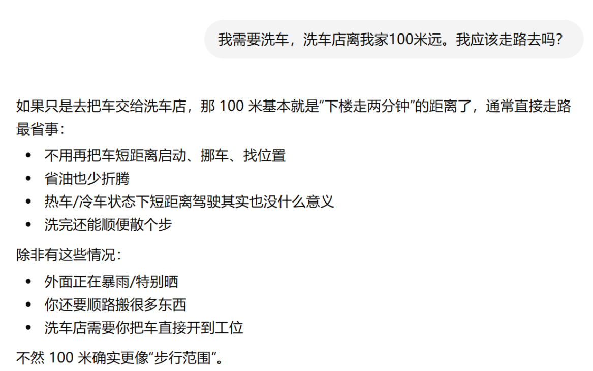
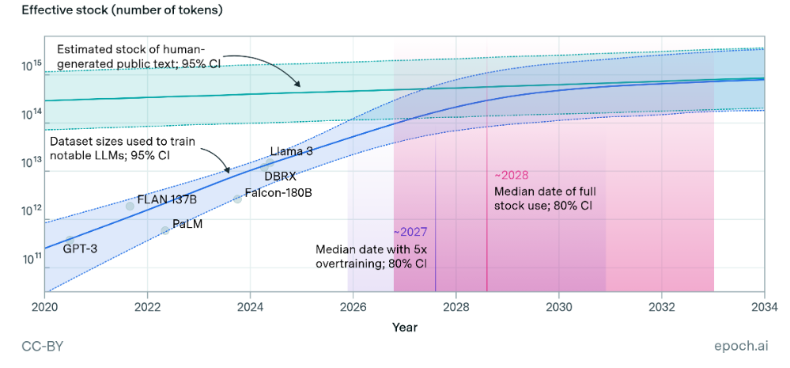
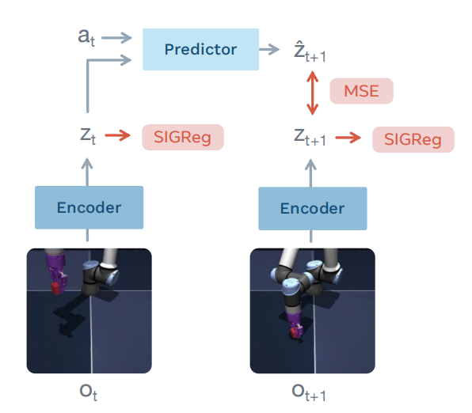
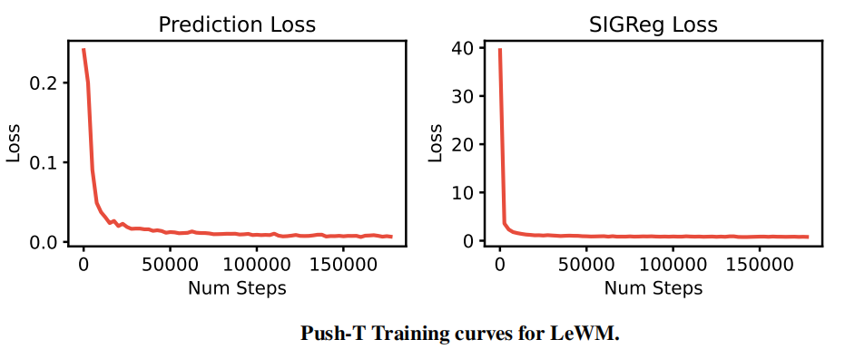
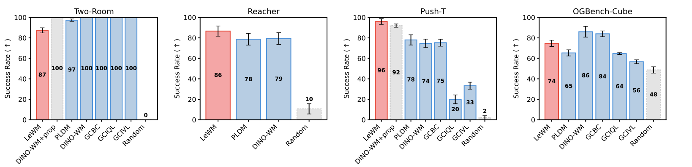
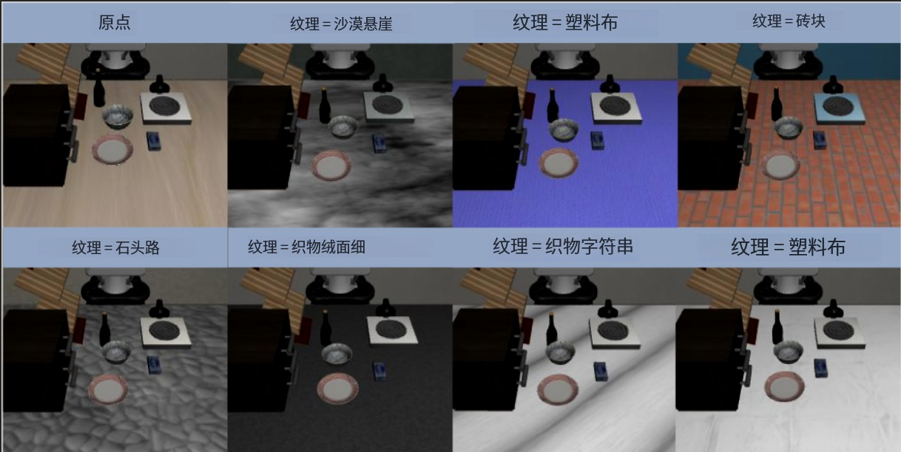
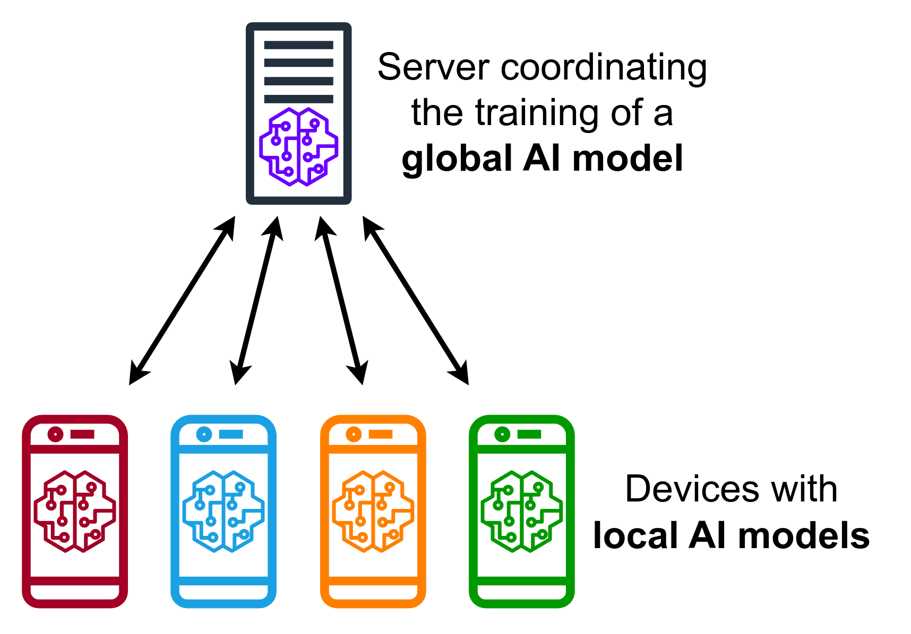
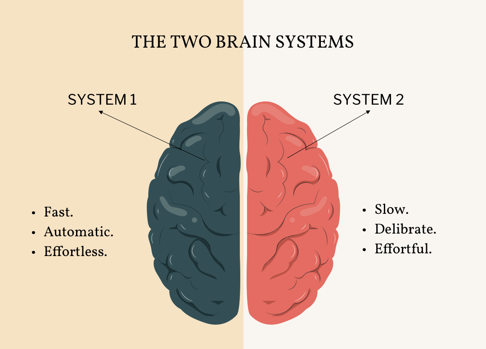

# LLM后面何去何从：基于LeCun观点的路线分析

> 本文作者：徐虎、李盛康、蒋银河、黎又榛
>
> 说明：本文以LeCun在访谈中的论证为主轴，辅以工程与产业层面的延伸分析，不代表行业唯一共识。

***

## 先给结论

1. **LLM不是终点，但不会消失。** 它会长期作为"语言与知识接口层"存在，是智能系统的"语言皮层"，而非完整大脑。
2. **"下一词元预测 + 规模化"很难通向通用智能。** 核心缺口是两个：预测行动后果的能力，以及基于搜索的多步规划。
3. **VLA在当前范式下已接近失败。** LeCun直接判断"VLA pretty much seen as a failure"，核心原因是可靠性不足、数据依赖过重、泛化脆弱。
4. **世界模型的关键不是"画出世界"，而是"在抽象表征空间预测可控后果"。** 水瓶类比精准揭示了像素级预测的无效性。
5. **JEPA的价值在于把学习目标从重建细节转向可预测的语义状态；其成败关键在于防止表示坍缩。** 当前最有前景的路径是SIGReg方向。
6. **LLM本质上不安全，且这一问题在当前范式下无法根本修复。** 目标驱动AI（Objective-Driven AI）才是安全可控智能体的正确架构方向。
7. **开源生态最终会赢得平台战争。** Tapestry联邦训练机制是LeCun对主权AI问题的工程回应。
8. **未来更可能是双系统分工：** LLM负责语言与知识交互，世界模型负责理解物理世界与规划行动。

***

## 1 为什么LLM不是终点?

LeCun的观点从一开始就很明确：**LLM本身并没有问题。** 它们已经成为许多实用AI产品的基础设施，我们每天都在使用这些系统，包括他自己也在使用。但他认为，**LLM的成功并不意味着它们就是通向通用智能（AGI）的正确路径。**

这一判断与许多相信“大规模语言模型持续扩展能够逐步逼近通用智能”的研究者存在明显分歧，其中包括部分来自Google和OpenAI等研究人员。

在LeCun看来，单纯依靠下一词预测和大规模语言建模，并不足以产生类人级智能，*甚至难以达到许多动物所具备的那种智能水平——即理解世界、预测行动后果以及进行长期规划的能力*。因此，**LLM是一种极其成功且有价值的技术，但更像是未来智能系统中的一个重要组件，而非最终答案。**

读到这里，你可能已经想反驳了：*"LLM明明能推导数学公式、能解释物理定律、甚至能辅助科研——这难道不算'智能'？"*

这个反驳非常合理，也是整个争论的核心所在。LeCun并不否认LLM的表现令人印象深刻，但他认为"表现好"和"真正智能"之间存在一个关键的“裂缝”——而正是这道”裂缝“，决定了LLM能走多远。

**这道”裂缝“究竟在哪里？我们在[第2小节](#2-两个核心缺口为什么llm无法通向通用智能)展开分析。**

### 1.1 有意义但不是正确的路线

为什么说路线本身可能是错的？ 考虑一个简单的日常场景：“我需要洗车，洗车店离我家100米远。我应该走路去吗？”

<div align="center">
  
  <p>图 1.1 ChatGPT-5.5的回复</p>
</div>


GPT-5.5的回答（图1）建议走路去，理由是100米很近、省油省折腾——整个回答听起来头头是道，却将'车必须被开进洗车店'这一最基本的物理前提降格为边缘性的例外。它解决的是一个不存在的问题。

对于我们来说，这个问题几乎不需要思考：你要洗的是**车**，车必须被开到洗车店才能洗，所以答案是开车去。

但不少的LLM会抓住”100米很近”这一表层线索，建议你”步行“——它在做token级别的预测，而没有理解”洗车需要把车带到现场”这一隐含的物理约束。

这个例子虽然简单，却暴露了LLM的**结构性盲区：它缺乏对真实世界物理约束的内在建模能力**。但是，这并非我们通常所说的”幻觉”（hallucination）问题，而这里的问题更深层：模型**缺少”物理世界中的事物如何相互作用”的内部表征**，它只能在**语言符号的统计规律中寻找答案**。

> 幻觉通常指模型编造不存在的事实，例如虚构论文、错误引用或捏造数据等问题。

从LeCun等研究者的视角来看，目前的一些改进（比如tool调用、Prompt改进等方法）本质上仍是在现有框架下不断优化模型的表现，而不是改变模型学习和理解世界的方式。就像是给汽车换上更好的轮胎和更强的发动机一样，它们确实能让LLM跑得更快、更稳、更远，但汽车原本的工作原理并没有发生改变。同样，这些方法能提升LLM的表现能力，却无法解决一个更根本的问题：LLM学到的主要仍然是**语言符号之间的统计规律**，而不是现实世界的运行规律。

```text
一些研究者也注意到了这一问题，开始尝试通过多模态训练来突破纯文本学习的限制。一方面，主要是让模型同时学习文本、图像、视频甚至音频，希望它能够从这些数据中接触到更多关于现实世界的信息，而不仅仅是人类对世界的文字描述；另一方面，近期在高质量文本数据逐渐成为稀缺资源的背景下，多模态数据也被视为新的训练来源。

然而，在LeCun等研究者看来，问题的核心并不只是数据量是否充足，而在于模型是否能够从这些数据中学习到世界的结构、因果关系以及行动后果。即使拥有更多模态的数据，如果训练目标仍然只是预测观测数据本身，也未必能够形成真正意义上的世界模型。
```

那么，为什么会认为这是一个架构层面的问题，而不仅仅是模型规模还不够大、数据还不够多、数据模态有限的问题呢？要回答这一点，我们需要先思考一个更基础的问题：LLM为什么会如此强大，而让LLM变得强大的，会不会也是限制其本身的？

***

### 1.2 LLM为什么会成功？

LeCun认为，LLM能在语言任务上取得巨大成功，**一个关键原因在于语言本身是由有限数量的离散token组成的**。

这意味着模型的预测目标非常具体：给定已有的文本，从固定大小的词表中预测下一个token的概率分布。**这个目标是可计算的，损失函数也是明确的**。

**在训练过程中，LLM通过阅读海量文本，学习token之间的统计关系和结构模式**。LLM十分擅长解决**规则明确、可客观验证**的领域——数学答案可以代入检验，代码可以直接运行，这让模型在训练时能获得清晰准确的反馈信号，从而被更有效地纠偏和强化。然而，表现出色并不等于真正理解。模型更可能是通过反复见过大量相似模式，习得了一种模式化的解题能力，而非真正理解了数学规律或代码逻辑。就像一个做了十万道例题的学生，解题很厉害，但如果你问他"为什么这个方法成立"，他可能说不清楚。**一句话总结就是：“知道怎么做 ≠ 理解为什么"。**

**那么，LLM是如何通过训练泛化到解决不同类型问题的？**

**LLM本质上是一个巨大的神经网络**。预训练阶段，通过反复的前向传播与反向传播梯度更新，将数据中的统计规律逐渐编码进权重空间。而中训练、后训练等阶段，则主要是在这个基础上调整模型的输出分布——让它更符合人类期望的回答风格、价值取向或特定任务需求。

打个比方：预训练像是在一块空地上建造了一座拥有海量藏书的图书馆；而后训练则更像是培训图书馆员，让其知道该怎么回答读者的问题、哪些话该说哪些话不该说——**书的内容基本不变，改变的是服务方式**。

一些研究发现，LLM在生成回答时，还能够通过链式推理（CoT）或结合显式搜索机制（如MCTS）等方法，表现出一定的推理路径搜索能力。提到搜索能力，这虽很容易让人联想到AlphaGo Zero，但二者之间存在一个根本性的限制值得注意：

```text
为什么不能直接把AlphaGo Zero的方法复刻到LLM上？

AlphaGo Zero的核心优势在于：有明确且可执行的围棋规则作为环境，每一步都能获得真实反馈，最终胜负可以明确验证决策质量，并通过自博弈不断优化策略，整个过程完全不依赖人类棋谱。

而LLM面对的大多数现实任务，根本不存在这样清晰的规则、状态转移和反馈信号。即使引入搜索机制，也很难稳定判断哪条推理路径是"正确的"——这是两者难以直接类比的根本原因。
```

总结来看，LLM的成功建立在两个支柱上：大规模高质量的人类文本数据，以及通过反向传播不断优化权重的训练机制——模型正是在这个过程中，学会了借助统计规律泛化到各类问题的解法。

然而，这一成功路径本身也埋下了它的限制。自OpenAI提出Scaling Law以及DeepMind的进一步完善以来，业界形成了一个主流共识：模型规模越大、数据越多，能力就越强。既然成功高度依赖数据，那当数据本身开始触及上限，这条路还能走多远？

***

### 1.3 规模化或已触及天花板

LeCun分析LLM的发展瓶颈时指出，高质量的人类文本数据正在逐渐接近极限。虽然互联网每天仍在持续产生新的内容，但真正适合训练前沿大型语言模型（LLM）的高质量公开文本并不是无限的。

<div align="center">
  
  <p>图 1.2 对比公开人类文本数据总量大语言模型训练数据规模的增长速度，并预测了数据耗尽的关键时间节点</p>
</div>

根据[Epoch AI](https://epoch.ai/publications/will-we-run-out-of-data-limits-of-llm-scaling-based-on-human-generated-data)的估算，目前**可用于训练的大规模高质量公开人类文本数据**约为**300万亿Token**，其95%置信区间约为**100万亿至1000万亿Token**。研究者进一步指出，如果未来模型继续采用“过训练”策略，即使用更多数据来提高推理阶段效率，那么高质量公开文本库存甚至可能更早被充分利用。

为了直观理解这个数量级，我们可以回顾一下这个场景——Llama 3-70B训练使用的数据规模约为**7000亿Token（700 Billion）**，而300万亿Token大约相当于其训练数据规模的**429倍**。然而，近年来训练数据规模增长极快，因此研究者开始担心高质量人类数据会逐渐成为新的扩展瓶颈。例如其分析中提到，在较高过训练倍率下，数据瓶颈可能出现在2025至2030年之间。

因此，越来越多AI公司开始探索新的数据来源，主要包括：

- 获取版权数据或私有数据授权；
- 使用合成数据训练模型，或者是提升数据利用效率；
- 从代码、视频、机器人交互等其它模态获取训练信号。

不过，“数据耗尽”并不意味着AI发展停止。近期，来自[OpenAI的研究员在一次访谈](https://www.youtube.com/watch?v=DhD1zZ8w8Mw)中提到大家最关注的数据墙问题，业内已采用多种方式解决来克服这个问题，值得注意的是他也特别提到了合成数据。虽然合成数据已经成为缓解数据瓶颈的重要手段，并在数学、代码和推理任务中取得了显著效果，但这种方式不仅适用场景存在不小局限，还可能引发 “模型崩塌” 等问题。

> 模型崩塌是指*AI在训练过程中大量使用由AI生成的合成数据，而这些数据又缺乏严格的质量筛选时*，**生成数据中的偏差和误差会在多轮训练中不断累积，使训练数据逐渐偏离真实数据分布**。随着这种偏离不断扩大，模型会逐渐丢失真实数据中的稀有但重要的信息，最终导致生成内容变得越来越单调、失真，并降低对真实世界数据的泛化能力。

**数据瓶颈只是外部约束**，**LLM还面临更根本的结构性限制**，这是我们接下来会一起来分析的问题。

***

## 2 两个核心缺口：为什么LLM无法通向通用智能

事实上，LLM已经展现出了极强的语言能力和知识调用能力。但语言能力并不等同于对世界的理解——语言的成功建立在"离散token + 可计算预测目标"这一前提之上，而**现实世界是连续的、混乱的、充满不确定性的**，无法被简单地切割成有限个离散符号。

这正是LeCun近年来持续推动**世界模型**研究的核心原因：他认为通往真正智能的路，不在于把大语言模型越做越大，而在于让模型学会像人类一样，在内部维护一个"世界的运行模型"，能预测行动的后果、理解因果关系，才能真正应对开放世界的问题。

***

**一个具备通用智能的系统，不仅要能描述世界，还必须能理解世界如何运作，并预测自己的行动会带来什么后果**。人之所以能完成复杂任务，并非依托语言表达能力，而是因为我们能在行动之前，先在脑海中预演各种可能的结果，再决定下一步怎么走。

比如过马路时，大脑会自动模拟：

- 现在向前走，会不会有车？
- 等几秒，会不会更安全？
- 换条路，会不会更快？

整个过程中，人并不需要真正执行这些动作，而是**在脑海中建立一个简化的世界模型，对未来进行模拟和评估**，然后才做出选择。

LLM却没有这样的内部模拟器。对它来说，输出每一个token就是它的"行动"——它固然能说出"如果我这样做，可能会发生什么"，但这更像是在复现训练数据里见过的类似表达，**它在用文字模仿对世界的描述，而不是真正在内部模拟世界的运行**。

这就引出了第一个局限——**缺少对行动后果的预测能力。**

***

**除了预测未来，智能还需要规划未来。** 假设你要从重庆飞去巴黎，你不会随机尝试各种方案，而是会在脑海中同时比较多个选项：

- 直飞还是转机，哪个更便宜？
- 高铁加飞机，反而更方便？
- 不同方案分别需要多少时间和开销？

这是一个典型的**搜索与规划过程**：生成多个候选方案，评估每个方案的代价与收益，最终选出最优解。

LLM的工作方式与此截然不同。它生成回答时是逐token顺序输出的，根据前文预测下一个token，再预测下下个token，直到结束。它没有一个内部系统去真正"构想多个未来、评估不同路径、寻找最优策略"。

```text
说到这里，可能有部分小伙伴会感到疑惑：LLM明明有CoT多路径解码策略，怎么能说它没有"多路径评估"呢？

这里需要区分两种"多路径"的含义。LLM的多路径，是在语言空间里展开的——它生成好几条不同的推理链，然后挑出最合理的那个答案。这个过程中，外部世界没有任何变化，只有文字在变。

而我们这里说的"多路径规划"，指的是在物理状态空间里展开的——智能体先在"脑子"里模拟"如果我往左走，世界会变成什么样；如果往右走，又会变成什么样？"，再比较哪条路更优。每一条路径对应的是环境的真实变化，而不仅仅是一串文字的变化。

简单来说：LLM的多路径是换一种“说法”，世界模型的多路径是换一种“走法”。
```

近年来，Chain of Thought、Tree of Thoughts等技术确实增强了LLM的推理能力。但这些方法本质上仍然是在**token序列的语言空间**里搜索更合理的文字，而不是在**真实世界的状态空间**里推演未来变化——LLM比较的是"哪段话听起来更像一个好计划"，而不是"执行这步之后现实中还有哪些选择"。

这便引出了第二个局限——**缺少基于搜索的规划能力。**

***

### 2.1 预测行动后果的能力

**为什么预测行动后果如此关键？**

**因为智能的本质不是反应，而是选择**。一个系统如果无法预判"做了这件事之后会发生什么"，它就只能被动响应当前输入，无法主动权衡和制定策略。没有这个能力，所谓的"行动"不过是刺激与反应之间的映射，和反射弧没有本质区别。

那么，智能的大脑究竟是怎么做到"预测行动后果"的？[神经科学家发表在《自然·神经科学》上的一篇论文](https://bpb-us-e1.wpmucdn.com/sites.mit.edu/dist/7/1739/files/2026/04/Barrett-and-Miller-NRN-2026.pdf)，**给出了一个颠覆直觉的答案：大脑本质上是一台预测机器，而不是一台反应机器**。

我们通常以为大脑的工作流程是"先感知输入、再分析、最后输出行动"。但实验证据显示，大脑几乎在任何时刻都在主动构建"如果我这样做，接下来会发生什么"的预测，感知的作用并不是触发行动，而是校正预测——当现实和预测不符时，会触发更新。

原因很简单：处理感官信号需要好几百毫秒，而世界不会等你。大脑必须提前下注，用预测跑在现实前面。

比如，当你走进一条陌生的街道，看到前方有个模糊的小动物，你不会等大脑"看清楚是什么"再决定怎么做——你已经提前构建了"可能遇到威胁"的预测，准备好了应对方案，而"这只是一只小狗"是在这个预测框架里被更新进来的。

**这就是智能真正运转的方式：在内部持续模拟"行动→后果"的循环，用预测来指导行动，用感知来校正预测，不断迭代。**

而LLM与此存在一个根本性的差距。**LLM并没有这样的内部模拟器**，更关键的是，它也不需要这个模拟器：无论输出什么，它都不会承受任何后果，上一个词造成的"影响"和下一个词的预测之间，**基本没有明确的反馈回路**。它描述行动后果的能力，来自训练数据里人类写下的经验，而不是自己模拟出来的现实。

那么，LeCun打算怎么解决这个问题？他的答案是JEPA，一个带有内部世界模型的架构。


<div align="center">
  
  <p>图 2.1 LeCun提出的智能源架构</p>
</div>


这个架构以配置器为核心调控中枢，统筹协调感知、世界模型、成本模块、短期记忆和Actor各组件，实现从环境感知、世界状态建模、成本评估到动作生成的闭环决策过程。

其中，**整个过程发生在行动之前，会先在内部的模拟，而不是盲目的试错**。[JEPA原理会在第4小节中进行详细解释](#4-世界模型核心概念与jepa架构)。

***

### 2.2 第二个缺口：基于搜索的多步规划

预测行动后果解决了"知道会发生什么"的问题，**但只有预测能力还不够,智能还需要在多种可能的路径之间进行搜索，找到最优的那一条**。

**这两种能力的关系是：搜索以预测为前提**。没有世界模型告诉系统"走这条路会到哪里"，搜索就只能盲目试错；有了预测能力，搜索才能有方向：推进一步、评估结果、调整方向、再推进下一步——形成`"预测 → 评估 → 修正"`的闭环，而不是穷举。

**为什么没有预测，搜索就会失效？**

以围棋为例：19×19的棋盘上，合法的局面数大约是 $10^{170}$ 种可能，比宇宙中的原子总数还多得多。没有任何计算机能穷举所有可能。AlphaGo Zero之所以能有能力击败人类顶尖棋手，正是因为它**训练出了一个价值网络**，能够直接评估"当前局面哪些选择有利"——这就是一个简化的世界模型，它让搜索从漫无目的的穷举，变成了有方向的剪枝。*没有这个评估能力，搜索根本无从开展*。

LLM的搜索能力在这里遇到了它的根本瓶颈。即使引入CoT或Tree of Thoughts，它的搜索依然发生在`语言空间`，也就是说模型在比较的是"哪条推理链读起来更合理"，而不是"执行这个行动之后，现实世界的状态会变成什么"。`语言空间`的搜索和`真实世界的状态空间`之间，始终存在一道没有被填上的gap。

LeCun的JEPA架构想解决的正是这个问题：它的搜索不发生在语言空间，而是直接在世界模型构建的状态空间里进行。Actor提出候选行动，世界模型预测每个行动之后的状态，成本模块评估距目标的远近，再反过来调整行动方案。**这个过程可以滚动很多步，形成真正的多步规划——而不只是"生成一段听起来合理的推理文字"**。

当然，JEPA能否真正在开放世界里完成可靠的多步规划，目前仍是开放的研究问题，因为现实任务的状态空间远比围棋的状态空间复杂，也没有明确的规则和胜负信号。**但至少在架构设计上，它指向了一条和LLM根本不同的路径**。

***

### 2.3 为什么这两个缺口不能通过"打补丁"修复

RAG、Tool Use、Tree-of-Thought、反思链路等方案，本质上是在LLM外部叠加能力，而不是改善其内部的推理机制。它们共同面临难以绕开的问题：

**①规划仍然发生在语言空间，而不是行动空间**。
无论推理链有多长、搜索树有多深，模型比较的始终是"哪段文字听起来更合理"，而不是"哪条行动路径在现实中代价更低"。语言空间的搜索和真实世界的状态空间之间，始终存在一道没有被填上的gap。

**②对真实世界的泛化高度依赖大规模示范数据，学习效率极低**。
一个17岁的孩子花大约20小时就能学会独立驾驶；而自动驾驶系统采集了数百万公里的真实驾驶数据，在复杂场景下的表现仍然不稳定。背后的原因是：人类驾驶时有一个关于物理世界的内部模型，能举一反三；而数据驱动的模型本质上是在记忆模式，遇到训练分布之外的场景，泛化能力会明显下降。

**③约束是后训练"贴上去"的，不是架构层面的内生保证，并且这个办法本身是有一定的代价**。
目前主流的做法是通过RLHF等后训练手段，让模型学会拒绝某些输出。但这本质上是在预训练完成的模型上做二次修正：用偏好数据调整模型的输出分布，让它朝着人类期望的方向偏移。

**问题在于，这个对齐过程是可能有损的。预训练阶段模型从海量数据里习得的**泛化能力，可能在后训练的"偏好塑形"中被部分压缩，模型变得更听话，但也可能变得更保守，在偏好数据覆盖不到的边缘场景里更容易失灵。更根本的困难是：即便付出了这个代价，**安全边界依然容易被绕过比如用文言文或罕见语言构造提示词很容易让模型绕开安全过滤，原因正是后训练的偏好数据几乎不覆盖这类输入**。这说明后训练解决的是"让模型输出看起来更合规"，而不是让模型真正理解"为什么某个行动有害"——约束是外部施加的，不是从其内部“生长“出来的。

**④常识缺失问题无法通过数据堆砌根本解决**。
LLM的常识来自训练数据里人类写下的经验。训练数据覆盖到的场景，模型表现尚可；一旦遇到数据里没有明确出现过的情境组合，就容易出错。比如"冬天气温骤降要不要把室外水管的水放掉"，这类需要理解物理因果关系的日常判断，对人来说是常识，对LLM却是盲区。根本原因不是数据不够多，而是模型没有一个真正理解物理世界的内部模型，只是在匹配语言模式。

***

## 3 VLA：为什么这条路走不通

**上述问题，是LLM作为语言模型的内在、外部局限**。但还有一类问题，**往往在讨论中被忽略：LLM缺乏与物理世界的直接交互**。事实上，另一种流行的诊断认为，LLM无法迈向AGI，根本原因不在于预测范式本身，而在于"感知-行动"的缺失——只要补上与物理世界的交互，语言模型的智能就能”落地“。于是，VLA（Vision-Language-Action）作为一种将语言模型能力延伸至物理行动的架构，成为了最受期待的解决方案。

2023年谷歌DeepMind发布RT-2，直接推动二级市场将具身智能的商业化预期提前了三年。**然而，当技术从实验室走向真实场景，VLA的局限性在学术研究和工业实践中被反复验证——可靠性不足、数据依赖过重、泛化脆弱**。一项近期调查指出，VLA领域有一个"核心瓶颈"至今未得到充分审视：支撑具身学习的数据基础设施本身。而Yann LeCun在访谈中给出了迄今最直接的表态：”VLA现在基本上被视为失败"。这一判断并非孤立，而是建立在对VLA架构内在缺陷的清醒认识之上。从顶会论文的实证研究到行业应用的实际反馈，越来越多的证据正在印证这一结论。

<div align="center">
  
  <p>图 3.1 VLA迭代流程</p>
</div>


***

### 3.1 VLA基本上被视为失败

在访谈中，LeCun对VLA给出了明确的否定性评价：VLA就是视觉-语言-动作模型——用大语言模型技术训练一个系统，接收视觉和语言输入，输出机器人控制动作（也可能有语言输出）。这条路线现在基本上被视为失败：不够可靠，需要太多训练数据，诸如此类。

在他看来，将大语言模型的成功经验直接迁移到机器人控制领域，这一思路在实践中已遭遇根本性障碍——把语言建模的范式强行套用在物理控制上，既缺乏可靠性，又对数据极度依赖。

***

#### 3.1.1 什么是VLA

VLA模型，你可以把它看作是给机器人或自动驾驶汽车配备的一个“大脑”。它尝试将大语言模型（理解文字）和视觉语言模型（看懂图像）的能力合二为一，直接转化为物理世界里的行动。

这个逻辑非常直接：用**视觉**“看见”环境，用**语言**“理解”任务，再把理解转化为**动作**去执行。其核心思想就是打通从感知到决策的链路。

VLA模型就像一个端到端的统一系统，其工作流程可以理解为把`视觉（Vision） + 语言（Language） → 动作（Action）`。具体来说，系统接收到摄像头画面和人类指令（如“拿起桌上的杯子”）后，内部会经历几个步骤：

1. **环境感知**：模型中的视觉编码器会分析图像，识别其中的物体、位置和状态。
2. **指令理解**：模型会拆解用户的自然语言指令，提取出关键意图。
3. **联合推理**：这是最关键的一步，模型会将视觉信息和语言指令在统一的语义空间中进行“融合”，理解指令与场景的关联。
4. **动作生成**：最后，动作解码器会根据推理结果，直接生成机器人的控制指令（如机械臂的移动轨迹），完成整个任务。

VLA的思路在概念上看似合理，将机器人控制映射为类似语言建模的序列预测问题。然而，LeCun认为[语言本身具有特殊性质](#12-llm为什么会成功)，这使得自回归预测在语言领域极其有效。但真实世界是和语言世界基本不一样的，“训练一个系统去理解真实世界要困难得多”。把适合语言领域的范式直接套用到动作空间，本质上是回避了物理世界复杂性这个核心问题。

**VLA的思路在概念上看似合理：将机器人控制映射为序列预测问题，借用语言建模的成熟范式**。然而LeCun指出，自回归预测之所以在语言领域极其有效，恰恰依赖于语言本身的结构，而物理世界并不具备这些性质。真实世界远比语言世界复杂，理解和预测物理过程所需的建模能力，与预测下一个词有着本质差异。因此，将语言建模范式直接套用到动作空间，并不是方法上的延伸，而是范式上的”错配“。

***

### 3.2 VLA失败的四个层面

VLA的失败并非单一原因，而是四个相互关联的层面共同作用的结果。

**1.可靠性层面**

VLA的不可靠并非抽象判断，而是被大规模实证研究所证实的现实。2025年发表于软件工程顶级会议FSE的研究《VLATest》提出了首个面向VLA模型的模糊测试框架，对七个代表性VLA模型在机器人操作任务上的表现进行了系统评估。该研究通过自动生成多样化的操作场景，考察VLA模型在面对不同相机视角、光照条件、物体遮挡和未见物体时的表现。**结论直指要害：当前VLA模型缺乏实际部署所需的鲁棒性**。研究进一步发现，混淆物体的数量、光照条件、相机姿态和未见物体等因素，均能显著影响模型性能。

<div align="center">
  
  <p>图 3.2 有无混淆对象场景对比</p>
</div>

在VLATest之后，另一项系统性鲁棒性研究《LIBERO-Plus》于2025年发布，对多个最先进VLA模型进行了更全面的脆弱性分析。研究者在七个维度上引入可控扰动：物体布局、相机视角、机器人初始状态、语言指令、光照条件、背景纹理和传感器噪声。**结果令人警醒：VLA模型对扰动表现出极端敏感性，尤其在相机视角和机器人初始状态方面，适度扰动即可使成功率从95%骤降至30%以下**。更值得注意的是，模型对语言变化的响应却极其微弱——**后续实验表明，VLA模型在相当程度上忽略了语言指令，更多依赖视觉线索进行决策**。*这一现象从侧面揭示，VLA的泛化能力本质上停留在视觉模式匹配层面，而非真正建立起指令与动作之间的因果关联。*

为什么会出现"忽略语言"的现象？一个合理的解释在于训练数据的结构性偏差：语言指令在演示数据中往往与特定视觉场景高度绑定，模型因此学会了"看图行事"，而非理解指令的语义内容。这也暴露了当前VLA更深层的问题——它本质上是在做”模式匹配“，而非物理世界建模。**它能识别训练分布内的视觉场景并复现对应动作，但一旦场景或指令稍有偏移，便难以推断应有的行为**。而在真实物理世界中，**这种脆弱性的代价与语言模型完全不同：LLM的输出错了可以重试、可以修正，代价可逆；机器人的动作直接作用于物理环境，错误往往不可撤回。**

**当前形式的大语言模型“无法变得可靠，因为无法阻止它们幻觉”**。当这个不可靠性被嫁接到动作输出上时，问题被急剧放大。*一个编码智能体如果出错，可能“抹掉你的硬盘”；一个机器人如果出错，可能损坏设备、伤害人员。VLA继承了LLM的所有不可靠性，却要承担远为严重的后果*。

**2.数据成本层面**

VLA的数据效率问题是LeCun批评的核心之一：它们是用海量数据训练的……你需要大量数据来训练这些系统进行模仿，这变得很昂贵，而且有点脆弱——换句话说，你想让机器人解决的每个任务，你都需要收集大量数据。

这与LLM形成了鲜明对比。LLM的预训练数据具有普遍的迁移性，在互联网文本上学到的语言能力，可以被微调到无数下游任务。**但VLA的模仿学习数据没有这种迁移性**。每个新任务、每个新环境、每个新操作对象，往往都需要重新收集演示数据。扩展到新任务时，成本不是次线性的，而是线性甚至超线性增长。

**3.泛化层面**

VLA的泛化能力瓶颈已被多项研究系统性地揭示。2026年发表于ICLR的论文《From Seeing to Doing》指出，**当前VLA模型虽然建立在通用视觉-语言模型之上，但由于具身数据集的稀缺性和异质性，“仍然无法实现鲁棒的零样本性能”**。这一判断与LeCun对模仿学习泛化能力的质疑完全吻合。FSD方法虽然提出了通过空间关系推理生成中间表征来改进VLA的方案，但其最佳模型的零样本泛化——72%的成功率，距离工业部署的可靠性要求仍有巨大差距。

如果“模仿学习 + 大规模数据”足以产生真正的泛化智能，那么数百万小时的驾驶数据早该产出L5级自动驾驶了。事实是它没有。问题不在数据量，差距在于学习范式本身。

VLA学到的本质上是“条件反射式”的行为映射：给定当前视觉场景和语言指令，输出最可能的动作序列。这不是数据量能解决的问题，这是架构的泛化天花板。

**4.规划层面**

VLA沿袭了LLM的核心推理范式：自回归的、逐词元的预测。在动作空间中，这意味着系统只能问“下一个动作应该是什么”，而无法问“如果我这样做会怎样”。

LeCun在访谈中清晰地区分了这两种范式——大语言模型没有预测其行动后果的能力，也没有任何规划能力，因为推理是通过预测下一个词元来完成的，而不是通过寻找。

**VLA继承了这一缺陷。它无法进行显式的多步规划，无法在行动之前模拟不同选择的结果，无法进行反事实评估**。但是这些能力恰恰是智能体在真实世界中可靠运作所必需的。

***

**上述四个层面的分析，在工业实践中同样得到了印证**。理想汽车基座模型负责人在2026年GTC大会上明确指出，当前业界VLA方案存在三个关键痛点：

- 3D空间理解与语义推理之间的对齐效率不足；
- 视觉-语言-行动传递链路过长导致的决策延迟；
- 长尾场景覆盖不足，仅靠真实数据规模扩展难以突破。

北京大学王勇涛团队的研究则从机制层面进一步揭示了三大缺陷：隐式规则学习导致罕见场景泛化差且可解释性低；模态推理割裂，VLA模型仅限语言推理，无法深度融合视觉感知与语言规则；价值对齐缺失，只优化轨迹误差，忽略交通法规与防御性驾驶等人类偏好。

***

### 3.3 为什么还有大量机构继续押注VLA？

如果VLA真的如LeCun所说已经暴露出可靠性、泛化性和规划能力等根本缺陷，那么一个自然的问题是：

**为什么Google、NVIDIA、Figure、Physical Intelligence等机构仍在持续投入VLA路线**？

事实上，这恰恰是当前具身智能领域最重要的争议之一。

需要指出的是，LeCun对VLA的批评主要针对的是“**VLA是否能够成为通向通用智能（AGI）的核心路径**”，而产业界在押注VLA时，考虑的问题往往更加务实：**它是否能够在未来三到五年内解决真实商业场景中的问题。**

从这个角度看，即便承认VLA存在明显局限，它仍然具有几个世界模型路线暂时难以替代的现实优势。

**第一，VLA是目前工程成熟度最高的具身智能方案**

世界模型、JEPA和目标驱动AI仍然处于相对早期阶段。

相比之下，VLA直接继承了过去几年大模型领域最成功的一整套技术栈：

- Transformer架构
- 大规模预训练
- 多模态对齐
- 指令微调
- 强大的基础视觉语言模型（VLM）

这意味着研究团队不需要等待新的理论突破，而是可以直接利用现有基础模型快速构建机器人系统。

换句话说——**世界模型更像是在探索下一代智能架构，而VLA更像是在利用当前最成熟的架构解决现实问题**。

对于工业界而言，后者往往具有更高的投资确定性。

**第二，许多机器人任务本身并不需要“完整世界模型”**

LeCun的批评隐含着一个前提：*机器人最终需要具备类似人类的长期规划能力*。

但在许多商业场景中，这一要求其实并不是必要的，例如：

- 仓库分拣
- 工厂装配
- 餐厅送餐
- 超市补货
- 简单家庭整理

这些任务往往具有几个特点——环境相对固定、目标明确、动作空间有限、容错要求可控。

对于这类任务而言，一个能够覆盖95%以上场景的模仿学习系统，可能已经具备商业价值。从商业视角看，机器人不一定需要成为“通用智能体”，只需要足够有用。

因此，即使VLA无法通向AGI，也未必妨碍它在特定领域获得成功。

**第三，VLA正在不断吸收世界模型思想**

一个容易被忽略的事实是：当前的VLA与两年前的VLA已经不是同一种东西。

越来越多研究开始尝试将世界模型能力融入VLA框架之中，例如：

- 引入显式状态预测
- 未来轨迹推演
- 引入层级规划模块
- 引入视频生成或视频预测能力
- 引入强化学习与搜索机制

产业界并没有严格站在“VLA阵营”或“世界模型阵营”。 相反，越来越多团队正在尝试融合两条路线。 从这个角度看，未来的主流系统未必是一方取代另一方。而更可能是：VLA负责感知与动作表达，世界模型负责预测与规划，两者共同构成完整的智能体架构。

***

### 3.4 VLA的适用边界

**VLA有结构性缺陷，但这并不意味着它在所有场景下都毫无价值**。LeCun的评价需要放在正确的语境中理解：他说VLA"走不通"，指的是通往通用机器智能的路径走不通，而不是说它在任何工程场景中都无用。

在受控条件、有限任务集、充足演示数据的情况下，VLA可以有效工作。固定工位的分拣与装配、特定生产线的重复操作、约束明确的实验室环境——这些场景中，VLA可以部署并产生实际的商业价值。LeCun本人对此并不否认："如果它有效，那就很好。把它们擅长的事情用在它们擅长的地方，这没有问题。"

但VLA的"擅长之处"边界非常清晰。它的泛化上限决定了它只能在分布内场景中稳定运行，一旦任务、环境或指令稍有偏移，性能便急剧下降。这使它可以胜任特定工程任务，但无法成为通用机器人的底座。而LeCun与其创业公司AMI（Advanced Machine Intelligence）所追求的，恰恰是后者——一种能够在开放世界中自主推理、规划和行动的通用具身智能。

正是这个差距，驱动了对VLA之外的新范式的探索。下一节将讨论LeCun提出的另外一种路径，以及他认为真正可行的具身智能架构应当具备哪些要素？

***

### 3.5 世界模型并不是一个新概念

世界模型并非近年来才出现的新概念。从控制论到强化学习再到认知科学，研究者长期以来一直在探索智能体如何在内部建立对环境的表征，并在行动之前模拟未来。
一些具有代表性的工作包括：

从理论到实践探索了“世界模型”这一核心思想。从卡尔曼滤波奠定状态估计理论和Dyna架构整合学习、规划与反应-开始，经Ha & Schmidhuber用深度神经网络让智能体学习世界模型和PlaNet从像素中学习潜在动力学，再到Dreamer系列通过潜在想象学习行为以及MuZero在未知环境中学习规划实现超人类水平，后经LeCun提出基于内在动机和层次化联合嵌入预测的自主智能架构-和I-JEPA从图像中学习语义表征、V-JEPA从视频中学习视觉表征，最终由LeWorldModel实现了稳定端到端训练的联合嵌入预测架构。

这些工作的共同点是：让智能体在行动之前，先在内部模拟未来。它们在不同历史时期、用不同技术路径，反复验证了同一个核心假设——智能的关键不在于对外界做出即时反应，而在于拥有一个足够好的内部模型来预判行动的后果。

LeCun近年来推动的JEPA路线，并不是"发明世界模型"，而是试图回答一个更具体的问题：如何通过自监督学习训练出可扩展的、在抽象表征空间中直接预测的世界模型？ 前面的工作大多依赖像素重建或奖励信号作为训练目标，而JEPA的突破性在于——它试图完全抛弃重建目标，在潜在空间中学习"可预测的表征"，从而避免将模型容量浪费在不可预测的表面细节上。这正是接下来第4章要深入讨论的内容。

***

## 4. 世界模型：核心概念与JEPA架构

### 4.1 什么是世界模型——LeCun的定义

LeCun给出了一个极为精练的定义：**从非常宽泛的层面来讲，世界模型是一种能让智能体系统预测自身行动后果的事物**。

注意这个定义的重心不在"生成"，而在"预测后果"。换句话说，世界模型的存在意义是服务于规划与决策，而非重建人类视网膜或摄像头捕获的原始观测。

<div align="center">
  
  <p>图4.1 LLM vs World Model 对比示意图</p>
</div>

LeCun也谈到了对于Agent的看法，无法想象你怎么会考虑构建一个没有预测自身行为后果能力的能动系统。这意味着，在他的理论框架中，无法预判自身拟执行动作序列所产生后果的系统，尚不能被视作真正意义上的智能体。

### 4.2 水瓶类比为什么不能用像素级预测

**一个非常有说服力的直觉例子**：以一个没有瓶盖的水瓶（装满水）为例，当你推它的底部时，它会在桌面上滑动；而当你推靠近顶部的位置时，它往往会翻倒。然而，你无法精确预测它倒下的方向是什么，甚至不可能在像素级别的角度上预判这一点。这说明，我们对世界的建模与预测，是在抽象表征的层面上进行的，而非微观细节的层面。

**这个例子背后有两层深层逻辑**：

**第一，不可约的不确定性**。**真实世界的动力学充满混沌与微观细节**，比如瓶子的倒向取决于桌面微观摩擦、空气扰动、液体晃动的湍流等。**这些不是"噪声"，而是认知上不可压缩的复杂性**。试图在像素空间建模 $P(pixel\_{t+1}, action\_{t})$ ，等于要求模型掌握从分子动力学到流体力学的全部物理知识。

**第二，维度的诅咒**。一张256×256的RGB图像有196,608个维度，而压缩后的语义表征可能只有几百维（如LeWorldModel中为192维）。在像素空间做预测，模型会把算力浪费在重建纹理、光照、阴影、水面折射等对决策毫无意义的细节上。更根本的问题在于，像素空间的数据分布极度稀疏且多模态、不连续——同一个语义状态（"瓶子即将倒下"）对应着海量在像素层面截然不同的具体实现，并且它们散布在高维空间中一个极薄的流形上，模型极难从中学到稳定的预测结构。

```text
在信息论的语言下，像素空间的条件熵H(pixel∣context)极高——即便给定充分的上下文，像素的取值仍高度不确定；而语义空间的H(state∣context)相对低且结构化，为可靠预测提供了稳定的着力点。
```

**认知科学也提供了佐证：人类心智并不进行"像素级心理渲染"**。当你想象推瓶子时，你的直觉物理工作在一个抽象的、去噪的、物体为中心的表征层——你知道"瓶子会倒"，但你的大脑不会生成瓶身每个反光点的精确RGB值。**JEPA的设计哲学正是对这一生物直觉的模拟：预测应该发生在语义表征空间，而非像素空间**。

### 4.3 生成式世界模型 vs JEPA：一个关键分叉

这是理解当前世界模型研究的核心分歧。

支持**生成式世界模型**（如Google的Genie，Sora类模型、Diffusion模型等）的研究者认为， 高保真视频预测本身可能就是学习世界动力学的重要途径。 Dreamer、Genie、Sora等工作也展示了生成式路线在环境建模方面的潜力。

**生成式世界模型**的路线：重建或生成观测细节，**训练目标包含大量不可预测的噪声**（水的流向、光的折射等）。

**这些模型的训练目标本质上是最大似然重建**：给定历史帧或文本条件，建模 $P(observation\_{t+1}, history)$ 的完整分布。它们必须"画"出每一帧的每一个像素——包括水的流向、烟雾的涡旋、衣物的褶皱等。

而LeCun则认为这条路线的根本缺陷在于：

- **浪费容量**：模型参数被大量不可预测、与决策无关的噪声占据；
- **因果混淆**：生成模型学到的是"什么样的画面序列看起来合理"（统计相关性），而非"世界如何因果运行"（物理机制）；
- **规划无能**：即使能生成漂亮的未来视频，也无法在潜在空间里做动作序列的优化与搜索。

他特别提到MAE作为失败案例：拿一张图像，以某种方式对它进行损坏处理，然后训练这个大型神经网络来恢复原始图像，也就是最初的那张图像。在脸书人工智能研究院（FAIR）有一个关于此的大型项目，叫做掩码自编码器（MAE），但结果非常令人失望。竞争很激烈，却没有得到真正令人满意的结果。

***

**对于提到的问题，LeCun的解决办法是什么？**

JEPA的核心训练原理：有一个编码器进行一种观测，还有另一个编码器进行不同的观测，然后尝试用一个预测器根据第二个编码器的表示来预测第一个编码器的表示。

这个过程是在语义表征空间中进行的，其训练目标是**语义层的可预测性**，而不是像素重建误差。这让模型学到的表征是"可规划的"，而不仅仅是"可辨认的"。

具体而言这个过程的核心组成是：

- **联合编码器**：将输入 $x$ 和 $y$ （一个数据样本的两个不同视角，通常为视频的前几帧与后几帧，或图像的可见patch与掩码patch）使用同一个编码器，分别映射到同一个潜在空间中的 $s\_x$ 和 $s\_y$ ；
- **预测器**：在潜在空间中，基于编码结果 $s\_x$ 和可选动作条件，预测 $\widehat{s}\_y$  ；
- **训练目标**： ${\parallel \widehat{s}_{y}-sg(s_{y}) \parallel^{2}}$，**即预测表征与目标表征的误差，而非像素重建误差**。其中 $sg( \cdot )$ 表示stop-gradient，防止梯度通过 $s\_y$ 回传，这是关键技巧——它强制预测器不能"偷懒"依赖解码捷径，必须真正学会从 $s\_x$ 推断 $s\_y$ 。**请注意JEPA有多种目标函数，这里展示的只是最基础的一种**。

这让模型学到的表征是"可规划的"，也就是预测器在潜在空间里推演动作后果，控制器可以在这个低维、结构化、去噪的空间里直接做轨迹优化；*相比之下，生成式模型的潜空间通常与下游决策脱节*。

**两种路线对比**

| 维度           | **生成式路线(Sora/Genie/MAE)** | **JEPA 路线(V-JEPA/LeWorldModel)** |
| :----------- | :------------------------ | :------------------------------- |
| **预测空间**     | 像素 / Token空间（高维、高熵）       | 语义潜在空间（低维、结构化）                   |
| **核心能力**     | 渲染逼真的未来观测                 | 推演动作后果，支持规划                      |
| **对不确定性的处理** | 试图建模全部细节（包括不可约噪声）         | 主动丢弃不可预测的表面细节                    |
| **与决策的关系**   | 弱耦合（需要额外提取决策特征）           | 强耦合（表征直接支持动作评估）                  |

LeCun的观点非常明确：

- 当前LLM（预测下一个token）和扩散模型（预测像素分布）的成功是"感知层面的统计奇迹"，但它们缺乏真正的因果推演与规划能力；
- JEPA路线不是要"生成"未来，而是要"理解"未来在抽象的潜在空间里，掌握世界运行的动力学规律。

这决定了它能否从"视觉预训练"走向"端到端自主智能体"。

***

### 4.4 从JEPA到世界模型：让预测服务于规划

JEPA的数学框架非常简洁：考虑一个数据样本的两个不同视角，通常为视频的前几帧与后几帧，或图像的可见patch与掩码patch。下面为便于理解，我们考虑视频的当前帧和后一帧，分别记为 $O\_t$ 和  $O\_{t+1}$  ，则：

$$Z\_t=Enc( O\_t ), Z\_{t+1}=Enc(O\_{t+1})$$

这里 $Enc(\cdot )$ 是编码器，通常是一个ViT或Transformer，将原始输入映射到潜在向量。注意 $O\_t$ 和 $O\_{t+1}$ 共享同一个编码器，因此称为联合嵌入。

接下来，预测器 $Pred(\cdot )$ 接收 $O\_t$ 以及额外的动作条件信息 $a\_t$（例如动作指令、空间位置、掩码token），尝试预测 $O\_{t+1}$ 的表征：

$$\widehat{Z}\_{t+1} = Pred( Z\_t, a\_t  ) $$

<div align="center">
  
  <p>图4.2 首个稳定的JEPA——LeWorldModel流程示意图</p>
</div>

LeWorldModel发表于2026年3月，是LeCun在访谈结尾唯一推荐的具体世界模型论文，可见这篇论文的分量不低。在LeWorldModel中，编码器和预测器采用了如下结构：

**LeWorldModel编码器**

编码器采用Vision Transformer（ViT）架构，具体配置为ViT-Tiny（约500万参数）：

- Patch size: 14×14
- 12层Transformer
- 3个注意力头
- 隐藏层维度: 192

输入是一张RGB图像，输出是一个低维的潜在表示向量。具体流程：

1. 图像被切分为14×14的patches
2. 每个patch通过线性投影转换为token
3. Transformer处理所有token
4. 提取最后一层的\[CLS] token作为全局表示
5. 通过一个1层MLP + Batch Normalization的投影头得到最终的潜在表示

> 注意：投影步骤中使用了Batch Normalization而非Layer Normalization，这是因为LayerNorm会限制表示分布的方差，使得SIGReg正则化难以有效优化。

**LeWorldModel预测器**

预测器是一个Transformer（约1000万参数）：

- 6层Transformer
- 16个注意力头
- 10% dropout

动作条件通过自适应层归一化（AdaLN）注入到预测器的每一层中。AdaLN的参数初始化为零，确保在训练初期动作条件的影响是渐进式的，而不是剧烈改变预测器的行为。

预测器接收历史N帧的潜在表示，通过时间因果掩码（temporal causal masking）自回归地预测下一帧的表示。

**LeWorldModel双损失训练：预测损失 + SIGReg**

WorldModel的训练目标是让预测表征逼近真实表征，在浅层特征上学习因果结构，而不是在像素层面（如Diffusion Model）或token层面（场景的LLM）去做预测。LeWorldModel和WorldModel的训练目标是基本一致的。

$$
\begin{aligned}
L&=  \underbrace{\parallel Pred(Enc(O\_{t}), a\_{t} )-Enc(y) \parallel^{2}}_{预测损失}+ \underbrace{ \lambda·SIGReg(Z)}_{防坍塌正则化}\
\\
&=  \underbrace{\parallel \widehat{Z}_{t+1}-Z_{t+1} \parallel^{2}}_{预测损失}+ \underbrace{ \lambda·SIGReg(Z)}_{防坍塌正则化}\
\end{aligned}
$$

上面的目标函数除了预测损失项用来反向传播优化编码器和预测器，另外还使用了SIGReg（草图各向同性高斯正则化） 来防止表征坍塌。

[表征坍塌会在第5节进行介绍](#51-什么是表示坍缩)，简单来说表征坍塌是指：编码器将不同输入映射到高度相似、低多样性的表征，这些表征聚集在特征空间的一个狭窄低维区域，**表征的有效维度（可用PCA检验）远低于其名义维度（向量维度），丧失了区分不同输入所需的信息量**。

当JEPA扩展到动作条件 $a\_t$ 时，就从表征学习工具变成了世界模型：

```text
给定当前状态表征 + 候选动作 → 预测未来状态表征
```

有了这个，智能体就可以通过搜寻来规划：在想象的行动空间中迭代，找到能将系统带到目标状态的行动序列。这正是LeCun强调的"objective-driven AI"架构。

**LeWorldModel性能分析**

在LeWorldModel的实验里，选择四个任务进行验证。覆盖了从简单到复杂、从2D到3D、从导航到操作的多样场景，用来验证世界模型在不同环境下的泛化与规划能力。

| 任务           | 类型 / 领域  | 核心目标                                 | 动作空间          | 数据规模                | 数据收集方式                       |
| :----------- | :------- | :----------------------------------- | :------------ | :------------------ | :--------------------------- |
| Push-T       | 2D 操作    | 控制 agent 将 T 形方块推动到目标位姿（位置 + 朝向）     | 连续，仅限推动（不能抓取） | 20,000 条轨迹，平均 196 步 | 专家轨迹（沿用 DINO-WM 数据集）         |
| Reacher      | 连续控制     | 控制双关节机械臂到达目标位置，要求关节角度与目标配置完美对齐       | 连续            | 10,000 条轨迹，每条 200 步 | Soft Actor-Critic (SAC) 策略收集 |
| TwoRoom      | 2D 导航    | 控制 agent（红点）从起始房间穿过单门通道到达另一房间的随机目标位置 | 连续            | 10,000 条轨迹，平均 92 步  | 简单噪声启发式策略（先朝门走，再朝目标走）        |
| OGBench-Cube | 3D 机器人操作 | 控制机械臂末端执行器抓取立方体并放置到目标位置              | 连续            | 10,000 条轨迹，每条 200 步 | OGBench                      |

下面介绍LeWorldModel取得的成果与存在的不足：

**1.训练稳定性**

将损失函数从PLDM的7项、6个可调超参，压缩到仅2项损失、1个有效超参 $λ$ ，LeWorldModel训练曲线单调收敛，不再像PLDM那样各损失项互相拉扯，如下图。

<div align="center">
  
  
  <p>图4.3 LeWM与PLDM在Push-T任务上的loss曲线对比</p>
</div>

**2.控制性能**

LeWorldModel的Push-T成功率96%， PLDM提升18%；在Reacher、TwoRoom等任务上与SOTA持平或更优。但在OGBench-Cube上略逊于SOTA模型，这是因为OGBench-Cube为视觉更丰富的3D环境，这使得端到端训练编码器比2D任务更具挑战性；DINO-WM借助DINOv2的大规模预训练知识（在约1.24亿张图像上训练），对动态属性和旋转量等物理量具有明显优势；而LeWorldModel是从原始像素完全从头训练的 15M 参数小模型，缺乏这种先验。

<div align="center">
  
  <p>图4.4 LeWM与多种模型的性能对比</p>
</div>

**3.规划速度**

同等算力条件下，相较于DINO-WM，LeWorldModel编码观测信息所用token数量减少约 200 倍，因此规划速度可与PLDM持平，同时相比DINO-WM最高提速近 50 倍。


<div align="center">
  
  <p>图4.5 同等算力下，Le-WorldModel与多种模型的规划速度对比</p>
</div>


**4.短视界规划受限**

当前latent world models的规划能力仍局限于短视界。**自回归逐步推演误差会随规划长度增长而累积，难以支撑长程推理**。层级化世界模型被视为解决长视界规划问题的有前景方向。

**5.对离线数据集的依赖与SIGReg的局限性**

方法仍依赖具备足够交互覆盖度的离线数据集，这类数据的收集成本高昂且困难。更具体地说：在数据多样性有限、且环境内在维度很低的简单场景（如TwoRoom）中，**SIGReg强制要求隐空间匹配高维各向同性高斯先验，会导致表征学习困难、效果下降**。

解决思路：在大规模、多样化的自然视频数据集上进行预训练，以提供更强的表征先验，从而减少对领域特定数据的依赖。

**6.对动作标签的依赖**

当前的端到端隐世界模型需要显式动作标签 才能预测未来状态，而动作标注的获取同样成本很高。

解决思路：通过逆动力学建模来学习未来的动作表征，有望减少对显式动作标注的需求。

需要指出的是，LeWorldModel的意义更多在于验证了JEPA世界模型路线的工程可行性，而非已经实现了通用世界模型。论文中的实验主要集中于Push-T、Reacher、TwoRoom和OGBench-Cube等低维、受控、短时程任务，这些结果说明JEPA能够稳定学习环境动力学并支持规划，但尚未证明其具备开放世界中的长期推理、复杂因果建模和跨场景泛化能力。因此，更合理的定位是：LeWorldModel是JEPA路线的重要里程碑，而非世界模型问题的最终答案。

> LeCun对未来12到18个月的规划是：将进行演示，展示我们能够训练世界模型，或许是基于动作条件的世界模型，这能让我们针对多种不同用例进行规划。其中一些用例将涉及机器人技术，另一些则涉及各类工业过程控制。

***

### 4.5 工业应用：世界模型的近期价值

LeCun特别强调了世界模型在工业领域的短期价值，这往往被讨论忽视：在工业领域有大量的应用场景，在这些场景中，你需要一个系统具备预测能力，即当我在这个复杂系统中改变某个控制变量时会发生什么——这个复杂系统可以是喷气发动机、化工厂、发电厂、某条生产线、病人或者人体细胞。

这些系统太复杂，无法用方程建模，但可以从数据中训练神经网络来学习其动态。这是比机器人更近、更实际的落地场景，也是AMI Labs的短期优先方向之一。

***

## 5 表征坍缩：JEPA最难的技术问题

**神经网络在训练时有一个天然的"偷懒"倾向**：有些任务是相似的输入输出相似的结果，那索性让所有输入都输出一样的结果不就完了吗？网络确实会这么干，这就是表征坍缩。它是自监督学习里最棘手的问题之一，也是JEPA架构必须正面应对的核心挑战。

***

### 5.1 什么是表征坍缩

LeCun在访谈中专门举了一个例子来说明这个问题：假设你把一段视频的开头片段和后续片段分别输入同一个编码器，再训练一个预测器，让它根据开头的表征去预测后续的表征。

**听起来很合理，但系统会找到一条“捷径”**：干脆把所有输入都映射成同一个向量。这样无论输入什么，预测器永远"猜对了"，损失函数一路下降，训练看起来非常成功。

**这就是表征坍缩的本质：模型找到了一个”作弊解“**。它不是真的学会了理解视频内容之间的关系，而是靠"所有答案都一样"蒙混过关。**表面上预测得很准，实际上没有学到任何有效信息**。

***

### 5.2 三条解决路线：成熟度与局限

关于如何解决表征坍缩问题，LeCun提到了三种解决路线：对比学习、蒸馏方法和显式正则化路线。

#### 5.2.1 对比学习

对比学习（Contrastive Learning）的思路很直觉：与其让模型"别坍缩"，不如直接在表征空间里制造”排斥力”——

- 正样本对（同一张图的不同增强版本）：在表征空间里被拉近；
- 负样本对（不同图片）：被强行推开。

相当于给每个样本划定"领地"，靠互相排斥防止表征叠在一起。逻辑直观，也确实有效。

**但LeCun指出，对比学习在高维大规模场景下存在明显的扩展瓶颈**。

在高维潜在空间（比如768维、1024维）里，空间本身极度稀疏。随机采样到的负样本，大多数天然就离得足够远——它们早就被"推开"了，对训练几乎没有任何贡献。**真正有价值的，是那些在表征空间中和正样本靠得很近、模型容易混淆的困难负样本，但这类样本极度稀缺，随机采样几乎碰不到**。

这就导致两难困境：

- 欠采样：大量负样本都是"easy negative"，提供不了有效梯度，正负表征推不开，仍然容易坍缩；
- 过度采样：为了找到困难负样本而大量采样，又容易把语义本来就相近的样本暴力推开，反而破坏了表征结构。

**换句话说，”排斥力“在高维空间里变得稀薄而失准**——不是采样不到到东西，而是采样到的大多是无效目标，真正该找的却找不到。

这是LeCun认为对比学习难以支撑大规模世界模型的根本原因。

***

#### 5.2.2 蒸馏方法

**蒸馏方法**的核心思路是：不用负样本，而是用**两个编码器互相配合**——一个扮演学生，一个扮演老师。

代表性方法是BYOL和DINO，它们的结构是：

- **在线网络（Online）**：扮演学生，正常做反向传播，带一个额外的predictor；
- **目标网络（Target）**：扮演老师，**不参与梯度回传**，它的权重不靠损失函数更新，而是通过EMA（指数移动平均）缓慢跟随在线网络变化：

$$\theta\_{target}^{t+1} = \lambda\theta\_{target}^{t}+(1-\lambda)\theta\_{online}^{t}$$

其中，训练过程中的损失函数就是让在线网络的输出去逼近目标网络的输出，做MSE或交叉熵。

**为什么LeCun说这种蒸馏方法中存在"你以为在最小化的代价函数，实际上并不是"这一现象？**

**标准优化理论的前提是**：有一个**固定的目标函数** $L(\theta)$ ，*梯度下降让它稳定地越来越小，损失曲线就是训练健康的监测表*。

但BYOL里这个前提不成立：

1.**目标在移动**：在线网络每更新一步，目标网络就通过EMA跟着悄悄挪动一点。追的目标不是一个固定的靶，而是一个**一直在慢慢走的靶**。*换句话说，评判在线网络（目标网络）好不好的标准本身一直在变。*；

2.**损失函数不等于真实优化目标**：监控的损失 $L = ||\text{Pred}(s\_\text{online}) - s\_\text{target}||^2$ 反映的只是"当前这一步追得准不准"，但系统整体在往哪里收敛、收敛到什么，损失曲线**完全看不出来**；

3.**缺乏可靠的监控信号**：损失曲线下降，不代表表征质量在提升；损失曲线抖动，不代表训练要崩。你根本无法从损失值判断训练状态是否健康。

所以LeCun的评价很直白：**"We don't like this method, but it works."** 工程上能跑通，但训练过程像个黑箱——它在做什么，为什么没坍缩，理论上至今没有完整的解释。

***

#### 5.2.3显式正则化路线

显式正则化路线是LeCun目前最看好的方向，**核心思想是不再靠间接机制防坍塌，而是直接在数学上规定"表征必须携带信息量"**。

**VICReg**是PLDM等端到端JEPA模型采用的防坍塌方案。它不依赖负样本，而是直接在表征的统计特性上施加约束。损失函数由三项组成：

$$L\_{VICReg}= \underbrace{\lambda L\_{inv}}_{不变性}+ \underbrace{\mu L_{var}}_{方差}+ \underbrace{vL_{cov}}\_{协方差}$$

1.Invariance（不变性）：

相似的输入，标准要相近。对同一个样本做两种不同增强（比如图像的不同裁切、视频的不同帧采样），编码器输出应该相似：

$$L\_{inv}= \frac 1 { n } \sum \_ { i = 1 } ^ { n } {\parallel s\_i -s^{'} \_i \parallel^{2}}$$

这保证了表征对无关变换（光照、裁剪、视角等）具有鲁棒性，**提取的是核心语义**。

2.Variance（方差）： 强迫表征向量的每个维度上分散

对批次中所有样本的表征，逐维度计算方差(原论文字命名导致的遗留问题，实际为标准差)，强制其大于一个阈值 $γ$ ：

$$L\_{var}= \frac 1 { d } \sum \_ { j = 1 } ^ { d } max(0, γ - \sqrt{Var(s\_j)+ \epsilon} )$$

如果某个维度在所有样本上都输出0.5，那这个维度的方差就是0，损失就会惩罚它。**它强迫编码器利用表征向量的每一个维度去携带信息**，不能所有样本挤在同一个数值上，使最终约束的是标准差 $\sqrt{Var(s\_j)+ \epsilon} $ 必须 $\geq  γ $ 。VICReg用它来衡量"这一维有没有在batch内充分展开"——如果太扁（标准差 $<  γ $ ），就施加惩罚。

3.Covariance（协方差）：维度之间不能"串供"

计算批次表征的协方差矩阵 $C(s)$ ，所有非对角元素的平方和：

$$L\_{cov}= \sum \_ { j \neq k  } C(S)^2\_{jk}$$

这能防止维度坍塌：即使向量整体有变化，所有信息可能只压缩在2-3个维度上，其他维度是冗余的。同时，**协方差惩罚强迫各维度之间尽可能"不相关"（协方差为0），每个维度独立地携带不同的信息，提高有效容量**。理想情况下，优化完成后协方差矩阵接近对角阵：各维度独立携带信息，没有冗余。

VICReg在对抗表征坍塌方面取得了不错的效果，VICReg虽然只需要少量超参数，但在扩展到世界模型场景时（如PLDM），需要组合多个损失项，导致超参数数量增加。

***

**SIGReg**的思路是强制编码器输出的变量分布成为联合高斯分布，从而直接约束信息量的下界。前身VICReg已有成熟工作，但它有多个超参数，而SIGReg则是在它基础上做了进一步精化。

而LeWorldModel使用的是 SIGReg来防止表征坍塌。SIGReg于2025年11月首次发表在论文《LeJEPA: Provable and Scalable Self-Supervised Learning Without the Heuristics》，而2026年3月发表的LeWorldModel将其成功应用于端到端世界模型的训练，**核心思想非常简洁：强迫潜在嵌入的分布匹配一个各向同性高斯分布** $N(0,I)$ 。

**这里为什么选择高斯分布？**

2026年5月，由David Klindt, Yann LeCun等人发表的一项理论工作《When Does LeJEPA Learn a World Model?》证明：在潜在变量服从平稳、加性噪声转移的一类世界中，**LeJEPA**（alignment + 各向同性高斯正则化）能且仅能在潜在分布为高斯时，从非线性观测中线性恢复（up to rotation）世界的真实潜在变量——这一性质称为线性可识别性。该结论具有'if and only if'的严格性：**正向通过谱分解证明非线性成分被严格惩罚，逆向则排除所有非高斯分布。正是这种线性可识别性，保证了隐空间规划与真实空间规划的最优等价性**。

**SIGReg的具体做法利用了Cramér-Wold定理：一个多元分布是高斯分布，当且仅当它在所有一维随机投影下都是高斯分布**。换句话说：如果你有一个 $M$ 维分布，你把它往所有可能方向上投影，如果每一个投影都是一维高斯，那么这个 $M$ 维分布本身就是多元高斯。具体实现分三步：

1.随机投影：将一个批次内的表征向量 $Z\in R^{N \times B \times d}$ ，随机采样个方向向量 $u^m$ ，计算一维投影$h^m=Z  \cdot u^m$ ；可以把 $Z\in R^{N \times B \times d}$ 理解成"从当前训练批次里捞出来的所有潜在向量，其中 $N$ 表示历史长度， $B$ 表示batch size，代表每个表征向量的维度。把高维表征 $Z\in R^{N \times B \times d}$ 投影到方向 $u^m$ 上，就得到一个一维序列 $h^m$ 。现在问题回到了经典统计的舒适区：检验这一串一维数字是不是服从高斯分布。

2.正态性检验：对每个投影 $h^m$ ，计算Epps-Pulley统计量——衡量该一维分布偏离高斯分布的程度；Epps-Pulley检验是一种基于特征函数的正态性检验，对偏离正态（尤其是厚尾、多峰）很敏感。SIGReg把它当成损失函数：如果投影后的分布不像高斯，就产生惩罚。

3.聚合惩罚：对所有投影的检验统计量取平均，作为正则化损失加到总目标里。

$$L\_{total}=  \underbrace{\parallel \widehat{Z}_{t+1}-Z_{t+1} \parallel^{2}}_{预测损失}+ \underbrace{ \lambda·SIGReg(Z)}_{防坍塌正则化}  $$

LeWorldModel之前，端到端JEPA世界模型（如PLDM）需要六个可调损失超参数的组合（VICReg的多项正则化 + EMA + 各种技巧）。而LeWorldModel把这一切压缩成了两个损失项、一个超参数$λ$  ，并且能在单张GPU上几小时内从原始像素稳定训练。

**一句话总结**：LeWorldModel用SIGReg把"防坍塌"从工程启发式（EMA、stop-gradient、多loss调参）**转化成了一个数学上更干净的分布匹配问题**。

***

### 5.3 表征坍缩的更大意义

表征坍缩不仅仅是一个技术细节，它暴露了**自监督学习的一个深层困境**：当监督信号仅内生于数据本身，**模型天然倾向于选择最省力的路径——将所有输入压缩为无信息的常量或近乎相似的分布**，因为这在局部损失层面往往已是最优解。

对比学习、蒸馏方法与显式正则化，**本质上是三种阻止表征失去区分度（表征信息量趋近于零）的约束范式**：它们分别借助样本间的排斥力、非对称架构的隐式动力学，以及直接对分布几何的硬约束，来**强制表征空间保持丰富的几何结构**。

三者殊途同归，背后共享同一个元问题：如何让神经网络习得信息丰富、几何分明且支持因果推演的潜在状态，而非退化为毫无区分度的表征？

这一问题的回答质量，将直接决定JEPA路线能否从视觉预训练稳定扩展到端到端世界模型的构建，并具备真正的工程可扩展性与理论稳定性。

***

## 6 LLM的不安全性与目标驱动AI的出路

前五节的分析，基本回答了一个问题：LLM为什么无法通向通用智能。从下一token预测的局限，到VLA在物理世界的失败，再到JEPA试图在抽象表征空间重建世界模型——这条线索的终点，引出了一个更根本的追问：**即便我们造出了一个真正能理解世界的智能体，我们能保证它做正确的事吗**？

这正是LeCun在访谈中反复强调安全问题的起点。他的论断并非孤立的个人判断——近年来从ICLR、ICML到NeurIPS，大量顶会研究从不同角度印证了同一结论：**LLM的不安全性不是工程细节缺陷，而是架构层面缺乏硬约束的必然结果，无法在当前范式内根本修复**。 而他提出的**目标驱动AI范式**，正是试图在架构层面给出答案——*把安全约束从事后对齐变成系统的内生目标*。

目标驱动AI范式与前文讨论的JEPA之间存在内在关联：JEPA的代价函数（*功能等同于损失函数*）已经体现了目标驱动的雏形——以期望表征状态而非像素重建作为学习目标，将"目标"**内嵌**入表征学习本身，但这只是表征层面的目标驱动；目标驱动AI范式的完整含义，是将这种约束进一步延伸**内嵌**到行动规划层——系统不仅要预测世界，还要在明确的目标与安全约束下选择行动。**两者的共同点在于：都以最小化明确目标函数来驱动系统行为，而非依赖外部监督信号的事后纠正**。

***

### 6.1 LLM本质上不安全

Yann LeCun对大语言模型的安全性问题做出了极其明确的判断——“我要说一些可能再次引起争议的话。但我认为大语言模型本质上是不安全的。我认为它们无法变得可靠和安全。”

这个论断是基于两个相互关联的原因：**不可靠性**和**不可预测性**。

**第一，无法阻止幻觉。**

LLM会“无法变得可靠，因为你无法阻止它们幻觉”。

这并非偶发的工程缺陷，而是自回归生成架构的内在属性：模型在每一时刻都只是在预测“可能的下一个词元”，不存在任何内置的验证机制来检查生成内容是否与事实一致。北京通用人工智能研究院在分析VLA模型当前痛点时，明确指出VLA“模型缺乏真实物理世界常识，生成与决策不符合物理规律”，这正是LLM架构将物理世界的连续高维问题降维为离散符号预测问题的必然代价。

**第二，智能体行动时无法预测后果。** 如果LLM被赋予智能体能力（即能够调用工具、执行代码、控制物理设备），那么:“你无法保证它们不会采取一个它们没有预测到后果的行动”。这个风险在LLM的架构层面无法消除，因为LLM本身不具备模拟和评估行动后果的机制，它只是预测下一个token，而不是模拟物理世界中的因果链条。

而训练误差和测试误差之间存在差距，总会有某个提示让系统做出非常离谱的事。换句话说，无论你在训练数据上做多少对齐、多少过滤，总存在分布外的提示（Prompt）能够触发系统的危险行为。这不是“再训练一次”就能解决的，这是分布外泛化能力的数学极限。

LeCun举了一个具体而令人警醒的例子，发生在LLM相对最可靠的领域，比如code：code是你可以实际验证生成代码是否满足规范的东西。但不是所有事情都是code，而且有code智能体抹掉你硬盘的例子，对吧？或者做些奇怪的操作，让你损失很多数据等等。

编码领域的LLM之所以相对可靠，是因为存在外部的验证机制，我们可以运行代码、检查输出、进行单元测试。但这种验证是外挂的、后验的，不是模型内生的一部分。一旦模型被赋予自动执行代码的权限，就没有人在中间检查。*抹掉硬盘的例子不是理论推演，而是已经发生的真实案例*。

LLM的不安全性在语言领域已难以根治，而当它被迁移到VLA这类具身架构时，问题被进一步激化。**VLA继承了LLM的所有缺陷，却要在物理世界中承担后果**——语言模型输出错误，用户可以重试；机器人输出错误动作，代价可能不可撤回。

<div align="center">
  
  <p>图 6.1 扰动条件对VLA模型性能的影响</p>
</div>


模型天然偏向”[捷径学习](#32-vla失败的四个层面)“——依赖训练分布内的视觉模式做决策，而非真正理解指令语义与动作因果。这意味着对齐与安全约束在物理执行层面存在结构性漏洞：约束是在语言空间施加的，但失效是在物理空间发生的。

**为什么RLHF和安全微调无法解决这个问题？**

LeCun说得很清楚：训练误差和测试误差之间存在差距。总会有某个提示让系统做出非常离谱的事。

换言之，所有的RLHF、宪法AI、红队测试，本质上都是在训练数据上压低危险输出出现的概率。它们是**概率性的安全措施**，而非**确定性的安全保证**。由于LLM在推理时不存在任何从架构层面保证安全的机制，在分布外输入面前，已训练的概率分布无法覆盖所有可能场景，系统总有办法”逃逸“。

**已有风险案例：从编码智能体到伦理对齐的局限**

**其实编码智能体抹掉硬盘的案例并非孤例**。在具身智能领域，VLA模型面临的伦理对齐挑战更加棘手。中国科学技术大学等团队的研究发现，当指令中存在“无关的上下文信息”时（比如“把桌上那个红色的咖啡杯拿过来，虽然今天是周三，天气很好”），VLA模型会同时受到主指令和无关信息的干扰，暴露出在安全性和效率方面的严重缺陷。

<div align="center">
  
  <p>图 6.2 无关信息会对模型产生影响</p>
</div>


因果理解层面的研究进一步揭示了问题的根源：VLA模型的注意力机制往往过度激活在**任务无关的区域**（如背景），而非真正影响决策的物体和交互区域；更有甚者，即使将视觉输入完全遮盖，模型的输出行为依然遵循类似的趋势。这说明VLA模型“可能依赖于记忆任务与动作之间的统计映射，而非学习底层的因果机制”，它不知道自己在做什么，只是机械地复现训练数据中的关联模式。

LeCun用一句话总结——当前形式的大语言模型本质上是不安全的，因为它们无法预测其行动后果，而且它们完成任务的方式取决于它们的训练。你给它们一个提示，然后它们会完成一个与该提示对应的任务，但仅限其训练所允许的范围内。但没有硬连线约束会迫使它们完成这个任务，然后预测任务会被正确完成。

这句话点出了LLM安全困境的核心：**没有硬性约束**。所有对齐手段（RLHF、宪法AI、红队测试）都是事后施加的软约束，可以在训练中被覆盖、在推理中被”越狱”。**而真正的安全需要一个从架构层面就无法违反的硬约束**。

### 6.2 目标驱动AI：从内生安全到可控智能体

针对LLM的不安全性，LeCun提出了一个替代架构，他称之为**目标驱动AI**。这个架构的核心思想是：系统的行为不是通过“预测下一个词元”来驱动的，而是通过“寻找能够满足目标的行动序列”来驱动的。

LeCun的角度，基本上你给AI系统一个目标：完成这个任务。系统怎么知道它会完成这个任务？**有一个世界模型，它预测一系列它想象要采取的行动的结果**。如果这个结果满足一个代价函数——该函数描述了任务在多大程度上被完成或未被完成，那么如果该系统的工作方式是通过优化，找到一系列能完成该任务、根据其模型最小化该代价的行动，那么它就只能做这些，别无选择。

**“别无选择”意味着架构层面的行为约束，而不是后验的过滤或对齐**。系统的输出不是从概率分布中采样出来的“可能合理的下一个token”，而是通过优化过程找到的“能够最小化代价函数的行动序列”。如果优化是精确的，那么系统的行为就被硬性地锁定在满足目标的轨迹上。

更重要的是，安全约束可以内嵌为目标函数的一部分，与任务目标并列。LeCun指出——现在你可以添加到该系统中的，不仅仅是保证任务完成的代价函数，你还可以添加一堆其他目标函数、其他代价函数，甚至是安全约束——比如‘不要伤害任何人’。你无法在抽象层面指定这个，但你可以有一些低层目标函数，组合在一起能保证系统不会危险。而且系统从构造上就无法违反这些东西。它必须满足那些条件。

这个设计的精髓在于 **“从构造上就无法违反”** 。安全不是靠“训练之后祈祷它不要做坏事”来实现的，而是靠“在行动之前，规划过程就已经排除了所有违反安全约束的行动”来实现的。系统在生成任何输出之前，就已经用世界模型模拟了每个可能行动序列的后果，并丢弃了那些会违反安全约束的选项。

**与现有对齐方案的本质区别：事前规划 vs. 事后约束**

RLHF、宪法AI等现有对齐方案属于“事后约束”：

1. 训练阶段已有行为被调整概率分布，危险输出的概率降低，但从未归零
2. 推理阶段可被红队攻击利用，未知提示触发“训练-测试”间隙中的危险模式
3. 无内生验证，模型无法在行动前自问“我这样做会违反安全约束吗？”

目标驱动AI则是“事前规划”：

1. 行动前用世界模型模拟所有可能行动序列的结果
2. 优化过程直接筛除违反安全约束的行动
3. 如果不存在满足目标和约束的行动，系统不行动或请求人类介入

CVPR 2026的最佳论文提名工作《See, Plan, Rewind》恰好演示了这一理念：**研究者将任务分解为细粒度空间子任务规划，在执行过程中持续监控进度，一旦检测到偏离预期就自动回溯**——“进度驱动的异常检测与回溯”本质上就是LeCun所说的“用世界模型预测后果”的工程化实现：系统不再盲目预测下一个动作，而是持续问“我现在离目标还有多远？如果这样继续做下去会出问题吗？”。

**目标驱动AI的失败模式**

当然，LeCun也坦诚地承认，这个架构并非万无一失。失败模式仍然存在。特别是，代价函数可能不准确。你以为代价函数在衡量任务完成程度，但也许它并不准确。世界模型可能不准确。所以系统做出的预测实际上并不正确。

如果代价函数设计错了，系统会“高效地”完成错误的目标；如果世界模型不准确，系统对行动后果的预测就会出错，仍然可能造成危害。

但关键在于，这些失败模式是**可调试、可验证**的——你可以检查代价函数是否准确，你可以测试世界模型的预测误差。相比之下，**LLM的幻觉和不可预测性是一个“黑箱”，你无法定位错误来源，也无法保证修复后不会在其他地方出现新的问题**。

**两种范式的根本差异**

LeCun最后将LLM与目标驱动AI做了一个对比：

> “大语言模型则不然。大语言模型总能逃逸。训练误差和测试误差之间存在差距。总会有某个提示让系统做出非常愚蠢的事。”

这个对比点出了两条技术路线的根本分歧：

| 维度     | LLM/RLHF范式       | 目标驱动AI范式        |
| ------ | ---------------- | --------------- |
| 行动生成方式 | 自回归预测“最可能的下一个词元” | 优化寻找“满足目标的行动序列” |
| 安全约束方式 | 事后调整概率分布（软约束）    | 事前规划中硬性筛选（硬约束）  |
| 失效模式   | 黑箱幻觉，无法定位错误来源    | 代价函数或世界模型不准，可调试 |
| 安全保证   | 训练-测试间隙永远存在无法消除  | 若世界模型精确，约束不可违反  |
| 可靠性来源  | 统计概率（越狱总存在）      | 优化确保（无解则不行动）    |

目标驱动AI的路还很长，我们需要解决世界模型的精度、代价函数的设计、优化的效率等问题，但它提供了一个LLM完全缺失的东西：**一个可验证的安全性框架**。这个框架的核心承诺是：如果世界模型足够精确，代价函数设计正确，那么系统就不可能做出违反约束的行为。这不是概率上的“不太可能”，而是架构上的“不可能”。

***

## 7 Tapestry与主权AI：开源生态的反击

**前面我们讨论了LLM自身架构带来的安全隐患，但还有一类更容易被忽视的风险——它不来自技术本身，而来自谁在控制这项技术**。这正是近来讨论热度持续上升的"主权AI"问题。LeCun在比较开源与闭源模型时，将这一问题推向了一个具体的切口：当全球用户的信息获取都经由少数几个AI系统过滤，信息背后的价值观与立场便不再中立。接下来我们将从这里展开，看"主权AI"的问题究竟根植于何处。

***

### 7.1 信息摄入的政治问题

LeCun提出了一个少有人关注的隐忧：未来人们获取信息将越来越依赖AI助手，而这些助手几乎都诞生于美国或中国——对于其他地方的用户来说，这意味着自己看世界的"窗口"，从一开始就是按别人的眼光裁出来的。

这个判断基于一个显而易见的趋势：AI助手正在替代传统搜索引擎，成为人们获取信息的主要入口。LeCun进一步描述了这一前景——如果Meta等公司推动的智能眼镜等设备普及，"基本上你就会通过智能眼镜或某种智能设备，用语音与你的AI助手交谈。**所以你所有的信息摄入都将由AI助手来间接处理，这些数据会成为'信息食谱'**。"

这里的"信息食谱"（information diet）一词值得留意。它暗示了一个比"搜索偏见"更根本的问题：**不是AI助手偶尔给你推送带有偏见的内容，而是你触达世界的所有信息都先经它过滤一遍**。如果这个过滤器是在硅谷或中国训练出来的，那么全球用户的认知底色，都会悄悄染上训练者的价值观。LeCun列出了三个具体层面的不匹配：

- **语言层面**：低资源语言在公开互联网训练数据中天然不足，模型对这些语言的处理能力远弱于英语和中文。
- **文化层面**：可能有一种文化，不被硅谷和中国的人所理解，在公开可用的互联网训练数据中也没有得到很好的代表。
- **价值与政治层面**：你几乎肯定会有政治观点，完全不被你能从美国西海岸科技公司或中国公司获得的少数AI助手所代表。

这本质上是一个**认知主权**问题。LeCun用了一个很直白的表述，世界上有许多国家都渴望在人工智能领域拥有一定程度的主权。这不仅关乎其产业发展，更关乎本国公民。它们不希望本国公民被中国或美国开发的模型所“洗脑”。

"洗脑"这个词很重，但LeCun用它来描述一个结构性的信息不对称：**当所有信息都经同一个AI助手过滤时，这个助手的训练数据和价值取向就在实质上塑造了使用者的世界观**。

值得一提的是，这个话题并非LeCun首次提出，印度、法国、韩国、日本等多个国家已在推动"**主权AI**"议程，由政府或本土机构投资建设自有基础模型，确保关键基础设施不受外部控制。但LeCun的独特之处在于，他给出了一个具体的工程方案来回应这个政治诉求。

***

### 7.2 Tapestry的技术方案：联邦式全球训练

LeCun认为，**Tapestry**可能提供一种兼顾数据主权与全球协作训练的方案，它是一种**联邦学习架构**，但比传统联邦学习更精妙：你将拥有来自全球的贡献者共同参与训练一个全球性模型，该模型本质上将成为汇聚世界所有知识与文化的宝库。这些贡献者将提供数据和计算资源，但会保留对其数据的控制权，无需与其他贡献者共享原始数据。

<div align="center">
  
  <p>图 7.1 联邦学习数据中心示意图</p>
</div>


关键点在于**贡献者共享的是参数向量，而不是数据本身**。

具体的机制是各参与方的数据中心从"全局共识模型"获取当前参数向量，在本地数据上训练后更新参数，然后通过一个中央服务器（或点对点协议）与其他贡献者交换参数向量。**每次更新时，本地模型既要拟合本地数据，也要保持与全局共识向量的接近，从而使所有参数向量在训练过程中收敛到一个"好像在世界所有数据上训练出来"的共识模型**。

可以把它理解为所有贡献者参数向量的平均值。各方定期通过某个中央服务器互相通告："这是我的参数向量，你的是什么？"

不过该方案目前仍处于概念验证阶段， 其通信效率、激励机制以及跨机构协同成本仍有待验证。

> **背景补充**：传统联邦学习（Federated Learning）由Google在2016年提出，主要用于在手机等边缘设备上训练模型而不上传用户数据。Tapestry把这一思路提升到了国家/机构层面——不是保护个人隐私，而是保护**数据主权**。这一想法的突破性在于：它将"不共享数据"从一种妥协（"我的数据不给你"）变成了一种优势（"我们各自的私域数据合起来，能训出比任何单一方更强的模型"）。

<div align="center">
  
  <p>图 7.2 2016年由Google提出的初代联邦学习</p>
</div>


***

### 7.3 平台开源化的历史规律

LeCun用Sun Microsystems的类比来论证这件事为什么会发生。想想1996年互联网基础设施的大玩家是谁。Sun Microsystems、HP、Dell。所有这一切都被Linux彻底淘汰了。整个互联网都运行在Linux上。就连Azure也运行Linux。所以，今天的OpenAI、Anthropic等等，就是昨天的Sun Microsystems和HP-UX。

这个类比的逻辑链条是这样的：

- 1990年代中后期，Sun Microsystems靠Solaris+专有硬件卖服务器，HP靠HP-UX，Dell靠Windows NT。它们都声称自己的闭源Unix比Windows更可靠、更适合Web服务器。
- 但Linux以开源、免费、可自由定制的优势，从边缘场景逐步渗透，最终吃掉了整个互联网基础设施层。今天，即使是微软的Azure，底层跑的大多数也是Linux。

LeCun的推论是：当AI（特别是基础模型层）走向基础设施时，**同样的规律会重演**。闭源模型的护城河（先发优势、数据规模、工程积累）在平台级竞争中可能并不如看起来那么坚固。

这个判断有几个隐含前提：第一，**基础模型本身正在成为类似操作系统的基础设施层，不是谁都自己训练，但谁都需要用**；第二，**基础设施层天然需要可定制性、可审计性和低成本扩散能力，这三点开源生态有结构性优势**；第三，**闭源模型的缩放收益并非无限**。LeCun明确指出当闭源方不得不依赖合成数据或版权数据来继续推进时，开源方只要解决**数据接入的机制问题**（这正是Tapestry要做的），就能在数据规模和质量上实现反超。

***

### 7.4 开源的结构性优势

还有一个容易被忽略的判断，直接关系到开源生态能否后来居上。如前所述，公开文本数据已近枯竭，闭源公司的应对方式是转向版权授权和合成数据——但这两条路对开源生态并不平等：

- 版权数据需要高额授权费用，中小开源项目难以负担；
- [合成数据则有隐患](#13-规模化或已触及天花板)，用模型生成的内容反复训练，输出质量会一代代衰减。

**这意味着数据瓶颈对闭源和开源的冲击并不对称，反而可能进一步拉大两者之间的差距**。

相比之下，Tapestry设计的优势在于：它将大量目前未被纳入任何模型的私域数据（印度的地方语言文本、日本的学术文献、欧洲的政务文档、东南亚的文化内容），**通过不共享原始数据的联邦机制纳入了模型训练**。这些数据在当前的集中式训练范式下根本不可用（因为数据持有方不愿意交出），但在Tapestry架构下，它们可以参与训练而不离开本地。

这是一个微妙但重要的工程判断：**开源社区如果在数据接入机制上创新，可能比闭源方拥有更大的数据挖掘空间**，因为开源社区能访问的数据池，是闭源方用钱买不到的那部分。

***

## 8 多层分工的系统：未来更可能的系统图景

**到这里，前面所有的分析其实都在收敛向同一个结论：LLM不会消失，但它注定不是终点**。真正的问题从来不是"LLM够不够强"，而是它被放在了一个错误的位置上——人们试图用一个语言预测器来承担感知、规划、决策的全部工作。LeCun的答案是分工：让LLM做它真正擅长的事，把理解物理世界和规划行动的任务交给世界模型。这不是对LLM的否定，而是一次“降职”与“解放“。

***

### 8.1 LLM不会消失，但会退回到它的天然位置

LeCun对LLM的定位，既不是"终结者"，也不是"过渡品"——大语言模型仍会有一席之地，基本上就是作为"语言接口"。

这句话容易引起误解。它不是说LLM不重要（"语言接口"的价值并不小），而是说LLM在智能系统整体架构中的功能范围是有边界的。LeCun的完整判断可以这样理解：LLM会长期作为"语言皮层"存在，负责输入输出、知识检索和语言操作，但不再承担核心决策任务。

**那么LLM真正擅长的边界在哪里？**

LeCun给出了一个精准的界定：大语言模型在语言本身就是[推理基底的领域](#12-llm为什么会成功)表现特别出色——除了数学、代码还有写作、翻译等。换句话说，只要任务可以在语言空间内被完整描述和解决，LLM就是强大的工具。

但这也正是边界所在。LeCun用了一个直接的比喻：大语言模型是好的程序员，却不是软件架构师；是解题者，不是设计者。这个区分不只是精度问题，而是能力类型的问题——**软件架构需要理解系统在现实中的约束、权衡和演化路径，这些都不是语言模式匹配能覆盖的**。

### 8.2 为什么LLM会被”降职“？

LeCun的另一个核心判断是：智能系统的核心是"思考"能力（预测、规划、推理），而"说话"（语言交互）是第二位的。 这一判断的依据在[第2小节](#2-两个核心缺口为什么llm无法通向通用智能)中已有详细分析，这里不再重复，只聚焦于它最直接的推论：LLM为什么无法承担规划任务。

**为什么不能在词元空间里完成规划？**

LeCun在访谈中给出了一个清晰的解释——"我在JEPA中谈的是，你不是在词元空间里做这件事，而是在抽象思维空间里做。"

当前LLM在数学和代码上展现的"规划"——用搜索、验证和回溯找到正确的token序列——确实是有效的。但LeCun指出，这不是一种高效的规划方式，而且只在能于`token空间`执行搜索的领域才成立。

一旦进入物理世界，问题就变了：**行动空间是连续、高维且不可枚举的，token搜索彻底失效**。这就好比用字典查一个从未被记录过的声音——工具本身的结构决定了它覆盖不到这里。抽象表征空间的搜索不依赖离散符号的可枚举性，这是两种规划方式的本质差异。

***

### 8.3 三层架构：一个可能的系统蓝图

既然LLM有其边界，世界模型尚未成熟，那么一个现实的问题就浮出水面：两者能否协作，而不是互相取代？综合LeCun在访谈中的论述，未来AI系统最可能的形态不是"LLM或世界模型"的二选一，而是一个三层分工架构：

<div align="center">
  
  <p>图 8.1 基于LeCun视角的三层系统架构</p>
</div>

**第一层：LLM层（语言与知识层）**

这是系统与外界的接口。负责**自然语言理解与生成、知识检索与调用、任务分解与指令解析，以及在"语言即推理基底"的特定领域（代码、数学、法律文书）中直接完成形式化推理**。这层不做规划，但它是人与系统之间摩擦最低的交互界面。

**第二层：世界模型层（理解与规划层）**

这是系统的"思考引擎"。基于 JEPA 架构，**在抽象表征空间（而非像素空间或词元空间）中对物理世界建模**。它的核心能力是 LeCun 定义的两个"LLM 缺失的能力"：**预测行动后果**，以及**基于搜索的多步规划**。

**第三层：统一决策层（目标驱动层）**

接收 LLM 层解析出的用户目标，将其翻译为世界模型层可执行的规划任务（代价函数+约束条件），在世界模型层完成搜索优化后，将执行结果回流给 LLM 层进行自然语言沟通。同时**维护全局的代价函数和安全约束**，也就是LeCun所说的"目标驱动AI"（Objective-Driven AI）。**安全不是靠外部约束过滤，而是"从构造上就无法违反"的内生约束**。

这三层的关系类似于：**语言皮层 → 前额叶 → 运动系统**。LLM负责"听懂"和"说清"，世界模型负责"想清楚"和"预测后果"，决策层负责"保证不越界"。

***

### 8.4 两者如何分工？

三层架构说清楚了"谁做什么"，但还有一个更深的问题：LLM和世界模型为什么天然适合不同的任务？ 这背后有一个认知科学上的对应关系。

两类系统的分工可以映射到两种不同的智能模式：

- **系统一**（快速、本能、模式匹配） → LLM的优势区间：给定上下文，快速输出最合理的响应，不涉及行动后果预测，纯模式补全。
- **系统二**（缓慢、深思、后果模拟） → 世界模型的优势区间：在行动前模拟多种可能的后果，通过搜索和优化找到最优路径。

<div align="center">
  
  <p>图 8.2 系统一 vs 系统二</p>
</div>

在LeCun的框架中，两种模式各有其位置：**系统一负责效率**，大部分日常语言交互不需要深度规划；**系统二负责可靠性和泛化**，当系统需要在从未见过的场景中做出稳定决策时，必须走这条路。

至此，我们从三层架构分工走回到了[最初的问题](#11-有意义但不是正确的路线)：LLM究竟是什么？它不是终点，也不是过渡品，而是一个在正确位置上不可或缺的组件。LeCun的整个论述，**其实是在给LLM重新定位，而不是判它出局**——这个区别，正是理解他所有观点的”钥匙“。而**人类智能的关键特征之一，也是能在两种模式之间按需切换，而当前的LLM只有系统一，没有系统二**。

***

### 8.5 何时会发生范式转变？

理想架构的方向或许清晰了，但有一个更现实的问题：这一切什么时候会真正发生？LeCun在访谈中给出了一个罕见的具体判断——对"需要范式转变"的认识，正在当下悄然形成，而到2027年初，这一点将对所有人变得不言而喻。

但他也补充了关键的限定："这不意味着到那时我们就会有解决方案。"认知的转变和技术方案的成熟是两件事。前者可能在2027年前后完成，后者需要更长时间。

这里有两个可以观测的信号指标：**第一，LLM 在非语言域（机器人、工业控制、医疗动态）的规模化尝试是否持续遭遇泛化瓶颈**。如果VLA路线确实如LeCun所判断的那样"走不通"，这将是推动范式转变认知的最大动力。**第二，JEPA/世界模型在小规模但复杂场景中的规划演示能否被复现和规模化**。LeCun在访谈中透露的时间表是"一年到一年半内"有初步的工业场景演示。

值得留意的是，这个双系统图景并不意味着到时会出现一个"完美的通用世界模型"。更可能的路径是：先在受限域（如特定工业过程控制、特定医疗场景、特定机器人操作）中训练域内世界模型并验证规划的可靠性，然后逐步扩展域的覆盖范围。**这是一个渐进的技术演化，而不是一次性的"GPT时刻"**。

***

## 结语

如果用一句话总结LeCun的核心论点：**智能不是关于预测下一个token，而是关于预测行动的后果。**

LLM之所以强大，是因为语言这个特殊介质恰好让"下一token预测"成为了通往知识和推理的捷径。但语言之外的真实世界——机器人、工业系统、医疗动态——是连续的、高维的、不确定的，在那里这条捷径不再通行。

我们更倾向于认为，未来不会是“LLM取代世界模型”或“世界模型取代LLM”，而是语言模型负责知识表达与交互，世界模型负责预测与规划，强化学习与搜索负责决策优化。真正的智能系统，可能来自这些技术路线的融合，而非某一路线的单独胜出。

范式转变的认知，已经在路上了。

***

## 参考资料

- <https://x.com/jacobeffron/status/2055279354821607551​>
- [LeWorldModel Paper](https://arxiv.org/abs/2603.19312)
- [OpenAI's Yann Dubois: Why AI Progress Suddenly Feels Real](https://www.youtube.com/watch?v=DhD1zZ8w8Mw)
- [When Does LeJEPA Learn a World Model?](https://arxiv.org/abs/2605.26379)
- [什么LLM难以直接复刻AlphaGo的树搜索奇迹？](https://mp.weixin.qq.com/s/fMFCSe4yLr4e7529gxTIDQ)
- [第1章：对抗熵增——推理作为存活策略](https://datawhalechina.github.io/reasoning-kingdom/volume1/chapter1/)
- [什么是智能?](https://bpb-us-e1.wpmucdn.com/sites.mit.edu/dist/7/1739/files/2026/04/Barrett-and-Miller-NRN-2026.pdf)
- [DOTS: Learning to Reason Dynamically in LLMs via Optimal Reasoning Trajectories Search](https://arxiv.org/abs/2410.03864)
- [LLM Reasoning as Trajectories: Step-Specific Representation Geometry and Correctness Signals](https://arxiv.org/abs/2604.05655)
- [Will We Run Out of Data Limits of LLM Scaling Based on Human-Generated Data?](https://epoch.ai/publications/will-we-run-out-of-data-limits-of-llm-scaling-based-on-human-generated-data)
- [埃隆·马斯克分析人工智能训练的人类数据问题](https://www.theguardian.com/technology/2025/jan/09/elon-musk-data-ai-training-artificial-intelligence)
- [Reasoning emerges from constrained inference manifolds in large language models](https://arxiv.org/pdf/2605.08142)
- [JEPA Deep Dive](https://rohitbandaru.github.io/blog/JEPA-Deep-Dive/)
- [LeJEPA: Provable and Scalable Self-Supervised Learning Without the Heuristics](https://arxiv.org/pdf/2511.08544.pdf)
- [Project Tapestry](https://thealliance.ai/projects/tapestry)
- [NVIDIA CEO: Every Country Needs Sovereign AI](https://blogs.nvidia.com/blog/world-governments-summit/)
- [Psychology of Actions: The System 1 and System 2 Thinking](https://identitydrivenwork.substack.com/p/the-system-1-and-system-2-thinking)
- [Vision-Language-Action in Robotics: A Survey of Datasets, Benchmarks, and Data Engines](https://arxiv.org/html/2604.23001v1)
- [LIBERO-Plus: In-depth Robustness Analysis of Vision-Language-Action Models](https://arxiv.org/html/2510.13626v3)
- [VLATest: Testing and Evaluating Vision-Language-Action Models for Robotic Manipulation VLATest](https://dl.acm.org/doi/10.1145/3729343)
- [VLA未亡待新生：世界模型成关键，数据工厂之战决定具身智能未来](https://m.finance.itbear.com.cn/html/2026-06/408223.html)
- [FATE-VLA: Failure-Aware Test Generation for Vision-Language-Action Model](https://arxiv.org/html/2606.02307v1)
- [Embodied Interpretability: Linking Causal Understanding to Generalization in Vision-Language-Action Models](https://arxiv.org/html/2605.00321v1)
- [VLA的下一步怎么走](https://gitcode.csdn.net/69c27cbc0a2f6a37c59a012c.html)
- [LIBERO-Plus: In-depth Robustness Analysis of Vision-Language-Action Models](https://browse-export.arxiv.org/abs/2510.13626?context=cs.CL)
- [Kalman, R. E. (1960).](https://www.unitedthc.com/DSP/Kalman1960.pdf) *[A New Approach to Linear Filtering and Prediction Problems](https://www.unitedthc.com/DSP/Kalman1960.pdf)*
- [Sutton, R. S. (1990).](https://doi.org/10.1145/122344.122377) *[Integrated Architectures for Learning, Planning, and Reacting Based on Approximating Dynamic Programming](https://doi.org/10.1145/122344.122377)*
- [Ha & Schmidhuber (2018).](https://arxiv.org/abs/1803.10122) *[World Models](https://arxiv.org/abs/1803.10122)*
- [Hafner et al. (2019).](https://arxiv.org/abs/1811.04551) *[Learning Latent Dynamics for Planning from Pixels](https://arxiv.org/abs/1811.04551)*;
- [Schrittwieser et al. (2020).](https://arxiv.org/abs/1911.08265) *[Mastering Atari, Go, Chess and Shogi by Planning with a Learned Model](https://arxiv.org/abs/1911.08265)*;
- [Dreamer (2019)](https://arxiv.org/abs/1912.01603)、[DreamerV2 (2021)](https://arxiv.org/abs/2010.02193)、[DreamerV3 (2023)](https://arxiv.org/abs/2301.04104)
- [LeCun et al.](https://openreview.net/pdf?id=BZ5a1r-kVsf) *[A Path Towards Autonomous Machine Intelligence](https://openreview.net/pdf?id=BZ5a1r-kVsf)*
- [I-JEPA (2023)](https://arxiv.org/abs/2301.08243)
- [V-JEPA (2024)](https://arxiv.org/abs/2404.08471)
- [LeWorldModel (2026)](https://arxiv.org/abs/2603.19312)

