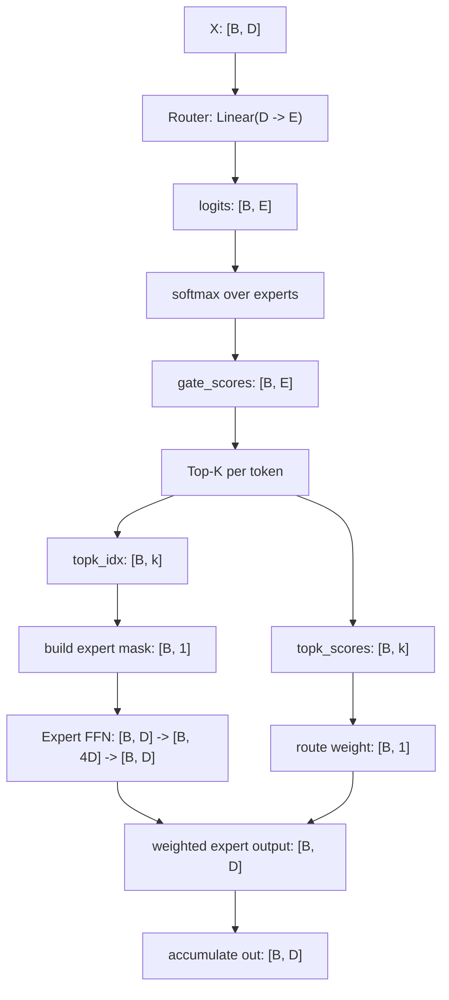

# TC MoE 网络定义与矩阵变化详解

> 来源章节：[Datawhale Diy-LLM 第 5 章：混合专家模型](https://github.com/datawhalechina/diy-llm/blob/main/docs/zh/chapter5/chapter5_%E6%B7%B7%E5%90%88%E4%B8%93%E5%AE%B6%E6%A8%A1%E5%9E%8B.md)  
> 整理日期：2026-06-09  
> 主题：解释 `TC_MoE` 网络定义代码，并画出 token choice 路由过程中的矩阵形状变化。

## 1. TC MoE 的核心思想

MoE，全称 Mixture of Experts，表示“混合专家模型”。它把普通 Transformer 里的单个 FFN 层替换成多个专家 FFN，并额外引入一个路由器决定每个 token 应该交给哪些专家处理。

TC 是 Token Choice 的缩写。TC MoE 的路由方式是：**每个 token 自己选择 Top-K 个专家**。也就是说，路由矩阵按 token 行做 Top-K，每一行只保留这个 token 最想使用的几个专家。

对第 `t` 个 token，TC MoE 的输出可以写成：

```text
y_t = sum_{j=1..k} score[t, j] * Expert_{idx[t, j]}(x_t)
```

其中：

- `x_t` 是第 `t` 个 token 的隐藏状态。
- `idx[t, j]` 是第 `t` 个 token 选择的第 `j` 个专家编号。
- `score[t, j]` 是路由器给这个专家的权重。
- `Expert_i` 是第 `i` 个专家 FFN。

## 2. 代码结构概览

原章节里的 `TC_MoE` 可以抽象成下面的结构：

```text
class TC_MoE:
    router:  Linear(D -> E)
    experts: E 个 Expert(D -> 4D -> D)
    k:       每个 token 选择的专家数量

    forward(X):
        gate_scores = softmax(router(X))
        topk_scores, topk_idx = topk(gate_scores, k)
        out = zeros_like(X)

        for top-k 位置 i:
            for 专家 e:
                找出当前选择了专家 e 的 token
                送入专家 e
                乘以对应路由权重
                累加到 out

        return out
```

参数含义：

| 记号 | 含义 |
| --- | --- |
| `B` | token 总数。真实模型中常把 `batch_size * seq_len` 展平成 token 维度 |
| `D` | hidden size，也就是每个 token 的隐藏向量维度 |
| `E` | 专家数量，即 `num_experts` |
| `k` | 每个 token 选择的专家数量 |
| `X` | 输入隐藏状态矩阵，形状 `[B, D]` |

## 3. Router：从 token 隐藏状态到专家分数

输入矩阵：

```text
X: [B, D]

        D 维隐藏状态
t0  [ x00 x01 ... x0D ]
t1  [ x10 x11 ... x1D ]
t2  [ x20 x21 ... x2D ]
...
```

路由器是一个线性层：

```text
router = Linear(D -> E)
```

在矩阵乘法上，它等价于：

```text
logits = X @ W_router^T + b_router
```

形状变化：

```text
[B, D]            [D, E]              [B, E]
X          x      W_router^T    ->    logits
```

画成矩阵：

```text
X: [B, D]                         logits: [B, E]

t0 [........ D ........]     ->    t0 [e0 e1 e2 ... eE]
t1 [........ D ........]     ->    t1 [e0 e1 e2 ... eE]
t2 [........ D ........]     ->    t2 [e0 e1 e2 ... eE]
```

这里 `logits[t, e]` 表示第 `t` 个 token 对第 `e` 个专家的原始偏好分数。

## 4. Softmax：把专家分数变成概率

代码会在专家维度做 softmax：

```text
gate_scores = softmax(logits, dim=-1)
```

形状不变：

```text
logits:      [B, E]
gate_scores: [B, E]
```

示例，假设 `E = 5`：

```text
             expert0 expert1 expert2 expert3 expert4
token0        0.05    0.60    0.10    0.20    0.05
token1        0.30    0.10    0.40    0.15    0.05
token2        0.08    0.12    0.10    0.55    0.15
```

每一行加起来等于 1。每一行代表一个 token 在所有专家上的路由概率分布。

## 5. Top-K：每个 token 选择 K 个专家

TC MoE 的关键步骤是对 `gate_scores` 的每一行做 Top-K：

```text
topk_scores, topk_idx = topk(gate_scores, k, dim=-1)
```

形状变化：

```text
gate_scores: [B, E]
topk_scores: [B, k]
topk_idx:    [B, k]
```

如果 `k = 2`，对前面的例子做 Top-K：

```text
topk_idx:
token0  [1, 3]
token1  [2, 0]
token2  [3, 4]

topk_scores:
token0  [0.60, 0.20]
token1  [0.40, 0.30]
token2  [0.55, 0.15]
```

这等价于把完整路由矩阵稀疏化：

```text
             expert0 expert1 expert2 expert3 expert4
token0        0       0.60    0       0.20    0
token1        0.30    0       0.40    0       0
token2        0       0       0       0.55    0.15
```

注意：TC 是“按行选择”。每个 token 保留自己分数最高的 `k` 个专家。

## 6. Mask：把 token 分发给对应专家

代码通常会外层遍历 Top-K 位置：

```text
for i in range(k):
```

当 `i = 0` 时，处理每个 token 的第一选择专家；当 `i = 1` 时，处理每个 token 的第二选择专家。

以 `i = 0` 为例：

```text
expert_ids    = topk_idx[:, 0]       # [B]
expert_weight = topk_scores[:, 0]    # [B]
```

对于上面的例子：

```text
expert_ids:
token0 -> expert1
token1 -> expert2
token2 -> expert3

expert_weight:
token0 -> 0.60
token1 -> 0.40
token2 -> 0.55
```

然后遍历所有专家 `e`。对每个专家构造 mask，找出当前这一轮 Top-K 中选择了它的 token。

例如当前专家是 `expert1`：

```text
expert_ids = [1, 2, 3]

mask for expert1:
token0  1
token1  0
token2  0

mask shape: [B, 1]
```

把 mask 乘到输入上：

```text
X: [B, D]

token0 [a a a]
token1 [b b b]
token2 [c c c]

mask: [B, 1]

token0 [1]
token1 [0]
token2 [0]

X * mask: [B, D]

token0 [a a a]
token1 [0 0 0]
token2 [0 0 0]
```

这样就保留了分配给当前专家的 token，其他 token 被置零。

## 7. Expert：每个专家内部的 FFN 矩阵变化

每个专家是一个两层 MLP：

```text
D -> 4D -> D
```

批量矩阵变化：

```text
输入:             [B, D]
第一层 Linear:    [B, D]  @ [D, 4D]   -> [B, 4D]
ReLU:             [B, 4D]              -> [B, 4D]
第二层 Linear:    [B, 4D] @ [4D, D]   -> [B, D]
输出:             [B, D]
```

画成流程：

```text
[B, D]
  |
  | Linear(D -> 4D)
  v
[B, 4D]
  |
  | ReLU
  v
[B, 4D]
  |
  | Linear(4D -> D)
  v
[B, D]
```

如果只看单个 token：

```text
x_t:      [D]
hidden:   [4D]
output:   [D]
```

专家输出仍然回到 `D` 维，因此可以和原 Transformer block 的 FFN 输出位置兼容。

## 8. 加权累加：把多个专家输出合成一个 token 输出

专家输出形状：

```text
expert_output: [B, D]
```

路由权重形状：

```text
expert_weight:              [B]
expert_weight.unsqueeze(1): [B, 1]
```

加权：

```text
weighted_output = expert_output * expert_weight.unsqueeze(1)
```

形状变化：

```text
[B, D] * [B, 1] -> [B, D]
```

然后累加：

```text
out += weighted_output
```

最终：

```text
out: [B, D]
```

每个 token 的最终输出是它选择的 `k` 个专家输出的加权和：

```text
out[token0] = 0.60 * Expert1(x0) + 0.20 * Expert3(x0)
out[token1] = 0.40 * Expert2(x1) + 0.30 * Expert0(x1)
out[token2] = 0.55 * Expert3(x2) + 0.15 * Expert4(x2)
```

## 9. 总流程图

```text
X: [B, D]
   |
   v
Router Linear(D -> E)
   |
   v
logits: [B, E]
   |
   v
softmax over expert dimension
   |
   v
gate_scores: [B, E]
   |
   v
Top-K per token
   |
   +--> topk_idx:    [B, k]
   +--> topk_scores: [B, k]
              |
              v
      for each top-k position i
              |
              v
      for each expert e
              |
              v
      build mask: [B, 1]
              |
              v
      selected input: [B, D]
              |
              v
      Expert_e FFN: [B, D] -> [B, 4D] -> [B, D]
              |
              v
      multiply route weight: [B, D] * [B, 1]
              |
              v
      accumulate to out: [B, D]
```

Mermaid 版本：



## 10. 一个实现注意点

教学代码里常用 `expert(X * mask)` 来保留 `[B, D]` 的矩阵形状，方便讲清楚路由和累加。但如果专家里的线性层带 bias，那么被 mask 成 0 的 token 仍然可能因为 bias 产生非零输出。

更严谨的写法通常有两类：

1. 先用布尔索引只取真正分配给当前专家的 token，送入专家后再 scatter/add 回 `out`。
2. 如果仍然使用 `X * mask`，至少在专家输出后再乘一次 mask，避免未分配 token 的 bias 输出参与累加。

伪代码：

```text
selected = expert_ids == e
selected_x = X[selected]
selected_y = Expert_e(selected_x)
out[selected] += selected_y * selected_weight
```

真实大规模 MoE 实现还会继续考虑 expert capacity、负载均衡损失、token dispatch/combine kernel、All-to-All 通信、专家并行等工程问题。这个章节里的 `TC_MoE` 更适合用来理解路由矩阵和专家加权合成的基本机制。

## 11. 小结

TC MoE 的矩阵主线可以浓缩为：

```text
[B, D]
  -> router
[B, E]
  -> softmax + top-k
[B, k] expert ids + [B, k] weights
  -> dispatch to experts
k 次 Expert(D -> 4D -> D)
  -> weighted sum
[B, D]
```

它和普通 FFN 的主要区别是：普通 FFN 每个 token 都走同一个 MLP；TC MoE 每个 token 先通过 router 选择少数几个专家，再把这些专家的输出按路由权重加权求和。
